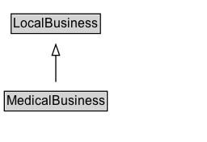

# MedicalBusiness

A particular physical or virtual business of an organization for medical purposes. Examples of MedicalBusiness include different businesses run by health professionals.

## Diagram

=== "SVG (interactive)"

    <!-- Generated by graphviz version 14.1.3 (20260303.0454)
     -->
    <!-- Pages: 1 -->
    <svg width="192pt" height="132pt"
     viewBox="0.00 0.00 192.00 132.00" xmlns="http://www.w3.org/2000/svg" xmlns:xlink="http://www.w3.org/1999/xlink">
    <g id="graph0" class="graph" transform="scale(1 1) rotate(0) translate(4 128)">
    <polygon fill="white" stroke="none" points="-4,4 -4,-128 187.75,-128 187.75,4 -4,4"/>
    <g id="clust3" class="cluster">
    <title>cluster_associated</title>
    </g>
    <!-- LocalBusiness -->
    <g id="node1" class="node">
    <title>LocalBusiness</title>
    <g id="a_node1"><a xlink:href="../LocalBusiness" xlink:title="&lt;TABLE&gt;">
    <polygon fill="lightgray" stroke="none" points="7.38,-97.88 7.38,-114.12 88.12,-114.12 88.12,-97.88 7.38,-97.88"/>
    <text xml:space="preserve" text-anchor="start" x="8.38" y="-101.88" font-family="Arial" font-size="12.00">LocalBusiness</text>
    <polygon fill="none" stroke="black" points="6.38,-96.88 6.38,-115.12 89.12,-115.12 89.12,-96.88 6.38,-96.88"/>
    </a>
    </g>
    </g>
    <!-- MedicalBusiness -->
    <g id="node2" class="node">
    <title>MedicalBusiness</title>
    <g id="a_node2"><a xlink:href="../MedicalBusiness" xlink:title="&lt;TABLE&gt;">
    <polygon fill="lightgray" stroke="none" points="1,-25.88 1,-42.12 94.5,-42.12 94.5,-25.88 1,-25.88"/>
    <text xml:space="preserve" text-anchor="start" x="2" y="-29.88" font-family="Arial" font-size="12.00">MedicalBusiness</text>
    <polygon fill="none" stroke="black" points="0,-24.88 0,-43.12 95.5,-43.12 95.5,-24.88 0,-24.88"/>
    </a>
    </g>
    </g>
    <!-- MedicalBusiness&#45;&gt;LocalBusiness -->
    <g id="edge1" class="edge">
    <title>MedicalBusiness&#45;&gt;LocalBusiness</title>
    <path fill="none" stroke="black" d="M47.75,-51.79C47.75,-59.25 47.75,-68.24 47.75,-76.69"/>
    <polygon fill="none" stroke="black" points="44.25,-76.54 47.75,-86.54 51.25,-76.54 44.25,-76.54"/>
    </g>
    <!-- Invis -->
    </g>
    </svg>

=== "PNG"

    

## Specializations of MedicalBusiness

| Class | Description |
|-------|-------------|
| [Covid Testing Facility](CovidTestingFacility.md) | A CovidTestingFacility is a [[MedicalClinic]] where testing for the COVID-19 Coronavirus
      disease is available. If the facility is being made available from an established [[Pharmacy]], [[Hotel]], or other
      non-medical organization, multiple types can be listed. This makes it easier to re-use existing schema.org information
      about that place, e.g. contact info, address, opening hours. Note that in an emergency, such information may not always be reliable.
       |
| [Dentist](Dentist.md) | A dentist. |
| [Individual Physician](IndividualPhysician.md) | An individual medical practitioner. For their official address use [[address]], for affiliations to hospitals use [[hospitalAffiliation]]. 
The [[practicesAt]] property can be used to indicate [[MedicalOrganization]] hospitals, clinics, pharmacies etc. where this physician practices. |
| [Medical Clinic](MedicalClinic.md) | A facility, often associated with a hospital or medical school, that is devoted to the specific diagnosis and/or healthcare. Previously limited to outpatients but with evolution it may be open to inpatients as well. |
| [Optician](Optician.md) | A store that sells reading glasses and similar devices for improving vision. |
| [Pharmacy](Pharmacy.md) | A pharmacy or drugstore. |
| [Physician](Physician.md) | An individual physician or a physician's office considered as a [[MedicalOrganization]]. |
| [Physicians Office](PhysiciansOffice.md) | A doctor's office or clinic. |

## Formalization for MedicalBusiness

| Property | Constraint |
|----------|------------|
| subClassOf | [LocalBusiness](LocalBusiness.md) |

