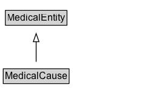

# MedicalCause

The causative agent(s) that are responsible for the pathophysiologic process that eventually results in a medical condition, symptom or sign. In this schema, unless otherwise specified this is meant to be the proximate cause of the medical condition, symptom or sign. The proximate cause is defined as the causative agent that most directly results in the medical condition, symptom or sign. For example, the HIV virus could be considered a cause of AIDS. Or in a diagnostic context, if a patient fell and sustained a hip fracture and two days later sustained a pulmonary embolism which eventuated in a cardiac arrest, the cause of the cardiac arrest (the proximate cause) would be the pulmonary embolism and not the fall. Medical causes can include cardiovascular, chemical, dermatologic, endocrine, environmental, gastroenterologic, genetic, hematologic, gynecologic, iatrogenic, infectious, musculoskeletal, neurologic, nutritional, obstetric, oncologic, otolaryngologic, pharmacologic, psychiatric, pulmonary, renal, rheumatologic, toxic, traumatic, or urologic causes; medical conditions can be causes as well.

## Diagram

=== "SVG (interactive)"

    <!-- Generated by graphviz version 14.1.3 (20260303.0454)
     -->
    <!-- Pages: 1 -->
    <svg width="178pt" height="132pt"
     viewBox="0.00 0.00 178.00 132.00" xmlns="http://www.w3.org/2000/svg" xmlns:xlink="http://www.w3.org/1999/xlink">
    <g id="graph0" class="graph" transform="scale(1 1) rotate(0) translate(4 128)">
    <polygon fill="white" stroke="none" points="-4,4 -4,-128 173.62,-128 173.62,4 -4,4"/>
    <g id="clust3" class="cluster">
    <title>cluster_associated</title>
    </g>
    <!-- MedicalEntity -->
    <g id="node1" class="node">
    <title>MedicalEntity</title>
    <g id="a_node1"><a xlink:href="../MedicalEntity" xlink:title="&lt;TABLE&gt;">
    <polygon fill="lightgray" stroke="none" points="3.62,-97.88 3.62,-114.12 77.62,-114.12 77.62,-97.88 3.62,-97.88"/>
    <text xml:space="preserve" text-anchor="start" x="4.62" y="-101.88" font-family="Arial" font-size="12.00">MedicalEntity</text>
    <polygon fill="none" stroke="black" points="2.62,-96.88 2.62,-115.12 78.62,-115.12 78.62,-96.88 2.62,-96.88"/>
    </a>
    </g>
    </g>
    <!-- MedicalCause -->
    <g id="node2" class="node">
    <title>MedicalCause</title>
    <g id="a_node2"><a xlink:href="../MedicalCause" xlink:title="&lt;TABLE&gt;">
    <polygon fill="lightgray" stroke="none" points="1,-25.88 1,-42.12 80.25,-42.12 80.25,-25.88 1,-25.88"/>
    <text xml:space="preserve" text-anchor="start" x="2" y="-29.88" font-family="Arial" font-size="12.00">MedicalCause</text>
    <polygon fill="none" stroke="black" points="0,-24.88 0,-43.12 81.25,-43.12 81.25,-24.88 0,-24.88"/>
    </a>
    </g>
    </g>
    <!-- MedicalCause&#45;&gt;MedicalEntity -->
    <g id="edge1" class="edge">
    <title>MedicalCause&#45;&gt;MedicalEntity</title>
    <path fill="none" stroke="black" d="M40.62,-51.79C40.62,-59.25 40.62,-68.24 40.62,-76.69"/>
    <polygon fill="none" stroke="black" points="37.13,-76.54 40.63,-86.54 44.13,-76.54 37.13,-76.54"/>
    </g>
    <!-- Invis -->
    </g>
    </svg>

=== "PNG"

    

## Formalization for MedicalCause

| Property | Constraint |
|----------|------------|
| subClassOf | [MedicalEntity](MedicalEntity.md) |

