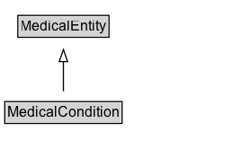

# MedicalCondition

Any condition of the human body that affects the normal functioning of a person, whether physically or mentally. Includes diseases, injuries, disabilities, disorders, syndromes, etc.

## Diagram

=== "SVG (interactive)"

    <!-- Generated by graphviz version 14.1.3 (20260303.0454)
     -->
    <!-- Pages: 1 -->
    <svg width="194pt" height="132pt"
     viewBox="0.00 0.00 194.00 132.00" xmlns="http://www.w3.org/2000/svg" xmlns:xlink="http://www.w3.org/1999/xlink">
    <g id="graph0" class="graph" transform="scale(1 1) rotate(0) translate(4 128)">
    <polygon fill="white" stroke="none" points="-4,4 -4,-128 189.88,-128 189.88,4 -4,4"/>
    <g id="clust3" class="cluster">
    <title>cluster_associated</title>
    </g>
    <!-- MedicalEntity -->
    <g id="node1" class="node">
    <title>MedicalEntity</title>
    <g id="a_node1"><a xlink:href="../MedicalEntity" xlink:title="&lt;TABLE&gt;">
    <polygon fill="lightgray" stroke="none" points="11.88,-97.88 11.88,-114.12 85.88,-114.12 85.88,-97.88 11.88,-97.88"/>
    <text xml:space="preserve" text-anchor="start" x="12.88" y="-101.88" font-family="Arial" font-size="12.00">MedicalEntity</text>
    <polygon fill="none" stroke="black" points="10.88,-96.88 10.88,-115.12 86.88,-115.12 86.88,-96.88 10.88,-96.88"/>
    </a>
    </g>
    </g>
    <!-- MedicalCondition -->
    <g id="node2" class="node">
    <title>MedicalCondition</title>
    <g id="a_node2"><a xlink:href="../MedicalCondition" xlink:title="&lt;TABLE&gt;">
    <polygon fill="lightgray" stroke="none" points="1,-25.88 1,-42.12 96.75,-42.12 96.75,-25.88 1,-25.88"/>
    <text xml:space="preserve" text-anchor="start" x="2" y="-29.88" font-family="Arial" font-size="12.00">MedicalCondition</text>
    <polygon fill="none" stroke="black" points="0,-24.88 0,-43.12 97.75,-43.12 97.75,-24.88 0,-24.88"/>
    </a>
    </g>
    </g>
    <!-- MedicalCondition&#45;&gt;MedicalEntity -->
    <g id="edge1" class="edge">
    <title>MedicalCondition&#45;&gt;MedicalEntity</title>
    <path fill="none" stroke="black" d="M48.88,-51.79C48.88,-59.25 48.88,-68.24 48.88,-76.69"/>
    <polygon fill="none" stroke="black" points="45.38,-76.54 48.88,-86.54 52.38,-76.54 45.38,-76.54"/>
    </g>
    <!-- Invis -->
    </g>
    </svg>

=== "PNG"

    

## Specializations of MedicalCondition

| Class | Description |
|-------|-------------|
| [Infectious Disease](InfectiousDisease.md) | An infectious disease is a clinically evident human disease resulting from the presence of pathogenic microbial agents, like pathogenic viruses, pathogenic bacteria, fungi, protozoa, multicellular parasites, and prions. To be considered an infectious disease, such pathogens are known to be able to cause this disease. |
| [Medical Sign](MedicalSign.md) | Any physical manifestation of a person's medical condition discoverable by objective diagnostic tests or physical examination. |
| [Medical Sign Or Symptom](MedicalSignOrSymptom.md) | Any feature associated or not with a medical condition. In medicine a symptom is generally subjective while a sign is objective. |
| [Medical Symptom](MedicalSymptom.md) | Any complaint sensed and expressed by the patient (therefore defined as subjective)  like stomachache, lower-back pain, or fatigue. |
| [Vital Sign](VitalSign.md) | Vital signs are measures of various physiological functions in order to assess the most basic body functions. |

## Formalization for MedicalCondition

| Property | Constraint |
|----------|------------|
| subClassOf | [MedicalEntity](MedicalEntity.md) |

