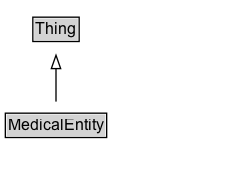

# MedicalEntity

The most generic type of entity related to health and the practice of medicine.

## Diagram

=== "SVG (interactive)"

    <!-- Generated by graphviz version 14.1.3 (20260303.0454)
     -->
    <!-- Pages: 1 -->
    <svg width="172pt" height="132pt"
     viewBox="0.00 0.00 172.00 132.00" xmlns="http://www.w3.org/2000/svg" xmlns:xlink="http://www.w3.org/1999/xlink">
    <g id="graph0" class="graph" transform="scale(1 1) rotate(0) translate(4 128)">
    <polygon fill="white" stroke="none" points="-4,4 -4,-128 168,-128 168,4 -4,4"/>
    <g id="clust3" class="cluster">
    <title>cluster_associated</title>
    </g>
    <!-- Thing -->
    <g id="node1" class="node">
    <title>Thing</title>
    <g id="a_node1"><a xlink:href="../Thing" xlink:title="&lt;TABLE&gt;">
    <polygon fill="lightgray" stroke="none" points="21.62,-97.88 21.62,-114.12 54.38,-114.12 54.38,-97.88 21.62,-97.88"/>
    <text xml:space="preserve" text-anchor="start" x="22.62" y="-101.88" font-family="Arial" font-size="12.00">Thing</text>
    <polygon fill="none" stroke="black" points="20.62,-96.88 20.62,-115.12 55.38,-115.12 55.38,-96.88 20.62,-96.88"/>
    </a>
    </g>
    </g>
    <!-- MedicalEntity -->
    <g id="node2" class="node">
    <title>MedicalEntity</title>
    <g id="a_node2"><a xlink:href="../MedicalEntity" xlink:title="&lt;TABLE&gt;">
    <polygon fill="lightgray" stroke="none" points="1,-25.88 1,-42.12 75,-42.12 75,-25.88 1,-25.88"/>
    <text xml:space="preserve" text-anchor="start" x="2" y="-29.88" font-family="Arial" font-size="12.00">MedicalEntity</text>
    <polygon fill="none" stroke="black" points="0,-24.88 0,-43.12 76,-43.12 76,-24.88 0,-24.88"/>
    </a>
    </g>
    </g>
    <!-- MedicalEntity&#45;&gt;Thing -->
    <g id="edge1" class="edge">
    <title>MedicalEntity&#45;&gt;Thing</title>
    <path fill="none" stroke="black" d="M38,-51.79C38,-59.25 38,-68.24 38,-76.69"/>
    <polygon fill="none" stroke="black" points="34.5,-76.54 38,-86.54 41.5,-76.54 34.5,-76.54"/>
    </g>
    <!-- Invis -->
    </g>
    </svg>

=== "PNG"

    

## Specializations of MedicalEntity

| Class | Description |
|-------|-------------|
| [Anatomical Structure](AnatomicalStructure.md) | Any part of the human body, typically a component of an anatomical system. Organs, tissues, and cells are all anatomical structures. |
| [Anatomical System](AnatomicalSystem.md) | An anatomical system is a group of anatomical structures that work together to perform a certain task. Anatomical systems, such as organ systems, are one organizing principle of anatomy, and can include circulatory, digestive, endocrine, integumentary, immune, lymphatic, muscular, nervous, reproductive, respiratory, skeletal, urinary, vestibular, and other systems. |
| [Approved Indication](ApprovedIndication.md) | An indication for a medical therapy that has been formally specified or approved by a regulatory body that regulates use of the therapy; for example, the US FDA approves indications for most drugs in the US. |
| [Artery](Artery.md) | A type of blood vessel that specifically carries blood away from the heart. |
| [Blood Test](BloodTest.md) | A medical test performed on a sample of a patient's blood. |
| [Bone](Bone.md) | Rigid connective tissue that comprises up the skeletal structure of the human body. |
| [Brain Structure](BrainStructure.md) | Any anatomical structure which pertains to the soft nervous tissue functioning as the coordinating center of sensation and intellectual and nervous activity. |
| [D Dx Element](DDxElement.md) | An alternative, closely-related condition typically considered later in the differential diagnosis process along with the signs that are used to distinguish it. |
| [Diagnostic Procedure](DiagnosticProcedure.md) | A medical procedure intended primarily for diagnostic, as opposed to therapeutic, purposes. |
| [Diet](Diet.md) | A strategy of regulating the intake of food to achieve or maintain a specific health-related goal. |
| [Dietary Supplement](DietarySupplement.md) | A product taken by mouth that contains a dietary ingredient intended to supplement the diet. Dietary ingredients may include vitamins, minerals, herbs or other botanicals, amino acids, and substances such as enzymes, organ tissues, glandulars and metabolites. |
| [Dose Schedule](DoseSchedule.md) | A specific dosing schedule for a drug or supplement. |
| [Drug](Drug.md) | A chemical or biologic substance, used as a medical therapy, that has a physiological effect on an organism. Here the term drug is used interchangeably with the term medicine although clinical knowledge makes a clear difference between them. |
| [Drug Class](DrugClass.md) | A class of medical drugs, e.g., statins. Classes can represent general pharmacological class, common mechanisms of action, common physiological effects, etc. |
| [Drug Cost](DrugCost.md) | The cost per unit of a medical drug. Note that this type is not meant to represent the price in an offer of a drug for sale; see the Offer type for that. This type will typically be used to tag wholesale or average retail cost of a drug, or maximum reimbursable cost. Costs of medical drugs vary widely depending on how and where they are paid for, so while this type captures some of the variables, costs should be used with caution by consumers of this schema's markup. |
| [Drug Legal Status](DrugLegalStatus.md) | The legal availability status of a medical drug. |
| [Drug Strength](DrugStrength.md) | A specific strength in which a medical drug is available in a specific country. |
| [Exercise Plan](ExercisePlan.md) | Fitness-related activity designed for a specific health-related purpose, including defined exercise routines as well as activity prescribed by a clinician. |
| [Imaging Test](ImagingTest.md) | Any medical imaging modality typically used for diagnostic purposes. |
| [Infectious Disease](InfectiousDisease.md) | An infectious disease is a clinically evident human disease resulting from the presence of pathogenic microbial agents, like pathogenic viruses, pathogenic bacteria, fungi, protozoa, multicellular parasites, and prions. To be considered an infectious disease, such pathogens are known to be able to cause this disease. |
| [Joint](Joint.md) | The anatomical location at which two or more bones make contact. |
| [Lifestyle Modification](LifestyleModification.md) | A process of care involving exercise, changes to diet, fitness routines, and other lifestyle changes aimed at improving a health condition. |
| [Ligament](Ligament.md) | A short band of tough, flexible, fibrous connective tissue that functions to connect multiple bones, cartilages, and structurally support joints. |
| [Lymphatic Vessel](LymphaticVessel.md) | A type of blood vessel that specifically carries lymph fluid unidirectionally toward the heart. |
| [Maximum Dose Schedule](MaximumDoseSchedule.md) | The maximum dosing schedule considered safe for a drug or supplement as recommended by an authority or by the drug/supplement's manufacturer. Capture the recommending authority in the recognizingAuthority property of MedicalEntity. |
| [Medical Cause](MedicalCause.md) | The causative agent(s) that are responsible for the pathophysiologic process that eventually results in a medical condition, symptom or sign. In this schema, unless otherwise specified this is meant to be the proximate cause of the medical condition, symptom or sign. The proximate cause is defined as the causative agent that most directly results in the medical condition, symptom or sign. For example, the HIV virus could be considered a cause of AIDS. Or in a diagnostic context, if a patient fell and sustained a hip fracture and two days later sustained a pulmonary embolism which eventuated in a cardiac arrest, the cause of the cardiac arrest (the proximate cause) would be the pulmonary embolism and not the fall. Medical causes can include cardiovascular, chemical, dermatologic, endocrine, environmental, gastroenterologic, genetic, hematologic, gynecologic, iatrogenic, infectious, musculoskeletal, neurologic, nutritional, obstetric, oncologic, otolaryngologic, pharmacologic, psychiatric, pulmonary, renal, rheumatologic, toxic, traumatic, or urologic causes; medical conditions can be causes as well. |
| [Medical Code](MedicalCode.md) | A code for a medical entity. |
| [Medical Condition](MedicalCondition.md) | Any condition of the human body that affects the normal functioning of a person, whether physically or mentally. Includes diseases, injuries, disabilities, disorders, syndromes, etc. |
| [Medical Condition Stage](MedicalConditionStage.md) | A stage of a medical condition, such as 'Stage IIIa'. |
| [Medical Contraindication](MedicalContraindication.md) | A condition or factor that serves as a reason to withhold a certain medical therapy. Contraindications can be absolute (there are no reasonable circumstances for undertaking a course of action) or relative (the patient is at higher risk of complications, but these risks may be outweighed by other considerations or mitigated by other measures). |
| [Medical Device](MedicalDevice.md) | Any object used in a medical capacity, such as to diagnose or treat a patient. |
| [Medical Guideline](MedicalGuideline.md) | Any recommendation made by a standard society (e.g. ACC/AHA) or consensus statement that denotes how to diagnose and treat a particular condition. Note: this type should be used to tag the actual guideline recommendation; if the guideline recommendation occurs in a larger scholarly article, use MedicalScholarlyArticle to tag the overall article, not this type. Note also: the organization making the recommendation should be captured in the recognizingAuthority base property of MedicalEntity. |
| [Medical Guideline Contraindication](MedicalGuidelineContraindication.md) | A guideline contraindication that designates a process as harmful and where quality of the data supporting the contraindication is sound. |
| [Medical Guideline Recommendation](MedicalGuidelineRecommendation.md) | A guideline recommendation that is regarded as efficacious and where quality of the data supporting the recommendation is sound. |
| [Medical Indication](MedicalIndication.md) | A condition or factor that indicates use of a medical therapy, including signs, symptoms, risk factors, anatomical states, etc. |
| [Medical Intangible](MedicalIntangible.md) | A utility class that serves as the umbrella for a number of 'intangible' things in the medical space. |
| [Medical Observational Study](MedicalObservationalStudy.md) | An observational study is a type of medical study that attempts to infer the possible effect of a treatment through observation of a cohort of subjects over a period of time. In an observational study, the assignment of subjects into treatment groups versus control groups is outside the control of the investigator. This is in contrast with controlled studies, such as the randomized controlled trials represented by MedicalTrial, where each subject is randomly assigned to a treatment group or a control group before the start of the treatment. |
| [Medical Procedure](MedicalProcedure.md) | A process of care used in either a diagnostic, therapeutic, preventive or palliative capacity that relies on invasive (surgical), non-invasive, or other techniques. |
| [Medical Risk Calculator](MedicalRiskCalculator.md) | A complex mathematical calculation requiring an online calculator, used to assess prognosis. Note: use the url property of Thing to record any URLs for online calculators. |
| [Medical Risk Estimator](MedicalRiskEstimator.md) | Any rule set or interactive tool for estimating the risk of developing a complication or condition. |
| [Medical Risk Factor](MedicalRiskFactor.md) | A risk factor is anything that increases a person's likelihood of developing or contracting a disease, medical condition, or complication. |
| [Medical Risk Score](MedicalRiskScore.md) | A simple system that adds up the number of risk factors to yield a score that is associated with prognosis, e.g. CHAD score, TIMI risk score. |
| [Medical Sign](MedicalSign.md) | Any physical manifestation of a person's medical condition discoverable by objective diagnostic tests or physical examination. |
| [Medical Sign Or Symptom](MedicalSignOrSymptom.md) | Any feature associated or not with a medical condition. In medicine a symptom is generally subjective while a sign is objective. |
| [Medical Study](MedicalStudy.md) | A medical study is an umbrella type covering all kinds of research studies relating to human medicine or health, including observational studies and interventional trials and registries, randomized, controlled or not. When the specific type of study is known, use one of the extensions of this type, such as MedicalTrial or MedicalObservationalStudy. Also, note that this type should be used to mark up data that describes the study itself; to tag an article that publishes the results of a study, use MedicalScholarlyArticle. Note: use the code property of MedicalEntity to store study IDs, e.g. clinicaltrials.gov ID. |
| [Medical Symptom](MedicalSymptom.md) | Any complaint sensed and expressed by the patient (therefore defined as subjective)  like stomachache, lower-back pain, or fatigue. |
| [Medical Test](MedicalTest.md) | Any medical test, typically performed for diagnostic purposes. |
| [Medical Test Panel](MedicalTestPanel.md) | Any collection of tests commonly ordered together. |
| [Medical Therapy](MedicalTherapy.md) | Any medical intervention designed to prevent, treat, and cure human diseases and medical conditions, including both curative and palliative therapies. Medical therapies are typically processes of care relying upon pharmacotherapy, behavioral therapy, supportive therapy (with fluid or nutrition for example), or detoxification (e.g. hemodialysis) aimed at improving or preventing a health condition. |
| [Medical Trial](MedicalTrial.md) | A medical trial is a type of medical study that uses a scientific process to compare the safety and efficacy of medical therapies or medical procedures. In general, medical trials are controlled and subjects are allocated at random to the different treatment and/or control groups. |
| [Muscle](Muscle.md) | A muscle is an anatomical structure consisting of a contractile form of tissue that animals use to effect movement. |
| [Nerve](Nerve.md) | A common pathway for the electrochemical nerve impulses that are transmitted along each of the axons. |
| [Occupational Therapy](OccupationalTherapy.md) | A treatment of people with physical, emotional, or social problems, using purposeful activity to help them overcome or learn to deal with their problems. |
| [Palliative Procedure](PalliativeProcedure.md) | A medical procedure intended primarily for palliative purposes, aimed at relieving the symptoms of an underlying health condition. |
| [Palliative Procedure](PalliativeProcedure.md) | A medical procedure intended primarily for palliative purposes, aimed at relieving the symptoms of an underlying health condition. |
| [Pathology Test](PathologyTest.md) | A medical test performed by a laboratory that typically involves examination of a tissue sample by a pathologist. |
| [Physical Activity](PhysicalActivity.md) | Any bodily activity that enhances or maintains physical fitness and overall health and wellness. Includes activity that is part of daily living and routine, structured exercise, and exercise prescribed as part of a medical treatment or recovery plan. |
| [Physical Exam](PhysicalExam.md) | A type of physical examination of a patient performed by a physician.  |
| [Physical Therapy](PhysicalTherapy.md) | A process of progressive physical care and rehabilitation aimed at improving a health condition. |
| [Prevention Indication](PreventionIndication.md) | An indication for preventing an underlying condition, symptom, etc. |
| [Psychological Treatment](PsychologicalTreatment.md) | A process of care relying upon counseling, dialogue and communication  aimed at improving a mental health condition without use of drugs. |
| [Radiation Therapy](RadiationTherapy.md) | A process of care using radiation aimed at improving a health condition. |
| [Recommended Dose Schedule](RecommendedDoseSchedule.md) | A recommended dosing schedule for a drug or supplement as prescribed or recommended by an authority or by the drug/supplement's manufacturer. Capture the recommending authority in the recognizingAuthority property of MedicalEntity. |
| [Reported Dose Schedule](ReportedDoseSchedule.md) | A patient-reported or observed dosing schedule for a drug or supplement. |
| [Substance](Substance.md) | Any matter of defined composition that has discrete existence, whose origin may be biological, mineral or chemical. |
| [Superficial Anatomy](SuperficialAnatomy.md) | Anatomical features that can be observed by sight (without dissection), including the form and proportions of the human body as well as surface landmarks that correspond to deeper subcutaneous structures. Superficial anatomy plays an important role in sports medicine, phlebotomy, and other medical specialties as underlying anatomical structures can be identified through surface palpation. For example, during back surgery, superficial anatomy can be used to palpate and count vertebrae to find the site of incision. Or in phlebotomy, superficial anatomy can be used to locate an underlying vein; for example, the median cubital vein can be located by palpating the borders of the cubital fossa (such as the epicondyles of the humerus) and then looking for the superficial signs of the vein, such as size, prominence, ability to refill after depression, and feel of surrounding tissue support. As another example, in a subluxation (dislocation) of the glenohumeral joint, the bony structure becomes pronounced with the deltoid muscle failing to cover the glenohumeral joint allowing the edges of the scapula to be superficially visible. Here, the superficial anatomy is the visible edges of the scapula, implying the underlying dislocation of the joint (the related anatomical structure). |
| [Surgical Procedure](SurgicalProcedure.md) | A medical procedure involving an incision with instruments; performed for diagnose, or therapeutic purposes. |
| [Therapeutic Procedure](TherapeuticProcedure.md) | A medical procedure intended primarily for therapeutic purposes, aimed at improving a health condition. |
| [Treatment Indication](TreatmentIndication.md) | An indication for treating an underlying condition, symptom, etc. |
| [Vein](Vein.md) | A type of blood vessel that specifically carries blood to the heart. |
| [Vessel](Vessel.md) | A component of the human body circulatory system comprised of an intricate network of hollow tubes that transport blood throughout the entire body. |
| [Vital Sign](VitalSign.md) | Vital signs are measures of various physiological functions in order to assess the most basic body functions. |

## Formalization for MedicalEntity

| Property | Constraint |
|----------|------------|
| subClassOf | [Thing](Thing.md) |

