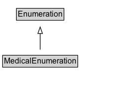

# MedicalEnumeration

Enumerations related to health and the practice of medicine: A concept that is used to attribute a quality to another concept, as a qualifier, a collection of items or a listing of all of the elements of a set in medicine practice.

## Diagram

=== "SVG (interactive)"

    <!-- Generated by graphviz version 14.1.3 (20260303.0454)
     -->
    <!-- Pages: 1 -->
    <svg width="210pt" height="132pt"
     viewBox="0.00 0.00 210.00 132.00" xmlns="http://www.w3.org/2000/svg" xmlns:xlink="http://www.w3.org/1999/xlink">
    <g id="graph0" class="graph" transform="scale(1 1) rotate(0) translate(4 128)">
    <polygon fill="white" stroke="none" points="-4,4 -4,-128 206.12,-128 206.12,4 -4,4"/>
    <g id="clust3" class="cluster">
    <title>cluster_associated</title>
    </g>
    <!-- Enumeration -->
    <g id="node1" class="node">
    <title>Enumeration</title>
    <g id="a_node1"><a xlink:href="../Enumeration" xlink:title="&lt;TABLE&gt;">
    <polygon fill="lightgray" stroke="none" points="22,-97.88 22,-114.12 92.25,-114.12 92.25,-97.88 22,-97.88"/>
    <text xml:space="preserve" text-anchor="start" x="23" y="-101.88" font-family="Arial" font-size="12.00">Enumeration</text>
    <polygon fill="none" stroke="black" points="21,-96.88 21,-115.12 93.25,-115.12 93.25,-96.88 21,-96.88"/>
    </a>
    </g>
    </g>
    <!-- MedicalEnumeration -->
    <g id="node2" class="node">
    <title>MedicalEnumeration</title>
    <g id="a_node2"><a xlink:href="../MedicalEnumeration" xlink:title="&lt;TABLE&gt;">
    <polygon fill="lightgray" stroke="none" points="1,-25.88 1,-42.12 113.25,-42.12 113.25,-25.88 1,-25.88"/>
    <text xml:space="preserve" text-anchor="start" x="2" y="-29.88" font-family="Arial" font-size="12.00">MedicalEnumeration</text>
    <polygon fill="none" stroke="black" points="0,-24.88 0,-43.12 114.25,-43.12 114.25,-24.88 0,-24.88"/>
    </a>
    </g>
    </g>
    <!-- MedicalEnumeration&#45;&gt;Enumeration -->
    <g id="edge1" class="edge">
    <title>MedicalEnumeration&#45;&gt;Enumeration</title>
    <path fill="none" stroke="black" d="M57.12,-51.79C57.12,-59.25 57.12,-68.24 57.12,-76.69"/>
    <polygon fill="none" stroke="black" points="53.63,-76.54 57.13,-86.54 60.63,-76.54 53.63,-76.54"/>
    </g>
    <!-- Invis -->
    </g>
    </svg>

=== "PNG"

    

## Specializations of MedicalEnumeration

| Class | Description |
|-------|-------------|
| [Drug Cost Category](DrugCostCategory.md) | Enumerated categories of medical drug costs. |
| [Drug Pregnancy Category](DrugPregnancyCategory.md) | Categories that represent an assessment of the risk of fetal injury due to a drug or pharmaceutical used as directed by the mother during pregnancy. |
| [Drug Prescription Status](DrugPrescriptionStatus.md) | Indicates whether this drug is available by prescription or over-the-counter. |
| [Infectious Agent Class](InfectiousAgentClass.md) | Classes of agents or pathogens that transmit infectious diseases. Enumerated type. |
| [Medical Audience Type](MedicalAudienceType.md) | Target audiences types for medical web pages. Enumerated type. |
| [Medical Device Purpose](MedicalDevicePurpose.md) | Categories of medical devices, organized by the purpose or intended use of the device. |
| [Medical Evidence Level](MedicalEvidenceLevel.md) | Level of evidence for a medical guideline. Enumerated type. |
| [Medical Imaging Technique](MedicalImagingTechnique.md) | Any medical imaging modality typically used for diagnostic purposes. Enumerated type. |
| [Medical Observational Study Design](MedicalObservationalStudyDesign.md) | Design models for observational medical studies. Enumerated type. |
| [Medical Procedure Type](MedicalProcedureType.md) | An enumeration that describes different types of medical procedures. |
| [Medical Specialty](MedicalSpecialty.md) | Any specific branch of medical science or practice. Medical specialities include clinical specialties that pertain to particular organ systems and their respective disease states, as well as allied health specialties. Enumerated type. |
| [Medical Study Status](MedicalStudyStatus.md) | The status of a medical study. Enumerated type. |
| [Medical Trial Design](MedicalTrialDesign.md) | Design models for medical trials. Enumerated type. |
| [Medicine System](MedicineSystem.md) | Systems of medical practice. |
| [Physical Exam](PhysicalExam.md) | A type of physical examination of a patient performed by a physician.  |

## Formalization for MedicalEnumeration

| Property | Constraint |
|----------|------------|
| subClassOf | [Enumeration](Enumeration.md) |

