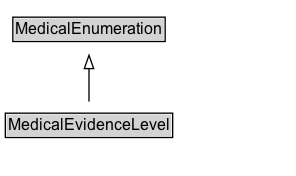

# MedicalEvidenceLevel

Level of evidence for a medical guideline. Enumerated type.

## Diagram

=== "SVG (interactive)"

    <!-- Generated by graphviz version 14.1.3 (20260303.0454)
     -->
    <!-- Pages: 1 -->
    <svg width="222pt" height="132pt"
     viewBox="0.00 0.00 222.00 132.00" xmlns="http://www.w3.org/2000/svg" xmlns:xlink="http://www.w3.org/1999/xlink">
    <g id="graph0" class="graph" transform="scale(1 1) rotate(0) translate(4 128)">
    <polygon fill="white" stroke="none" points="-4,4 -4,-128 217.75,-128 217.75,4 -4,4"/>
    <g id="clust3" class="cluster">
    <title>cluster_associated</title>
    </g>
    <!-- MedicalEnumeration -->
    <g id="node1" class="node">
    <title>MedicalEnumeration</title>
    <g id="a_node1"><a xlink:href="../MedicalEnumeration" xlink:title="&lt;TABLE&gt;">
    <polygon fill="lightgray" stroke="none" points="6.62,-97.88 6.62,-114.12 118.88,-114.12 118.88,-97.88 6.62,-97.88"/>
    <text xml:space="preserve" text-anchor="start" x="7.62" y="-101.88" font-family="Arial" font-size="12.00">MedicalEnumeration</text>
    <polygon fill="none" stroke="black" points="5.62,-96.88 5.62,-115.12 119.88,-115.12 119.88,-96.88 5.62,-96.88"/>
    </a>
    </g>
    </g>
    <!-- MedicalEvidenceLevel -->
    <g id="node2" class="node">
    <title>MedicalEvidenceLevel</title>
    <g id="a_node2"><a xlink:href="../MedicalEvidenceLevel" xlink:title="&lt;TABLE&gt;">
    <polygon fill="lightgray" stroke="none" points="1,-25.88 1,-42.12 124.5,-42.12 124.5,-25.88 1,-25.88"/>
    <text xml:space="preserve" text-anchor="start" x="2" y="-29.88" font-family="Arial" font-size="12.00">MedicalEvidenceLevel</text>
    <polygon fill="none" stroke="black" points="0,-24.88 0,-43.12 125.5,-43.12 125.5,-24.88 0,-24.88"/>
    </a>
    </g>
    </g>
    <!-- MedicalEvidenceLevel&#45;&gt;MedicalEnumeration -->
    <g id="edge1" class="edge">
    <title>MedicalEvidenceLevel&#45;&gt;MedicalEnumeration</title>
    <path fill="none" stroke="black" d="M62.75,-51.79C62.75,-59.25 62.75,-68.24 62.75,-76.69"/>
    <polygon fill="none" stroke="black" points="59.25,-76.54 62.75,-86.54 66.25,-76.54 59.25,-76.54"/>
    </g>
    <!-- Invis -->
    </g>
    </svg>

=== "PNG"

    

## Formalization for MedicalEvidenceLevel

| Property | Constraint |
|----------|------------|
| subClassOf | [MedicalEnumeration](MedicalEnumeration.md) |

