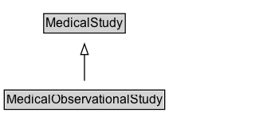

# MedicalObservationalStudy

An observational study is a type of medical study that attempts to infer the possible effect of a treatment through observation of a cohort of subjects over a period of time. In an observational study, the assignment of subjects into treatment groups versus control groups is outside the control of the investigator. This is in contrast with controlled studies, such as the randomized controlled trials represented by MedicalTrial, where each subject is randomly assigned to a treatment group or a control group before the start of the treatment.

## Diagram

=== "SVG (interactive)"

    <!-- Generated by graphviz version 14.1.3 (20260303.0454)
     -->
    <!-- Pages: 1 -->
    <svg width="248pt" height="132pt"
     viewBox="0.00 0.00 248.00 132.00" xmlns="http://www.w3.org/2000/svg" xmlns:xlink="http://www.w3.org/1999/xlink">
    <g id="graph0" class="graph" transform="scale(1 1) rotate(0) translate(4 128)">
    <polygon fill="white" stroke="none" points="-4,4 -4,-128 243.5,-128 243.5,4 -4,4"/>
    <g id="clust3" class="cluster">
    <title>cluster_associated</title>
    </g>
    <!-- MedicalStudy -->
    <g id="node1" class="node">
    <title>MedicalStudy</title>
    <g id="a_node1"><a xlink:href="../MedicalStudy" xlink:title="&lt;TABLE&gt;">
    <polygon fill="lightgray" stroke="none" points="38.12,-97.88 38.12,-114.12 112.88,-114.12 112.88,-97.88 38.12,-97.88"/>
    <text xml:space="preserve" text-anchor="start" x="39.12" y="-101.88" font-family="Arial" font-size="12.00">MedicalStudy</text>
    <polygon fill="none" stroke="black" points="37.12,-96.88 37.12,-115.12 113.88,-115.12 113.88,-96.88 37.12,-96.88"/>
    </a>
    </g>
    </g>
    <!-- MedicalObservationalStudy -->
    <g id="node2" class="node">
    <title>MedicalObservationalStudy</title>
    <g id="a_node2"><a xlink:href="../MedicalObservationalStudy" xlink:title="&lt;TABLE&gt;">
    <polygon fill="lightgray" stroke="none" points="1,-25.88 1,-42.12 150,-42.12 150,-25.88 1,-25.88"/>
    <text xml:space="preserve" text-anchor="start" x="2" y="-29.88" font-family="Arial" font-size="12.00">MedicalObservationalStudy</text>
    <polygon fill="none" stroke="black" points="0,-24.88 0,-43.12 151,-43.12 151,-24.88 0,-24.88"/>
    </a>
    </g>
    </g>
    <!-- MedicalObservationalStudy&#45;&gt;MedicalStudy -->
    <g id="edge1" class="edge">
    <title>MedicalObservationalStudy&#45;&gt;MedicalStudy</title>
    <path fill="none" stroke="black" d="M75.5,-51.79C75.5,-59.25 75.5,-68.24 75.5,-76.69"/>
    <polygon fill="none" stroke="black" points="72,-76.54 75.5,-86.54 79,-76.54 72,-76.54"/>
    </g>
    <!-- Invis -->
    </g>
    </svg>

=== "PNG"

    

## Formalization for MedicalObservationalStudy

| Property | Constraint |
|----------|------------|
| subClassOf | [MedicalStudy](MedicalStudy.md) |

