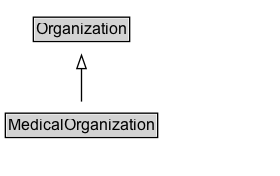

# MedicalOrganization

A medical organization (physical or not), such as hospital, institution or clinic.

## Diagram

=== "SVG (interactive)"

    <!-- Generated by graphviz version 14.1.3 (20260303.0454)
     -->
    <!-- Pages: 1 -->
    <svg width="210pt" height="132pt"
     viewBox="0.00 0.00 210.00 132.00" xmlns="http://www.w3.org/2000/svg" xmlns:xlink="http://www.w3.org/1999/xlink">
    <g id="graph0" class="graph" transform="scale(1 1) rotate(0) translate(4 128)">
    <polygon fill="white" stroke="none" points="-4,4 -4,-128 206.12,-128 206.12,4 -4,4"/>
    <g id="clust3" class="cluster">
    <title>cluster_associated</title>
    </g>
    <!-- Organization -->
    <g id="node1" class="node">
    <title>Organization</title>
    <g id="a_node1"><a xlink:href="../Organization" xlink:title="&lt;TABLE&gt;">
    <polygon fill="lightgray" stroke="none" points="22,-97.88 22,-114.12 92.25,-114.12 92.25,-97.88 22,-97.88"/>
    <text xml:space="preserve" text-anchor="start" x="23" y="-101.88" font-family="Arial" font-size="12.00">Organization</text>
    <polygon fill="none" stroke="black" points="21,-96.88 21,-115.12 93.25,-115.12 93.25,-96.88 21,-96.88"/>
    </a>
    </g>
    </g>
    <!-- MedicalOrganization -->
    <g id="node2" class="node">
    <title>MedicalOrganization</title>
    <g id="a_node2"><a xlink:href="../MedicalOrganization" xlink:title="&lt;TABLE&gt;">
    <polygon fill="lightgray" stroke="none" points="1,-25.88 1,-42.12 113.25,-42.12 113.25,-25.88 1,-25.88"/>
    <text xml:space="preserve" text-anchor="start" x="2" y="-29.88" font-family="Arial" font-size="12.00">MedicalOrganization</text>
    <polygon fill="none" stroke="black" points="0,-24.88 0,-43.12 114.25,-43.12 114.25,-24.88 0,-24.88"/>
    </a>
    </g>
    </g>
    <!-- MedicalOrganization&#45;&gt;Organization -->
    <g id="edge1" class="edge">
    <title>MedicalOrganization&#45;&gt;Organization</title>
    <path fill="none" stroke="black" d="M57.12,-51.79C57.12,-59.25 57.12,-68.24 57.12,-76.69"/>
    <polygon fill="none" stroke="black" points="53.63,-76.54 57.13,-86.54 60.63,-76.54 53.63,-76.54"/>
    </g>
    <!-- Invis -->
    </g>
    </svg>

=== "PNG"

    

## Specializations of MedicalOrganization

| Class | Description |
|-------|-------------|
| [Covid Testing Facility](CovidTestingFacility.md) | A CovidTestingFacility is a [[MedicalClinic]] where testing for the COVID-19 Coronavirus
      disease is available. If the facility is being made available from an established [[Pharmacy]], [[Hotel]], or other
      non-medical organization, multiple types can be listed. This makes it easier to re-use existing schema.org information
      about that place, e.g. contact info, address, opening hours. Note that in an emergency, such information may not always be reliable.
       |
| [Dentist](Dentist.md) | A dentist. |
| [Diagnostic Lab](DiagnosticLab.md) | A medical laboratory that offers on-site or off-site diagnostic services. |
| [Hospital](Hospital.md) | A hospital. |
| [Individual Physician](IndividualPhysician.md) | An individual medical practitioner. For their official address use [[address]], for affiliations to hospitals use [[hospitalAffiliation]]. 
The [[practicesAt]] property can be used to indicate [[MedicalOrganization]] hospitals, clinics, pharmacies etc. where this physician practices. |
| [Medical Clinic](MedicalClinic.md) | A facility, often associated with a hospital or medical school, that is devoted to the specific diagnosis and/or healthcare. Previously limited to outpatients but with evolution it may be open to inpatients as well. |
| [Pharmacy](Pharmacy.md) | A pharmacy or drugstore. |
| [Physician](Physician.md) | An individual physician or a physician's office considered as a [[MedicalOrganization]]. |
| [Physicians Office](PhysiciansOffice.md) | A doctor's office or clinic. |
| [Veterinary Care](VeterinaryCare.md) | A vet's office. |

## Formalization for MedicalOrganization

| Property | Constraint |
|----------|------------|
| subClassOf | [Organization](Organization.md) |

