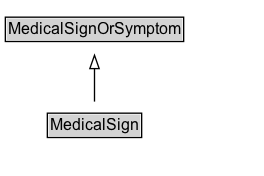

# MedicalSign

Any physical manifestation of a person's medical condition discoverable by objective diagnostic tests or physical examination.

## Diagram

=== "SVG (interactive)"

    <!-- Generated by graphviz version 14.1.3 (20260303.0454)
     -->
    <!-- Pages: 1 -->
    <svg width="198pt" height="132pt"
     viewBox="0.00 0.00 198.00 132.00" xmlns="http://www.w3.org/2000/svg" xmlns:xlink="http://www.w3.org/1999/xlink">
    <g id="graph0" class="graph" transform="scale(1 1) rotate(0) translate(4 128)">
    <polygon fill="white" stroke="none" points="-4,4 -4,-128 193.88,-128 193.88,4 -4,4"/>
    <g id="clust3" class="cluster">
    <title>cluster_associated</title>
    </g>
    <!-- MedicalSignOrSymptom -->
    <g id="node1" class="node">
    <title>MedicalSignOrSymptom</title>
    <g id="a_node1"><a xlink:href="../MedicalSignOrSymptom" xlink:title="&lt;TABLE&gt;">
    <polygon fill="lightgray" stroke="none" points="1,-97.88 1,-114.12 132.75,-114.12 132.75,-97.88 1,-97.88"/>
    <text xml:space="preserve" text-anchor="start" x="2" y="-101.88" font-family="Arial" font-size="12.00">MedicalSignOrSymptom</text>
    <polygon fill="none" stroke="black" points="0,-96.88 0,-115.12 133.75,-115.12 133.75,-96.88 0,-96.88"/>
    </a>
    </g>
    </g>
    <!-- MedicalSign -->
    <g id="node2" class="node">
    <title>MedicalSign</title>
    <g id="a_node2"><a xlink:href="../MedicalSign" xlink:title="&lt;TABLE&gt;">
    <polygon fill="lightgray" stroke="none" points="32.5,-25.88 32.5,-42.12 101.25,-42.12 101.25,-25.88 32.5,-25.88"/>
    <text xml:space="preserve" text-anchor="start" x="33.5" y="-29.88" font-family="Arial" font-size="12.00">MedicalSign</text>
    <polygon fill="none" stroke="black" points="31.5,-24.88 31.5,-43.12 102.25,-43.12 102.25,-24.88 31.5,-24.88"/>
    </a>
    </g>
    </g>
    <!-- MedicalSign&#45;&gt;MedicalSignOrSymptom -->
    <g id="edge1" class="edge">
    <title>MedicalSign&#45;&gt;MedicalSignOrSymptom</title>
    <path fill="none" stroke="black" d="M66.88,-51.79C66.88,-59.25 66.88,-68.24 66.88,-76.69"/>
    <polygon fill="none" stroke="black" points="63.38,-76.54 66.88,-86.54 70.38,-76.54 63.38,-76.54"/>
    </g>
    <!-- Invis -->
    </g>
    </svg>

=== "PNG"

    

## Specializations of MedicalSign

| Class | Description |
|-------|-------------|
| [Vital Sign](VitalSign.md) | Vital signs are measures of various physiological functions in order to assess the most basic body functions. |

## Formalization for MedicalSign

| Property | Constraint |
|----------|------------|
| subClassOf | [MedicalSignOrSymptom](MedicalSignOrSymptom.md) |

