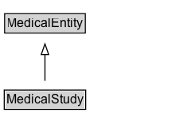

# MedicalStudy

A medical study is an umbrella type covering all kinds of research studies relating to human medicine or health, including observational studies and interventional trials and registries, randomized, controlled or not. When the specific type of study is known, use one of the extensions of this type, such as MedicalTrial or MedicalObservationalStudy. Also, note that this type should be used to mark up data that describes the study itself; to tag an article that publishes the results of a study, use MedicalScholarlyArticle. Note: use the code property of MedicalEntity to store study IDs, e.g. clinicaltrials.gov ID.

## Diagram

=== "SVG (interactive)"

    <!-- Generated by graphviz version 14.1.3 (20260303.0454)
     -->
    <!-- Pages: 1 -->
    <svg width="172pt" height="132pt"
     viewBox="0.00 0.00 172.00 132.00" xmlns="http://www.w3.org/2000/svg" xmlns:xlink="http://www.w3.org/1999/xlink">
    <g id="graph0" class="graph" transform="scale(1 1) rotate(0) translate(4 128)">
    <polygon fill="white" stroke="none" points="-4,4 -4,-128 168.38,-128 168.38,4 -4,4"/>
    <g id="clust3" class="cluster">
    <title>cluster_associated</title>
    </g>
    <!-- MedicalEntity -->
    <g id="node1" class="node">
    <title>MedicalEntity</title>
    <g id="a_node1"><a xlink:href="../MedicalEntity" xlink:title="&lt;TABLE&gt;">
    <polygon fill="lightgray" stroke="none" points="1.38,-97.88 1.38,-114.12 75.38,-114.12 75.38,-97.88 1.38,-97.88"/>
    <text xml:space="preserve" text-anchor="start" x="2.38" y="-101.88" font-family="Arial" font-size="12.00">MedicalEntity</text>
    <polygon fill="none" stroke="black" points="0.38,-96.88 0.38,-115.12 76.38,-115.12 76.38,-96.88 0.38,-96.88"/>
    </a>
    </g>
    </g>
    <!-- MedicalStudy -->
    <g id="node2" class="node">
    <title>MedicalStudy</title>
    <g id="a_node2"><a xlink:href="../MedicalStudy" xlink:title="&lt;TABLE&gt;">
    <polygon fill="lightgray" stroke="none" points="1,-25.88 1,-42.12 75.75,-42.12 75.75,-25.88 1,-25.88"/>
    <text xml:space="preserve" text-anchor="start" x="2" y="-29.88" font-family="Arial" font-size="12.00">MedicalStudy</text>
    <polygon fill="none" stroke="black" points="0,-24.88 0,-43.12 76.75,-43.12 76.75,-24.88 0,-24.88"/>
    </a>
    </g>
    </g>
    <!-- MedicalStudy&#45;&gt;MedicalEntity -->
    <g id="edge1" class="edge">
    <title>MedicalStudy&#45;&gt;MedicalEntity</title>
    <path fill="none" stroke="black" d="M38.38,-51.79C38.38,-59.25 38.38,-68.24 38.38,-76.69"/>
    <polygon fill="none" stroke="black" points="34.88,-76.54 38.38,-86.54 41.88,-76.54 34.88,-76.54"/>
    </g>
    <!-- Invis -->
    </g>
    </svg>

=== "PNG"

    

## Specializations of MedicalStudy

| Class | Description |
|-------|-------------|
| [Medical Observational Study](MedicalObservationalStudy.md) | An observational study is a type of medical study that attempts to infer the possible effect of a treatment through observation of a cohort of subjects over a period of time. In an observational study, the assignment of subjects into treatment groups versus control groups is outside the control of the investigator. This is in contrast with controlled studies, such as the randomized controlled trials represented by MedicalTrial, where each subject is randomly assigned to a treatment group or a control group before the start of the treatment. |
| [Medical Trial](MedicalTrial.md) | A medical trial is a type of medical study that uses a scientific process to compare the safety and efficacy of medical therapies or medical procedures. In general, medical trials are controlled and subjects are allocated at random to the different treatment and/or control groups. |

## Formalization for MedicalStudy

| Property | Constraint |
|----------|------------|
| subClassOf | [MedicalEntity](MedicalEntity.md) |

