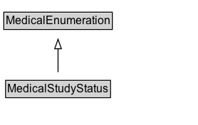

# MedicalStudyStatus

The status of a medical study. Enumerated type.

## Diagram

=== "SVG (interactive)"

    <!-- Generated by graphviz version 14.1.3 (20260303.0454)
     -->
    <!-- Pages: 1 -->
    <svg width="208pt" height="132pt"
     viewBox="0.00 0.00 208.00 132.00" xmlns="http://www.w3.org/2000/svg" xmlns:xlink="http://www.w3.org/1999/xlink">
    <g id="graph0" class="graph" transform="scale(1 1) rotate(0) translate(4 128)">
    <polygon fill="white" stroke="none" points="-4,4 -4,-128 204.12,-128 204.12,4 -4,4"/>
    <g id="clust3" class="cluster">
    <title>cluster_associated</title>
    </g>
    <!-- MedicalEnumeration -->
    <g id="node1" class="node">
    <title>MedicalEnumeration</title>
    <g id="a_node1"><a xlink:href="../MedicalEnumeration" xlink:title="&lt;TABLE&gt;">
    <polygon fill="lightgray" stroke="none" points="1,-97.88 1,-114.12 113.25,-114.12 113.25,-97.88 1,-97.88"/>
    <text xml:space="preserve" text-anchor="start" x="2" y="-101.88" font-family="Arial" font-size="12.00">MedicalEnumeration</text>
    <polygon fill="none" stroke="black" points="0,-96.88 0,-115.12 114.25,-115.12 114.25,-96.88 0,-96.88"/>
    </a>
    </g>
    </g>
    <!-- MedicalStudyStatus -->
    <g id="node2" class="node">
    <title>MedicalStudyStatus</title>
    <g id="a_node2"><a xlink:href="../MedicalStudyStatus" xlink:title="&lt;TABLE&gt;">
    <polygon fill="lightgray" stroke="none" points="2.88,-25.88 2.88,-42.12 111.38,-42.12 111.38,-25.88 2.88,-25.88"/>
    <text xml:space="preserve" text-anchor="start" x="3.88" y="-29.88" font-family="Arial" font-size="12.00">MedicalStudyStatus</text>
    <polygon fill="none" stroke="black" points="1.88,-24.88 1.88,-43.12 112.38,-43.12 112.38,-24.88 1.88,-24.88"/>
    </a>
    </g>
    </g>
    <!-- MedicalStudyStatus&#45;&gt;MedicalEnumeration -->
    <g id="edge1" class="edge">
    <title>MedicalStudyStatus&#45;&gt;MedicalEnumeration</title>
    <path fill="none" stroke="black" d="M57.12,-51.79C57.12,-59.25 57.12,-68.24 57.12,-76.69"/>
    <polygon fill="none" stroke="black" points="53.63,-76.54 57.13,-86.54 60.63,-76.54 53.63,-76.54"/>
    </g>
    <!-- Invis -->
    </g>
    </svg>

=== "PNG"

    

## Formalization for MedicalStudyStatus

| Property | Constraint |
|----------|------------|
| subClassOf | [MedicalEnumeration](MedicalEnumeration.md) |

