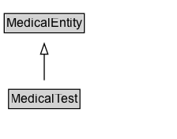

# MedicalTest

Any medical test, typically performed for diagnostic purposes.

## Diagram

=== "SVG (interactive)"

    <!-- Generated by graphviz version 14.1.3 (20260303.0454)
     -->
    <!-- Pages: 1 -->
    <svg width="168pt" height="132pt"
     viewBox="0.00 0.00 168.00 132.00" xmlns="http://www.w3.org/2000/svg" xmlns:xlink="http://www.w3.org/1999/xlink">
    <g id="graph0" class="graph" transform="scale(1 1) rotate(0) translate(4 128)">
    <polygon fill="white" stroke="none" points="-4,4 -4,-128 164,-128 164,4 -4,4"/>
    <g id="clust3" class="cluster">
    <title>cluster_associated</title>
    </g>
    <!-- MedicalEntity -->
    <g id="node1" class="node">
    <title>MedicalEntity</title>
    <g id="a_node1"><a xlink:href="../MedicalEntity" xlink:title="&lt;TABLE&gt;">
    <polygon fill="lightgray" stroke="none" points="1,-97.88 1,-114.12 75,-114.12 75,-97.88 1,-97.88"/>
    <text xml:space="preserve" text-anchor="start" x="2" y="-101.88" font-family="Arial" font-size="12.00">MedicalEntity</text>
    <polygon fill="none" stroke="black" points="0,-96.88 0,-115.12 76,-115.12 76,-96.88 0,-96.88"/>
    </a>
    </g>
    </g>
    <!-- MedicalTest -->
    <g id="node2" class="node">
    <title>MedicalTest</title>
    <g id="a_node2"><a xlink:href="../MedicalTest" xlink:title="&lt;TABLE&gt;">
    <polygon fill="lightgray" stroke="none" points="5.12,-25.88 5.12,-42.12 70.88,-42.12 70.88,-25.88 5.12,-25.88"/>
    <text xml:space="preserve" text-anchor="start" x="6.12" y="-29.88" font-family="Arial" font-size="12.00">MedicalTest</text>
    <polygon fill="none" stroke="black" points="4.12,-24.88 4.12,-43.12 71.88,-43.12 71.88,-24.88 4.12,-24.88"/>
    </a>
    </g>
    </g>
    <!-- MedicalTest&#45;&gt;MedicalEntity -->
    <g id="edge1" class="edge">
    <title>MedicalTest&#45;&gt;MedicalEntity</title>
    <path fill="none" stroke="black" d="M38,-51.79C38,-59.25 38,-68.24 38,-76.69"/>
    <polygon fill="none" stroke="black" points="34.5,-76.54 38,-86.54 41.5,-76.54 34.5,-76.54"/>
    </g>
    <!-- Invis -->
    </g>
    </svg>

=== "PNG"

    

## Specializations of MedicalTest

| Class | Description |
|-------|-------------|
| [Blood Test](BloodTest.md) | A medical test performed on a sample of a patient's blood. |
| [Imaging Test](ImagingTest.md) | Any medical imaging modality typically used for diagnostic purposes. |
| [Medical Test Panel](MedicalTestPanel.md) | Any collection of tests commonly ordered together. |
| [Pathology Test](PathologyTest.md) | A medical test performed by a laboratory that typically involves examination of a tissue sample by a pathologist. |

## Formalization for MedicalTest

| Property | Constraint |
|----------|------------|
| subClassOf | [MedicalEntity](MedicalEntity.md) |

