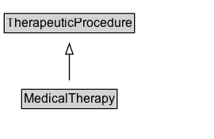

# MedicalTherapy

Any medical intervention designed to prevent, treat, and cure human diseases and medical conditions, including both curative and palliative therapies. Medical therapies are typically processes of care relying upon pharmacotherapy, behavioral therapy, supportive therapy (with fluid or nutrition for example), or detoxification (e.g. hemodialysis) aimed at improving or preventing a health condition.

## Diagram

=== "SVG (interactive)"

    <!-- Generated by graphviz version 14.1.3 (20260303.0454)
     -->
    <!-- Pages: 1 -->
    <svg width="203pt" height="132pt"
     viewBox="0.00 0.00 203.00 132.00" xmlns="http://www.w3.org/2000/svg" xmlns:xlink="http://www.w3.org/1999/xlink">
    <g id="graph0" class="graph" transform="scale(1 1) rotate(0) translate(4 128)">
    <polygon fill="white" stroke="none" points="-4,4 -4,-128 198.62,-128 198.62,4 -4,4"/>
    <g id="clust3" class="cluster">
    <title>cluster_associated</title>
    </g>
    <!-- TherapeuticProcedure -->
    <g id="node1" class="node">
    <title>TherapeuticProcedure</title>
    <g id="a_node1"><a xlink:href="../TherapeuticProcedure" xlink:title="&lt;TABLE&gt;">
    <polygon fill="lightgray" stroke="none" points="1,-97.88 1,-114.12 122.25,-114.12 122.25,-97.88 1,-97.88"/>
    <text xml:space="preserve" text-anchor="start" x="2" y="-101.88" font-family="Arial" font-size="12.00">TherapeuticProcedure</text>
    <polygon fill="none" stroke="black" points="0,-96.88 0,-115.12 123.25,-115.12 123.25,-96.88 0,-96.88"/>
    </a>
    </g>
    </g>
    <!-- MedicalTherapy -->
    <g id="node2" class="node">
    <title>MedicalTherapy</title>
    <g id="a_node2"><a xlink:href="../MedicalTherapy" xlink:title="&lt;TABLE&gt;">
    <polygon fill="lightgray" stroke="none" points="17.5,-25.88 17.5,-42.12 105.75,-42.12 105.75,-25.88 17.5,-25.88"/>
    <text xml:space="preserve" text-anchor="start" x="18.5" y="-29.88" font-family="Arial" font-size="12.00">MedicalTherapy</text>
    <polygon fill="none" stroke="black" points="16.5,-24.88 16.5,-43.12 106.75,-43.12 106.75,-24.88 16.5,-24.88"/>
    </a>
    </g>
    </g>
    <!-- MedicalTherapy&#45;&gt;TherapeuticProcedure -->
    <g id="edge1" class="edge">
    <title>MedicalTherapy&#45;&gt;TherapeuticProcedure</title>
    <path fill="none" stroke="black" d="M61.62,-51.79C61.62,-59.25 61.62,-68.24 61.62,-76.69"/>
    <polygon fill="none" stroke="black" points="58.13,-76.54 61.63,-86.54 65.13,-76.54 58.13,-76.54"/>
    </g>
    <!-- Invis -->
    </g>
    </svg>

=== "PNG"

    

## Specializations of MedicalTherapy

| Class | Description |
|-------|-------------|
| [Occupational Therapy](OccupationalTherapy.md) | A treatment of people with physical, emotional, or social problems, using purposeful activity to help them overcome or learn to deal with their problems. |
| [Palliative Procedure](PalliativeProcedure.md) | A medical procedure intended primarily for palliative purposes, aimed at relieving the symptoms of an underlying health condition. |
| [Physical Therapy](PhysicalTherapy.md) | A process of progressive physical care and rehabilitation aimed at improving a health condition. |
| [Radiation Therapy](RadiationTherapy.md) | A process of care using radiation aimed at improving a health condition. |

## Formalization for MedicalTherapy

| Property | Constraint |
|----------|------------|
| subClassOf | [TherapeuticProcedure](TherapeuticProcedure.md) |

