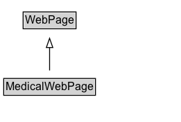

# MedicalWebPage

A web page that provides medical information.

## Diagram

=== "SVG (interactive)"

    <!-- Generated by graphviz version 14.1.3 (20260303.0454)
     -->
    <!-- Pages: 1 -->
    <svg width="196pt" height="132pt"
     viewBox="0.00 0.00 196.00 132.00" xmlns="http://www.w3.org/2000/svg" xmlns:xlink="http://www.w3.org/1999/xlink">
    <g id="graph0" class="graph" transform="scale(1 1) rotate(0) translate(4 128)">
    <polygon fill="white" stroke="none" points="-4,4 -4,-128 191.62,-128 191.62,4 -4,4"/>
    <g id="clust3" class="cluster">
    <title>cluster_associated</title>
    </g>
    <!-- WebPage -->
    <g id="node1" class="node">
    <title>WebPage</title>
    <g id="a_node1"><a xlink:href="../WebPage" xlink:title="&lt;TABLE&gt;">
    <polygon fill="lightgray" stroke="none" points="22,-97.88 22,-114.12 77.25,-114.12 77.25,-97.88 22,-97.88"/>
    <text xml:space="preserve" text-anchor="start" x="23" y="-101.88" font-family="Arial" font-size="12.00">WebPage</text>
    <polygon fill="none" stroke="black" points="21,-96.88 21,-115.12 78.25,-115.12 78.25,-96.88 21,-96.88"/>
    </a>
    </g>
    </g>
    <!-- MedicalWebPage -->
    <g id="node2" class="node">
    <title>MedicalWebPage</title>
    <g id="a_node2"><a xlink:href="../MedicalWebPage" xlink:title="&lt;TABLE&gt;">
    <polygon fill="lightgray" stroke="none" points="1,-25.88 1,-42.12 98.25,-42.12 98.25,-25.88 1,-25.88"/>
    <text xml:space="preserve" text-anchor="start" x="2" y="-29.88" font-family="Arial" font-size="12.00">MedicalWebPage</text>
    <polygon fill="none" stroke="black" points="0,-24.88 0,-43.12 99.25,-43.12 99.25,-24.88 0,-24.88"/>
    </a>
    </g>
    </g>
    <!-- MedicalWebPage&#45;&gt;WebPage -->
    <g id="edge1" class="edge">
    <title>MedicalWebPage&#45;&gt;WebPage</title>
    <path fill="none" stroke="black" d="M49.62,-51.79C49.62,-59.25 49.62,-68.24 49.62,-76.69"/>
    <polygon fill="none" stroke="black" points="46.13,-76.54 49.63,-86.54 53.13,-76.54 46.13,-76.54"/>
    </g>
    <!-- Invis -->
    </g>
    </svg>

=== "PNG"

    

## Formalization for MedicalWebPage

| Property | Constraint |
|----------|------------|
| subClassOf | [WebPage](WebPage.md) |

