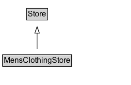

# MensClothingStore

A men's clothing store.

## Diagram

=== "SVG (interactive)"

    <!-- Generated by graphviz version 14.1.3 (20260303.0454)
     -->
    <!-- Pages: 1 -->
    <svg width="202pt" height="132pt"
     viewBox="0.00 0.00 202.00 132.00" xmlns="http://www.w3.org/2000/svg" xmlns:xlink="http://www.w3.org/1999/xlink">
    <g id="graph0" class="graph" transform="scale(1 1) rotate(0) translate(4 128)">
    <polygon fill="white" stroke="none" points="-4,4 -4,-128 198.38,-128 198.38,4 -4,4"/>
    <g id="clust3" class="cluster">
    <title>cluster_associated</title>
    </g>
    <!-- Store -->
    <g id="node1" class="node">
    <title>Store</title>
    <g id="a_node1"><a xlink:href="../Store" xlink:title="&lt;TABLE&gt;">
    <polygon fill="lightgray" stroke="none" points="38.12,-97.88 38.12,-114.12 68.62,-114.12 68.62,-97.88 38.12,-97.88"/>
    <text xml:space="preserve" text-anchor="start" x="39.12" y="-101.88" font-family="Arial" font-size="12.00">Store</text>
    <polygon fill="none" stroke="black" points="37.12,-96.88 37.12,-115.12 69.62,-115.12 69.62,-96.88 37.12,-96.88"/>
    </a>
    </g>
    </g>
    <!-- MensClothingStore -->
    <g id="node2" class="node">
    <title>MensClothingStore</title>
    <g id="a_node2"><a xlink:href="../MensClothingStore" xlink:title="&lt;TABLE&gt;">
    <polygon fill="lightgray" stroke="none" points="1,-25.88 1,-42.12 105.75,-42.12 105.75,-25.88 1,-25.88"/>
    <text xml:space="preserve" text-anchor="start" x="2" y="-29.88" font-family="Arial" font-size="12.00">MensClothingStore</text>
    <polygon fill="none" stroke="black" points="0,-24.88 0,-43.12 106.75,-43.12 106.75,-24.88 0,-24.88"/>
    </a>
    </g>
    </g>
    <!-- MensClothingStore&#45;&gt;Store -->
    <g id="edge1" class="edge">
    <title>MensClothingStore&#45;&gt;Store</title>
    <path fill="none" stroke="black" d="M53.38,-51.79C53.38,-59.25 53.38,-68.24 53.38,-76.69"/>
    <polygon fill="none" stroke="black" points="49.88,-76.54 53.38,-86.54 56.88,-76.54 49.88,-76.54"/>
    </g>
    <!-- Invis -->
    </g>
    </svg>

=== "PNG"

    

## Formalization for MensClothingStore

| Property | Constraint |
|----------|------------|
| subClassOf | [Store](Store.md) |

