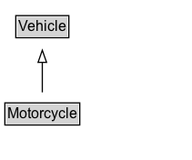

# Motorcycle

A motorcycle or motorbike is a single-track, two-wheeled motor vehicle.

## Diagram

=== "SVG (interactive)"

    <!-- Generated by graphviz version 14.1.3 (20260303.0454)
     -->
    <!-- Pages: 1 -->
    <svg width="158pt" height="132pt"
     viewBox="0.00 0.00 158.00 132.00" xmlns="http://www.w3.org/2000/svg" xmlns:xlink="http://www.w3.org/1999/xlink">
    <g id="graph0" class="graph" transform="scale(1 1) rotate(0) translate(4 128)">
    <polygon fill="white" stroke="none" points="-4,4 -4,-128 153.88,-128 153.88,4 -4,4"/>
    <g id="clust3" class="cluster">
    <title>cluster_associated</title>
    </g>
    <!-- Vehicle -->
    <g id="node1" class="node">
    <title>Vehicle</title>
    <g id="a_node1"><a xlink:href="../Vehicle" xlink:title="&lt;TABLE&gt;">
    <polygon fill="lightgray" stroke="none" points="10,-97.88 10,-114.12 51.75,-114.12 51.75,-97.88 10,-97.88"/>
    <text xml:space="preserve" text-anchor="start" x="11" y="-101.88" font-family="Arial" font-size="12.00">Vehicle</text>
    <polygon fill="none" stroke="black" points="9,-96.88 9,-115.12 52.75,-115.12 52.75,-96.88 9,-96.88"/>
    </a>
    </g>
    </g>
    <!-- Motorcycle -->
    <g id="node2" class="node">
    <title>Motorcycle</title>
    <g id="a_node2"><a xlink:href="../Motorcycle" xlink:title="&lt;TABLE&gt;">
    <polygon fill="lightgray" stroke="none" points="1,-25.88 1,-42.12 60.75,-42.12 60.75,-25.88 1,-25.88"/>
    <text xml:space="preserve" text-anchor="start" x="2" y="-29.88" font-family="Arial" font-size="12.00">Motorcycle</text>
    <polygon fill="none" stroke="black" points="0,-24.88 0,-43.12 61.75,-43.12 61.75,-24.88 0,-24.88"/>
    </a>
    </g>
    </g>
    <!-- Motorcycle&#45;&gt;Vehicle -->
    <g id="edge1" class="edge">
    <title>Motorcycle&#45;&gt;Vehicle</title>
    <path fill="none" stroke="black" d="M30.88,-51.79C30.88,-59.25 30.88,-68.24 30.88,-76.69"/>
    <polygon fill="none" stroke="black" points="27.38,-76.54 30.88,-86.54 34.38,-76.54 27.38,-76.54"/>
    </g>
    <!-- Invis -->
    </g>
    </svg>

=== "PNG"

    

## Formalization for Motorcycle

| Property | Constraint |
|----------|------------|
| subClassOf | [Vehicle](Vehicle.md) |

