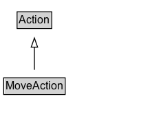

# MoveAction

The act of an agent relocating to a place.\n\nRelated actions:\n\n* [[TransferAction]]: Unlike TransferAction, the subject of the move is a living Person or Organization rather than an inanimate object.

## Diagram

=== "SVG (interactive)"

    <!-- Generated by graphviz version 14.1.3 (20260303.0454)
     -->
    <!-- Pages: 1 -->
    <svg width="164pt" height="132pt"
     viewBox="0.00 0.00 164.00 132.00" xmlns="http://www.w3.org/2000/svg" xmlns:xlink="http://www.w3.org/1999/xlink">
    <g id="graph0" class="graph" transform="scale(1 1) rotate(0) translate(4 128)">
    <polygon fill="white" stroke="none" points="-4,4 -4,-128 159.5,-128 159.5,4 -4,4"/>
    <g id="clust3" class="cluster">
    <title>cluster_associated</title>
    </g>
    <!-- Action -->
    <g id="node1" class="node">
    <title>Action</title>
    <g id="a_node1"><a xlink:href="../Action" xlink:title="&lt;TABLE&gt;">
    <polygon fill="lightgray" stroke="none" points="15.62,-97.88 15.62,-114.12 51.38,-114.12 51.38,-97.88 15.62,-97.88"/>
    <text xml:space="preserve" text-anchor="start" x="16.62" y="-101.88" font-family="Arial" font-size="12.00">Action</text>
    <polygon fill="none" stroke="black" points="14.62,-96.88 14.62,-115.12 52.38,-115.12 52.38,-96.88 14.62,-96.88"/>
    </a>
    </g>
    </g>
    <!-- MoveAction -->
    <g id="node2" class="node">
    <title>MoveAction</title>
    <g id="a_node2"><a xlink:href="../MoveAction" xlink:title="&lt;TABLE&gt;">
    <polygon fill="lightgray" stroke="none" points="1,-25.88 1,-42.12 66,-42.12 66,-25.88 1,-25.88"/>
    <text xml:space="preserve" text-anchor="start" x="2" y="-29.88" font-family="Arial" font-size="12.00">MoveAction</text>
    <polygon fill="none" stroke="black" points="0,-24.88 0,-43.12 67,-43.12 67,-24.88 0,-24.88"/>
    </a>
    </g>
    </g>
    <!-- MoveAction&#45;&gt;Action -->
    <g id="edge1" class="edge">
    <title>MoveAction&#45;&gt;Action</title>
    <path fill="none" stroke="black" d="M33.5,-51.79C33.5,-59.25 33.5,-68.24 33.5,-76.69"/>
    <polygon fill="none" stroke="black" points="30,-76.54 33.5,-86.54 37,-76.54 30,-76.54"/>
    </g>
    <!-- Invis -->
    </g>
    </svg>

=== "PNG"

    

## Specializations of MoveAction

| Class | Description |
|-------|-------------|
| [Arrive Action](ArriveAction.md) | The act of arriving at a place. An agent arrives at a destination from a fromLocation, optionally with participants. |
| [Depart Action](DepartAction.md) | The act of  departing from a place. An agent departs from a fromLocation for a destination, optionally with participants. |
| [Travel Action](TravelAction.md) | The act of traveling from a fromLocation to a destination by a specified mode of transport, optionally with participants. |

## Formalization for MoveAction

| Property | Constraint |
|----------|------------|
| subClassOf | [Action](Action.md) |

