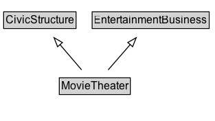

# MovieTheater

A movie theater.

## Diagram

=== "SVG (interactive)"

    <!-- Generated by graphviz version 14.1.3 (20260303.0454)
     -->
    <!-- Pages: 1 -->
    <svg width="235pt" height="132pt"
     viewBox="0.00 0.00 235.00 132.00" xmlns="http://www.w3.org/2000/svg" xmlns:xlink="http://www.w3.org/1999/xlink">
    <g id="graph0" class="graph" transform="scale(1 1) rotate(0) translate(4 128)">
    <polygon fill="white" stroke="none" points="-4,4 -4,-128 230.5,-128 230.5,4 -4,4"/>
    <g id="clust3" class="cluster">
    <title>cluster_associated</title>
    </g>
    <!-- CivicStructure -->
    <g id="node1" class="node">
    <title>CivicStructure</title>
    <g id="a_node1"><a xlink:href="../CivicStructure" xlink:title="&lt;TABLE&gt;">
    <polygon fill="lightgray" stroke="none" points="1,-97.88 1,-114.12 78,-114.12 78,-97.88 1,-97.88"/>
    <text xml:space="preserve" text-anchor="start" x="2" y="-101.88" font-family="Arial" font-size="12.00">CivicStructure</text>
    <polygon fill="none" stroke="black" points="0,-96.88 0,-115.12 79,-115.12 79,-96.88 0,-96.88"/>
    </a>
    </g>
    </g>
    <!-- EntertainmentBusiness -->
    <g id="node2" class="node">
    <title>EntertainmentBusiness</title>
    <g id="a_node2"><a xlink:href="../EntertainmentBusiness" xlink:title="&lt;TABLE&gt;">
    <polygon fill="lightgray" stroke="none" points="97.62,-97.88 97.62,-114.12 223.38,-114.12 223.38,-97.88 97.62,-97.88"/>
    <text xml:space="preserve" text-anchor="start" x="98.62" y="-101.88" font-family="Arial" font-size="12.00">EntertainmentBusiness</text>
    <polygon fill="none" stroke="black" points="96.62,-96.88 96.62,-115.12 224.38,-115.12 224.38,-96.88 96.62,-96.88"/>
    </a>
    </g>
    </g>
    <!-- MovieTheater -->
    <g id="node3" class="node">
    <title>MovieTheater</title>
    <g id="a_node3"><a xlink:href="../MovieTheater" xlink:title="&lt;TABLE&gt;">
    <polygon fill="lightgray" stroke="none" points="61.75,-25.88 61.75,-42.12 137.25,-42.12 137.25,-25.88 61.75,-25.88"/>
    <text xml:space="preserve" text-anchor="start" x="62.75" y="-29.88" font-family="Arial" font-size="12.00">MovieTheater</text>
    <polygon fill="none" stroke="black" points="60.75,-24.88 60.75,-43.12 138.25,-43.12 138.25,-24.88 60.75,-24.88"/>
    </a>
    </g>
    </g>
    <!-- MovieTheater&#45;&gt;CivicStructure -->
    <g id="edge1" class="edge">
    <title>MovieTheater&#45;&gt;CivicStructure</title>
    <path fill="none" stroke="black" d="M85.11,-51.79C77.98,-60.11 69.22,-70.32 61.29,-79.58"/>
    <polygon fill="none" stroke="black" points="58.86,-77.04 55.01,-86.91 64.17,-81.59 58.86,-77.04"/>
    </g>
    <!-- MovieTheater&#45;&gt;EntertainmentBusiness -->
    <g id="edge2" class="edge">
    <title>MovieTheater&#45;&gt;EntertainmentBusiness</title>
    <path fill="none" stroke="black" d="M114.13,-51.79C121.38,-60.11 130.28,-70.32 138.34,-79.58"/>
    <polygon fill="none" stroke="black" points="135.53,-81.67 144.74,-86.91 140.81,-77.08 135.53,-81.67"/>
    </g>
    <!-- Invis -->
    </g>
    </svg>

=== "PNG"

    

## Formalization for MovieTheater

| Property | Constraint |
|----------|------------|
| subClassOf | [CivicStructure](CivicStructure.md) |
| subClassOf | [EntertainmentBusiness](EntertainmentBusiness.md) |

