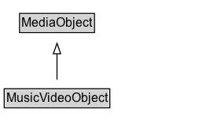

# MusicVideoObject

A music video file.

## Diagram

=== "SVG (interactive)"

    <!-- Generated by graphviz version 14.1.3 (20260303.0454)
     -->
    <!-- Pages: 1 -->
    <svg width="196pt" height="132pt"
     viewBox="0.00 0.00 196.00 132.00" xmlns="http://www.w3.org/2000/svg" xmlns:xlink="http://www.w3.org/1999/xlink">
    <g id="graph0" class="graph" transform="scale(1 1) rotate(0) translate(4 128)">
    <polygon fill="white" stroke="none" points="-4,4 -4,-128 192.38,-128 192.38,4 -4,4"/>
    <g id="clust3" class="cluster">
    <title>cluster_associated</title>
    </g>
    <!-- MediaObject -->
    <g id="node1" class="node">
    <title>MediaObject</title>
    <g id="a_node1"><a xlink:href="../MediaObject" xlink:title="&lt;TABLE&gt;">
    <polygon fill="lightgray" stroke="none" points="15.62,-97.88 15.62,-114.12 85.12,-114.12 85.12,-97.88 15.62,-97.88"/>
    <text xml:space="preserve" text-anchor="start" x="16.62" y="-101.88" font-family="Arial" font-size="12.00">MediaObject</text>
    <polygon fill="none" stroke="black" points="14.62,-96.88 14.62,-115.12 86.12,-115.12 86.12,-96.88 14.62,-96.88"/>
    </a>
    </g>
    </g>
    <!-- MusicVideoObject -->
    <g id="node2" class="node">
    <title>MusicVideoObject</title>
    <g id="a_node2"><a xlink:href="../MusicVideoObject" xlink:title="&lt;TABLE&gt;">
    <polygon fill="lightgray" stroke="none" points="1,-25.88 1,-42.12 99.75,-42.12 99.75,-25.88 1,-25.88"/>
    <text xml:space="preserve" text-anchor="start" x="2" y="-29.88" font-family="Arial" font-size="12.00">MusicVideoObject</text>
    <polygon fill="none" stroke="black" points="0,-24.88 0,-43.12 100.75,-43.12 100.75,-24.88 0,-24.88"/>
    </a>
    </g>
    </g>
    <!-- MusicVideoObject&#45;&gt;MediaObject -->
    <g id="edge1" class="edge">
    <title>MusicVideoObject&#45;&gt;MediaObject</title>
    <path fill="none" stroke="black" d="M50.38,-51.79C50.38,-59.25 50.38,-68.24 50.38,-76.69"/>
    <polygon fill="none" stroke="black" points="46.88,-76.54 50.38,-86.54 53.88,-76.54 46.88,-76.54"/>
    </g>
    <!-- Invis -->
    </g>
    </svg>

=== "PNG"

    

## Formalization for MusicVideoObject

| Property | Constraint |
|----------|------------|
| subClassOf | [MediaObject](MediaObject.md) |

