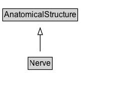

# Nerve

A common pathway for the electrochemical nerve impulses that are transmitted along each of the axons.

## Diagram

=== "SVG (interactive)"

    <!-- Generated by graphviz version 14.1.3 (20260303.0454)
     -->
    <!-- Pages: 1 -->
    <svg width="179pt" height="132pt"
     viewBox="0.00 0.00 179.00 132.00" xmlns="http://www.w3.org/2000/svg" xmlns:xlink="http://www.w3.org/1999/xlink">
    <g id="graph0" class="graph" transform="scale(1 1) rotate(0) translate(4 128)">
    <polygon fill="white" stroke="none" points="-4,4 -4,-128 175,-128 175,4 -4,4"/>
    <g id="clust3" class="cluster">
    <title>cluster_associated</title>
    </g>
    <!-- AnatomicalStructure -->
    <g id="node1" class="node">
    <title>AnatomicalStructure</title>
    <g id="a_node1"><a xlink:href="../AnatomicalStructure" xlink:title="&lt;TABLE&gt;">
    <polygon fill="lightgray" stroke="none" points="1,-97.88 1,-114.12 111,-114.12 111,-97.88 1,-97.88"/>
    <text xml:space="preserve" text-anchor="start" x="2" y="-101.88" font-family="Arial" font-size="12.00">AnatomicalStructure</text>
    <polygon fill="none" stroke="black" points="0,-96.88 0,-115.12 112,-115.12 112,-96.88 0,-96.88"/>
    </a>
    </g>
    </g>
    <!-- Nerve -->
    <g id="node2" class="node">
    <title>Nerve</title>
    <g id="a_node2"><a xlink:href="../Nerve" xlink:title="&lt;TABLE&gt;">
    <polygon fill="lightgray" stroke="none" points="38.88,-25.88 38.88,-42.12 73.12,-42.12 73.12,-25.88 38.88,-25.88"/>
    <text xml:space="preserve" text-anchor="start" x="39.88" y="-29.88" font-family="Arial" font-size="12.00">Nerve</text>
    <polygon fill="none" stroke="black" points="37.88,-24.88 37.88,-43.12 74.12,-43.12 74.12,-24.88 37.88,-24.88"/>
    </a>
    </g>
    </g>
    <!-- Nerve&#45;&gt;AnatomicalStructure -->
    <g id="edge1" class="edge">
    <title>Nerve&#45;&gt;AnatomicalStructure</title>
    <path fill="none" stroke="black" d="M56,-51.79C56,-59.25 56,-68.24 56,-76.69"/>
    <polygon fill="none" stroke="black" points="52.5,-76.54 56,-86.54 59.5,-76.54 52.5,-76.54"/>
    </g>
    <!-- Invis -->
    </g>
    </svg>

=== "PNG"

    

## Formalization for Nerve

| Property | Constraint |
|----------|------------|
| subClassOf | [AnatomicalStructure](AnatomicalStructure.md) |

