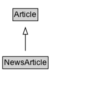

# NewsArticle

A NewsArticle is an article whose content reports news, or provides background context and supporting materials for understanding the news.

A more detailed overview of [schema.org News markup](/docs/news.html) is also available.

## Diagram

=== "SVG (interactive)"

    <!-- Generated by graphviz version 14.1.3 (20260303.0454)
     -->
    <!-- Pages: 1 -->
    <svg width="164pt" height="132pt"
     viewBox="0.00 0.00 164.00 132.00" xmlns="http://www.w3.org/2000/svg" xmlns:xlink="http://www.w3.org/1999/xlink">
    <g id="graph0" class="graph" transform="scale(1 1) rotate(0) translate(4 128)">
    <polygon fill="white" stroke="none" points="-4,4 -4,-128 160.25,-128 160.25,4 -4,4"/>
    <g id="clust3" class="cluster">
    <title>cluster_associated</title>
    </g>
    <!-- Article -->
    <g id="node1" class="node">
    <title>Article</title>
    <g id="a_node1"><a xlink:href="../Article" xlink:title="&lt;TABLE&gt;">
    <polygon fill="lightgray" stroke="none" points="16.38,-97.88 16.38,-114.12 52.12,-114.12 52.12,-97.88 16.38,-97.88"/>
    <text xml:space="preserve" text-anchor="start" x="17.38" y="-101.88" font-family="Arial" font-size="12.00">Article</text>
    <polygon fill="none" stroke="black" points="15.38,-96.88 15.38,-115.12 53.12,-115.12 53.12,-96.88 15.38,-96.88"/>
    </a>
    </g>
    </g>
    <!-- NewsArticle -->
    <g id="node2" class="node">
    <title>NewsArticle</title>
    <g id="a_node2"><a xlink:href="../NewsArticle" xlink:title="&lt;TABLE&gt;">
    <polygon fill="lightgray" stroke="none" points="1,-25.88 1,-42.12 67.5,-42.12 67.5,-25.88 1,-25.88"/>
    <text xml:space="preserve" text-anchor="start" x="2" y="-29.88" font-family="Arial" font-size="12.00">NewsArticle</text>
    <polygon fill="none" stroke="black" points="0,-24.88 0,-43.12 68.5,-43.12 68.5,-24.88 0,-24.88"/>
    </a>
    </g>
    </g>
    <!-- NewsArticle&#45;&gt;Article -->
    <g id="edge1" class="edge">
    <title>NewsArticle&#45;&gt;Article</title>
    <path fill="none" stroke="black" d="M34.25,-51.79C34.25,-59.25 34.25,-68.24 34.25,-76.69"/>
    <polygon fill="none" stroke="black" points="30.75,-76.54 34.25,-86.54 37.75,-76.54 30.75,-76.54"/>
    </g>
    <!-- Invis -->
    </g>
    </svg>

=== "PNG"

    

## Specializations of NewsArticle

| Class | Description |
|-------|-------------|
| [Analysis News Article](AnalysisNewsArticle.md) | An AnalysisNewsArticle is a [[NewsArticle]] that, while based on factual reporting, incorporates the expertise of the author/producer, offering interpretations and conclusions. |
| [Ask Public News Article](AskPublicNewsArticle.md) | A [[NewsArticle]] expressing an open call by a [[NewsMediaOrganization]] asking the public for input, insights, clarifications, anecdotes, documentation, etc., on an issue, for reporting purposes. |
| [Background News Article](BackgroundNewsArticle.md) | A [[NewsArticle]] providing historical context, definition and detail on a specific topic (aka "explainer" or "backgrounder"). For example, an in-depth article or frequently-asked-questions ([FAQ](https://en.wikipedia.org/wiki/FAQ)) document on topics such as Climate Change or the European Union. Other kinds of background material from a non-news setting are often described using [[Book]] or [[Article]], in particular [[ScholarlyArticle]]. See also [[NewsArticle]] for related vocabulary from a learning/education perspective. |
| [Opinion News Article](OpinionNewsArticle.md) | An [[OpinionNewsArticle]] is a [[NewsArticle]] that primarily expresses opinions rather than journalistic reporting of news and events. For example, a [[NewsArticle]] consisting of a column or [[Blog]]/[[BlogPosting]] entry in the Opinions section of a news publication.  |
| [Reportage News Article](ReportageNewsArticle.md) | The [[ReportageNewsArticle]] type is a subtype of [[NewsArticle]] representing
 news articles which are the result of journalistic news reporting conventions.

In practice many news publishers produce a wide variety of article types, many of which might be considered a [[NewsArticle]] but not a [[ReportageNewsArticle]]. For example, opinion pieces, reviews, analysis, sponsored or satirical articles, or articles that combine several of these elements.

The [[ReportageNewsArticle]] type is based on a stricter ideal for "news" as a work of journalism, with articles based on factual information either observed or verified by the author, or reported and verified from knowledgeable sources.  This often includes perspectives from multiple viewpoints on a particular issue (distinguishing news reports from public relations or propaganda).  News reports in the [[ReportageNewsArticle]] sense de-emphasize the opinion of the author, with commentary and value judgements typically expressed elsewhere.

A [[ReportageNewsArticle]] which goes deeper into analysis can also be marked with an additional type of [[AnalysisNewsArticle]].
 |
| [Review News Article](ReviewNewsArticle.md) | A [[NewsArticle]] and [[CriticReview]] providing a professional critic's assessment of a service, product, performance, or artistic or literary work. |

## Formalization for NewsArticle

| Property | Constraint |
|----------|------------|
| subClassOf | [Article](Article.md) |

