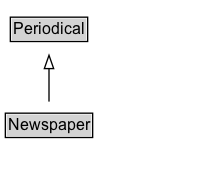

# Newspaper

A publication containing information about varied topics that are pertinent to general information, a geographic area, or a specific subject matter (i.e. business, culture, education). Often published daily.

## Diagram

=== "SVG (interactive)"

    <!-- Generated by graphviz version 14.1.3 (20260303.0454)
     -->
    <!-- Pages: 1 -->
    <svg width="162pt" height="132pt"
     viewBox="0.00 0.00 162.00 132.00" xmlns="http://www.w3.org/2000/svg" xmlns:xlink="http://www.w3.org/1999/xlink">
    <g id="graph0" class="graph" transform="scale(1 1) rotate(0) translate(4 128)">
    <polygon fill="white" stroke="none" points="-4,4 -4,-128 157.75,-128 157.75,4 -4,4"/>
    <g id="clust3" class="cluster">
    <title>cluster_associated</title>
    </g>
    <!-- Periodical -->
    <g id="node1" class="node">
    <title>Periodical</title>
    <g id="a_node1"><a xlink:href="../Periodical" xlink:title="&lt;TABLE&gt;">
    <polygon fill="lightgray" stroke="none" points="4.75,-97.88 4.75,-114.12 60.75,-114.12 60.75,-97.88 4.75,-97.88"/>
    <text xml:space="preserve" text-anchor="start" x="5.75" y="-101.88" font-family="Arial" font-size="12.00">Periodical</text>
    <polygon fill="none" stroke="black" points="3.75,-96.88 3.75,-115.12 61.75,-115.12 61.75,-96.88 3.75,-96.88"/>
    </a>
    </g>
    </g>
    <!-- Newspaper -->
    <g id="node2" class="node">
    <title>Newspaper</title>
    <g id="a_node2"><a xlink:href="../Newspaper" xlink:title="&lt;TABLE&gt;">
    <polygon fill="lightgray" stroke="none" points="1,-25.88 1,-42.12 64.5,-42.12 64.5,-25.88 1,-25.88"/>
    <text xml:space="preserve" text-anchor="start" x="2" y="-29.88" font-family="Arial" font-size="12.00">Newspaper</text>
    <polygon fill="none" stroke="black" points="0,-24.88 0,-43.12 65.5,-43.12 65.5,-24.88 0,-24.88"/>
    </a>
    </g>
    </g>
    <!-- Newspaper&#45;&gt;Periodical -->
    <g id="edge1" class="edge">
    <title>Newspaper&#45;&gt;Periodical</title>
    <path fill="none" stroke="black" d="M32.75,-51.79C32.75,-59.25 32.75,-68.24 32.75,-76.69"/>
    <polygon fill="none" stroke="black" points="29.25,-76.54 32.75,-86.54 36.25,-76.54 29.25,-76.54"/>
    </g>
    <!-- Invis -->
    </g>
    </svg>

=== "PNG"

    

## Formalization for Newspaper

| Property | Constraint |
|----------|------------|
| subClassOf | [Periodical](Periodical.md) |

