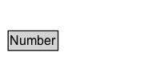

# Number

Data type: Number.\n\nUsage guidelines:\n\n* Use values from 0123456789 (Unicode 'DIGIT ZERO' (U+0030) to 'DIGIT NINE' (U+0039)) rather than superficially similar Unicode symbols.\n* Use '.' (Unicode 'FULL STOP' (U+002E)) rather than ',' to indicate a decimal point. Avoid using these symbols as a readability separator.

## Diagram

=== "SVG (interactive)"

    <!-- Generated by graphviz version 14.1.3 (20260303.0454)
     -->
    <!-- Pages: 1 -->
    <svg width="150pt" height="76pt"
     viewBox="0.00 0.00 150.00 76.00" xmlns="http://www.w3.org/2000/svg" xmlns:xlink="http://www.w3.org/1999/xlink">
    <g id="graph0" class="graph" transform="scale(1 1) rotate(0) translate(4 72)">
    <polygon fill="white" stroke="none" points="-4,4 -4,-72 146,-72 146,4 -4,4"/>
    <g id="clust3" class="cluster">
    <title>cluster_associated</title>
    </g>
    <!-- Number -->
    <g id="node1" class="node">
    <title>Number</title>
    <g id="a_node1"><a xlink:href="../Number" xlink:title="&lt;TABLE&gt;">
    <polygon fill="lightgray" stroke="none" points="4.62,-25.88 4.62,-42.12 49.38,-42.12 49.38,-25.88 4.62,-25.88"/>
    <text xml:space="preserve" text-anchor="start" x="5.62" y="-29.88" font-family="Arial" font-size="12.00">Number</text>
    <polygon fill="none" stroke="black" points="3.62,-24.88 3.62,-43.12 50.38,-43.12 50.38,-24.88 3.62,-24.88"/>
    </a>
    </g>
    </g>
    <!-- Invis -->
    </g>
    </svg>

=== "PNG"

    

## Specializations of Number

| Class | Description |
|-------|-------------|
| [Float](Float.md) | Data type: Floating number. |
| [Integer](Integer.md) | Data type: Integer. |

