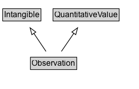

# Observation

Instances of the class [[Observation]] are used to specify observations about an entity at a particular time. The principal properties of an [[Observation]] are [[observationAbout]], [[measuredProperty]], [[statType]], [[value] and [[observationDate]]  and [[measuredProperty]]. Some but not all Observations represent a [[QuantitativeValue]]. Quantitative observations can be about a [[StatisticalVariable]], which is an abstract specification about which we can make observations that are grounded at a particular location and time.

Observations can also encode a subset of simple RDF-like statements (its observationAbout, a StatisticalVariable, defining the measuredPoperty; its observationAbout property indicating the entity the statement is about, and [[value]] )

In the context of a quantitative knowledge graph, typical properties could include [[measuredProperty]], [[observationAbout]], [[observationDate]], [[value]], [[unitCode]], [[unitText]], [[measurementMethod]].
    

## Diagram

=== "SVG (interactive)"

    <!-- Generated by graphviz version 14.1.3 (20260303.0454)
     -->
    <!-- Pages: 1 -->
    <svg width="205pt" height="132pt"
     viewBox="0.00 0.00 205.00 132.00" xmlns="http://www.w3.org/2000/svg" xmlns:xlink="http://www.w3.org/1999/xlink">
    <g id="graph0" class="graph" transform="scale(1 1) rotate(0) translate(4 128)">
    <polygon fill="white" stroke="none" points="-4,4 -4,-128 201.25,-128 201.25,4 -4,4"/>
    <g id="clust3" class="cluster">
    <title>cluster_associated</title>
    </g>
    <!-- Intangible -->
    <g id="node1" class="node">
    <title>Intangible</title>
    <g id="a_node1"><a xlink:href="../Intangible" xlink:title="&lt;TABLE&gt;">
    <polygon fill="lightgray" stroke="none" points="1,-97.88 1,-114.12 55.5,-114.12 55.5,-97.88 1,-97.88"/>
    <text xml:space="preserve" text-anchor="start" x="2" y="-101.88" font-family="Arial" font-size="12.00">Intangible</text>
    <polygon fill="none" stroke="black" points="0,-96.88 0,-115.12 56.5,-115.12 56.5,-96.88 0,-96.88"/>
    </a>
    </g>
    </g>
    <!-- QuantitativeValue -->
    <g id="node2" class="node">
    <title>QuantitativeValue</title>
    <g id="a_node2"><a xlink:href="../QuantitativeValue" xlink:title="&lt;TABLE&gt;">
    <polygon fill="lightgray" stroke="none" points="75.38,-97.88 75.38,-114.12 171.12,-114.12 171.12,-97.88 75.38,-97.88"/>
    <text xml:space="preserve" text-anchor="start" x="76.38" y="-101.88" font-family="Arial" font-size="12.00">QuantitativeValue</text>
    <polygon fill="none" stroke="black" points="74.38,-96.88 74.38,-115.12 172.12,-115.12 172.12,-96.88 74.38,-96.88"/>
    </a>
    </g>
    </g>
    <!-- Observation -->
    <g id="node3" class="node">
    <title>Observation</title>
    <g id="a_node3"><a xlink:href="../Observation" xlink:title="&lt;TABLE&gt;">
    <polygon fill="lightgray" stroke="none" points="42,-25.88 42,-42.12 108.5,-42.12 108.5,-25.88 42,-25.88"/>
    <text xml:space="preserve" text-anchor="start" x="43" y="-29.88" font-family="Arial" font-size="12.00">Observation</text>
    <polygon fill="none" stroke="black" points="41,-24.88 41,-43.12 109.5,-43.12 109.5,-24.88 41,-24.88"/>
    </a>
    </g>
    </g>
    <!-- Observation&#45;&gt;Intangible -->
    <g id="edge1" class="edge">
    <title>Observation&#45;&gt;Intangible</title>
    <path fill="none" stroke="black" d="M63.98,-51.79C58.57,-59.85 51.96,-69.69 45.9,-78.71"/>
    <polygon fill="none" stroke="black" points="43.14,-76.55 40.47,-86.8 48.95,-80.45 43.14,-76.55"/>
    </g>
    <!-- Observation&#45;&gt;QuantitativeValue -->
    <g id="edge2" class="edge">
    <title>Observation&#45;&gt;QuantitativeValue</title>
    <path fill="none" stroke="black" d="M86.76,-51.79C92.29,-59.85 99.04,-69.69 105.23,-78.71"/>
    <polygon fill="none" stroke="black" points="102.23,-80.54 110.77,-86.81 108.01,-76.58 102.23,-80.54"/>
    </g>
    <!-- Invis -->
    </g>
    </svg>

=== "PNG"

    

## Formalization for Observation

| Property | Constraint |
|----------|------------|
| subClassOf | [Intangible](Intangible.md) |
| subClassOf | [QuantitativeValue](QuantitativeValue.md) |

