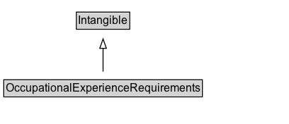

# OccupationalExperienceRequirements

Indicates employment-related experience requirements, e.g. [[monthsOfExperience]].

## Diagram

=== "SVG (interactive)"

    <!-- Generated by graphviz version 14.1.3 (20260303.0454)
     -->
    <!-- Pages: 1 -->
    <svg width="306pt" height="132pt"
     viewBox="0.00 0.00 306.00 132.00" xmlns="http://www.w3.org/2000/svg" xmlns:xlink="http://www.w3.org/1999/xlink">
    <g id="graph0" class="graph" transform="scale(1 1) rotate(0) translate(4 128)">
    <polygon fill="white" stroke="none" points="-4,4 -4,-128 302.12,-128 302.12,4 -4,4"/>
    <g id="clust3" class="cluster">
    <title>cluster_associated</title>
    </g>
    <!-- Intangible -->
    <g id="node1" class="node">
    <title>Intangible</title>
    <g id="a_node1"><a xlink:href="../Intangible" xlink:title="&lt;TABLE&gt;">
    <polygon fill="lightgray" stroke="none" points="77.88,-97.88 77.88,-114.12 132.38,-114.12 132.38,-97.88 77.88,-97.88"/>
    <text xml:space="preserve" text-anchor="start" x="78.88" y="-101.88" font-family="Arial" font-size="12.00">Intangible</text>
    <polygon fill="none" stroke="black" points="76.88,-96.88 76.88,-115.12 133.38,-115.12 133.38,-96.88 76.88,-96.88"/>
    </a>
    </g>
    </g>
    <!-- OccupationalExperienceRequirements -->
    <g id="node2" class="node">
    <title>OccupationalExperienceRequirements</title>
    <g id="a_node2"><a xlink:href="../OccupationalExperienceRequirements" xlink:title="&lt;TABLE&gt;">
    <polygon fill="lightgray" stroke="none" points="1,-25.88 1,-42.12 209.25,-42.12 209.25,-25.88 1,-25.88"/>
    <text xml:space="preserve" text-anchor="start" x="2" y="-29.88" font-family="Arial" font-size="12.00">OccupationalExperienceRequirements</text>
    <polygon fill="none" stroke="black" points="0,-24.88 0,-43.12 210.25,-43.12 210.25,-24.88 0,-24.88"/>
    </a>
    </g>
    </g>
    <!-- OccupationalExperienceRequirements&#45;&gt;Intangible -->
    <g id="edge1" class="edge">
    <title>OccupationalExperienceRequirements&#45;&gt;Intangible</title>
    <path fill="none" stroke="black" d="M105.12,-51.79C105.12,-59.25 105.12,-68.24 105.12,-76.69"/>
    <polygon fill="none" stroke="black" points="101.63,-76.54 105.13,-86.54 108.63,-76.54 101.63,-76.54"/>
    </g>
    <!-- Invis -->
    </g>
    </svg>

=== "PNG"

    

## Formalization for OccupationalExperienceRequirements

| Property | Constraint |
|----------|------------|
| subClassOf | [Intangible](Intangible.md) |

