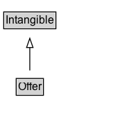

# Offer

An offer to transfer some rights to an item or to provide a service — for example, an offer to sell tickets to an event, to rent the DVD of a movie, to stream a TV show over the internet, to repair a motorcycle, or to loan a book.\n\nNote: As the [[businessFunction]] property, which identifies the form of offer (e.g. sell, lease, repair, dispose), defaults to http://purl.org/goodrelations/v1#Sell; an Offer without a defined businessFunction value can be assumed to be an offer to sell.\n\nFor [GTIN](http://www.gs1.org/barcodes/technical/idkeys/gtin)-related fields, see [Check Digit calculator](http://www.gs1.org/barcodes/support/check_digit_calculator) and [validation guide](http://www.gs1us.org/resources/standards/gtin-validation-guide) from [GS1](http://www.gs1.org/).

## Diagram

=== "SVG (interactive)"

    <!-- Generated by graphviz version 14.1.3 (20260303.0454)
     -->
    <!-- Pages: 1 -->
    <svg width="151pt" height="132pt"
     viewBox="0.00 0.00 151.00 132.00" xmlns="http://www.w3.org/2000/svg" xmlns:xlink="http://www.w3.org/1999/xlink">
    <g id="graph0" class="graph" transform="scale(1 1) rotate(0) translate(4 128)">
    <polygon fill="white" stroke="none" points="-4,4 -4,-128 147.25,-128 147.25,4 -4,4"/>
    <g id="clust3" class="cluster">
    <title>cluster_associated</title>
    </g>
    <!-- Intangible -->
    <g id="node1" class="node">
    <title>Intangible</title>
    <g id="a_node1"><a xlink:href="../Intangible" xlink:title="&lt;TABLE&gt;">
    <polygon fill="lightgray" stroke="none" points="1,-97.88 1,-114.12 55.5,-114.12 55.5,-97.88 1,-97.88"/>
    <text xml:space="preserve" text-anchor="start" x="2" y="-101.88" font-family="Arial" font-size="12.00">Intangible</text>
    <polygon fill="none" stroke="black" points="0,-96.88 0,-115.12 56.5,-115.12 56.5,-96.88 0,-96.88"/>
    </a>
    </g>
    </g>
    <!-- Offer -->
    <g id="node2" class="node">
    <title>Offer</title>
    <g id="a_node2"><a xlink:href="../Offer" xlink:title="&lt;TABLE&gt;">
    <polygon fill="lightgray" stroke="none" points="14.5,-25.88 14.5,-42.12 42,-42.12 42,-25.88 14.5,-25.88"/>
    <text xml:space="preserve" text-anchor="start" x="15.5" y="-29.88" font-family="Arial" font-size="12.00">Offer</text>
    <polygon fill="none" stroke="black" points="13.5,-24.88 13.5,-43.12 43,-43.12 43,-24.88 13.5,-24.88"/>
    </a>
    </g>
    </g>
    <!-- Offer&#45;&gt;Intangible -->
    <g id="edge1" class="edge">
    <title>Offer&#45;&gt;Intangible</title>
    <path fill="none" stroke="black" d="M28.25,-51.79C28.25,-59.25 28.25,-68.24 28.25,-76.69"/>
    <polygon fill="none" stroke="black" points="24.75,-76.54 28.25,-86.54 31.75,-76.54 24.75,-76.54"/>
    </g>
    <!-- Invis -->
    </g>
    </svg>

=== "PNG"

    

## Specializations of Offer

| Class | Description |
|-------|-------------|
| [Aggregate Offer](AggregateOffer.md) | When a single product is associated with multiple offers (for example, the same pair of shoes is offered by different merchants), then AggregateOffer can be used.\n\nNote: AggregateOffers are normally expected to associate multiple offers that all share the same defined [[businessFunction]] value, or default to http://purl.org/goodrelations/v1#Sell if businessFunction is not explicitly defined. |
| [Offer For Lease](OfferForLease.md) | An [[OfferForLease]] in Schema.org represents an [[Offer]] to lease out something, i.e. an [[Offer]] whose
  [[businessFunction]] is [lease out](http://purl.org/goodrelations/v1#LeaseOut.). See [Good Relations](https://en.wikipedia.org/wiki/GoodRelations) for
  background on the underlying concepts.
   |
| [Offer For Purchase](OfferForPurchase.md) | An [[OfferForPurchase]] in Schema.org represents an [[Offer]] to sell something, i.e. an [[Offer]] whose
  [[businessFunction]] is [sell](http://purl.org/goodrelations/v1#Sell.). See [Good Relations](https://en.wikipedia.org/wiki/GoodRelations) for
  background on the underlying concepts.
   |

## Formalization for Offer

| Property | Constraint |
|----------|------------|
| subClassOf | [Intangible](Intangible.md) |

