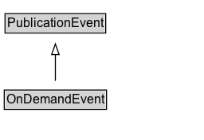

# OnDemandEvent

A publication event, e.g. catch-up TV or radio podcast, during which a program is available on-demand.

## Diagram

=== "SVG (interactive)"

    <!-- Generated by graphviz version 14.1.3 (20260303.0454)
     -->
    <!-- Pages: 1 -->
    <svg width="192pt" height="132pt"
     viewBox="0.00 0.00 192.00 132.00" xmlns="http://www.w3.org/2000/svg" xmlns:xlink="http://www.w3.org/1999/xlink">
    <g id="graph0" class="graph" transform="scale(1 1) rotate(0) translate(4 128)">
    <polygon fill="white" stroke="none" points="-4,4 -4,-128 188.12,-128 188.12,4 -4,4"/>
    <g id="clust3" class="cluster">
    <title>cluster_associated</title>
    </g>
    <!-- PublicationEvent -->
    <g id="node1" class="node">
    <title>PublicationEvent</title>
    <g id="a_node1"><a xlink:href="../PublicationEvent" xlink:title="&lt;TABLE&gt;">
    <polygon fill="lightgray" stroke="none" points="1.75,-97.88 1.75,-114.12 94.5,-114.12 94.5,-97.88 1.75,-97.88"/>
    <text xml:space="preserve" text-anchor="start" x="2.75" y="-101.88" font-family="Arial" font-size="12.00">PublicationEvent</text>
    <polygon fill="none" stroke="black" points="0.75,-96.88 0.75,-115.12 95.5,-115.12 95.5,-96.88 0.75,-96.88"/>
    </a>
    </g>
    </g>
    <!-- OnDemandEvent -->
    <g id="node2" class="node">
    <title>OnDemandEvent</title>
    <g id="a_node2"><a xlink:href="../OnDemandEvent" xlink:title="&lt;TABLE&gt;">
    <polygon fill="lightgray" stroke="none" points="1,-25.88 1,-42.12 95.25,-42.12 95.25,-25.88 1,-25.88"/>
    <text xml:space="preserve" text-anchor="start" x="2" y="-29.88" font-family="Arial" font-size="12.00">OnDemandEvent</text>
    <polygon fill="none" stroke="black" points="0,-24.88 0,-43.12 96.25,-43.12 96.25,-24.88 0,-24.88"/>
    </a>
    </g>
    </g>
    <!-- OnDemandEvent&#45;&gt;PublicationEvent -->
    <g id="edge1" class="edge">
    <title>OnDemandEvent&#45;&gt;PublicationEvent</title>
    <path fill="none" stroke="black" d="M48.12,-51.79C48.12,-59.25 48.12,-68.24 48.12,-76.69"/>
    <polygon fill="none" stroke="black" points="44.63,-76.54 48.13,-86.54 51.63,-76.54 44.63,-76.54"/>
    </g>
    <!-- Invis -->
    </g>
    </svg>

=== "PNG"

    

## Formalization for OnDemandEvent

| Property | Constraint |
|----------|------------|
| subClassOf | [PublicationEvent](PublicationEvent.md) |

