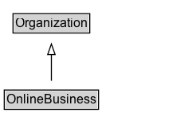

# OnlineBusiness

A particular online business, either standalone or the online part of a broader organization. Examples include an eCommerce site, an online travel booking site, an online learning site, an online logistics and shipping provider, an online (virtual) doctor, etc.

## Diagram

=== "SVG (interactive)"

    <!-- Generated by graphviz version 14.1.3 (20260303.0454)
     -->
    <!-- Pages: 1 -->
    <svg width="184pt" height="132pt"
     viewBox="0.00 0.00 184.00 132.00" xmlns="http://www.w3.org/2000/svg" xmlns:xlink="http://www.w3.org/1999/xlink">
    <g id="graph0" class="graph" transform="scale(1 1) rotate(0) translate(4 128)">
    <polygon fill="white" stroke="none" points="-4,4 -4,-128 180.38,-128 180.38,4 -4,4"/>
    <g id="clust3" class="cluster">
    <title>cluster_associated</title>
    </g>
    <!-- Organization -->
    <g id="node1" class="node">
    <title>Organization</title>
    <g id="a_node1"><a xlink:href="../Organization" xlink:title="&lt;TABLE&gt;">
    <polygon fill="lightgray" stroke="none" points="9.25,-97.88 9.25,-114.12 79.5,-114.12 79.5,-97.88 9.25,-97.88"/>
    <text xml:space="preserve" text-anchor="start" x="10.25" y="-101.88" font-family="Arial" font-size="12.00">Organization</text>
    <polygon fill="none" stroke="black" points="8.25,-96.88 8.25,-115.12 80.5,-115.12 80.5,-96.88 8.25,-96.88"/>
    </a>
    </g>
    </g>
    <!-- OnlineBusiness -->
    <g id="node2" class="node">
    <title>OnlineBusiness</title>
    <g id="a_node2"><a xlink:href="../OnlineBusiness" xlink:title="&lt;TABLE&gt;">
    <polygon fill="lightgray" stroke="none" points="1,-25.88 1,-42.12 87.75,-42.12 87.75,-25.88 1,-25.88"/>
    <text xml:space="preserve" text-anchor="start" x="2" y="-29.88" font-family="Arial" font-size="12.00">OnlineBusiness</text>
    <polygon fill="none" stroke="black" points="0,-24.88 0,-43.12 88.75,-43.12 88.75,-24.88 0,-24.88"/>
    </a>
    </g>
    </g>
    <!-- OnlineBusiness&#45;&gt;Organization -->
    <g id="edge1" class="edge">
    <title>OnlineBusiness&#45;&gt;Organization</title>
    <path fill="none" stroke="black" d="M44.38,-51.79C44.38,-59.25 44.38,-68.24 44.38,-76.69"/>
    <polygon fill="none" stroke="black" points="40.88,-76.54 44.38,-86.54 47.88,-76.54 40.88,-76.54"/>
    </g>
    <!-- Invis -->
    </g>
    </svg>

=== "PNG"

    

## Specializations of OnlineBusiness

| Class | Description |
|-------|-------------|
| [Online Marketplace](OnlineMarketplace.md) | An eCommerce marketplace. |
| [Online Store](OnlineStore.md) | An eCommerce site. |

## Formalization for OnlineBusiness

| Property | Constraint |
|----------|------------|
| subClassOf | [Organization](Organization.md) |

