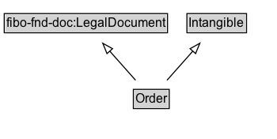

# Order

An order is a confirmation of a transaction (a receipt), which can contain multiple line items, each represented by an Offer that has been accepted by the customer.

## Diagram

=== "SVG (interactive)"

    <!-- Generated by graphviz version 14.1.3 (20260303.0454)
     -->
    <!-- Pages: 1 -->
    <svg width="262pt" height="132pt"
     viewBox="0.00 0.00 262.00 132.00" xmlns="http://www.w3.org/2000/svg" xmlns:xlink="http://www.w3.org/1999/xlink">
    <g id="graph0" class="graph" transform="scale(1 1) rotate(0) translate(4 128)">
    <polygon fill="white" stroke="none" points="-4,4 -4,-128 258.38,-128 258.38,4 -4,4"/>
    <g id="clust3" class="cluster">
    <title>cluster_associated</title>
    </g>
    <!-- fibo&#45;fnd&#45;doc_LegalDocument -->
    <g id="node1" class="node">
    <title>fibo&#45;fnd&#45;doc_LegalDocument</title>
    <g id="a_node1"><a xlink:href="https://w3id.org/citydata/imported/fibo-fnd-doc/latest/LegalDocument" xlink:title="&lt;TABLE&gt;">
    <polygon fill="lightgray" stroke="none" points="1,-97.88 1,-114.12 153.75,-114.12 153.75,-97.88 1,-97.88"/>
    <text xml:space="preserve" text-anchor="start" x="2" y="-101.88" font-family="Arial" font-size="12.00">fibo&#45;fnd&#45;doc:LegalDocument</text>
    <polygon fill="none" stroke="black" points="0,-96.88 0,-115.12 154.75,-115.12 154.75,-96.88 0,-96.88"/>
    </a>
    </g>
    </g>
    <!-- Intangible -->
    <g id="node2" class="node">
    <title>Intangible</title>
    <g id="a_node2"><a xlink:href="../Intangible" xlink:title="&lt;TABLE&gt;">
    <polygon fill="lightgray" stroke="none" points="174.12,-97.88 174.12,-114.12 228.62,-114.12 228.62,-97.88 174.12,-97.88"/>
    <text xml:space="preserve" text-anchor="start" x="175.12" y="-101.88" font-family="Arial" font-size="12.00">Intangible</text>
    <polygon fill="none" stroke="black" points="173.12,-96.88 173.12,-115.12 229.62,-115.12 229.62,-96.88 173.12,-96.88"/>
    </a>
    </g>
    </g>
    <!-- Order -->
    <g id="node3" class="node">
    <title>Order</title>
    <g id="a_node3"><a xlink:href="../Order" xlink:title="&lt;TABLE&gt;">
    <polygon fill="lightgray" stroke="none" points="123.38,-25.88 123.38,-42.12 155.38,-42.12 155.38,-25.88 123.38,-25.88"/>
    <text xml:space="preserve" text-anchor="start" x="124.38" y="-29.88" font-family="Arial" font-size="12.00">Order</text>
    <polygon fill="none" stroke="black" points="122.38,-24.88 122.38,-43.12 156.38,-43.12 156.38,-24.88 122.38,-24.88"/>
    </a>
    </g>
    </g>
    <!-- Order&#45;&gt;fibo&#45;fnd&#45;doc_LegalDocument -->
    <g id="edge1" class="edge">
    <title>Order&#45;&gt;fibo&#45;fnd&#45;doc_LegalDocument</title>
    <path fill="none" stroke="black" d="M124.5,-51.79C117.14,-60.11 108.09,-70.32 99.89,-79.58"/>
    <polygon fill="none" stroke="black" points="97.4,-77.12 93.39,-86.92 102.64,-81.76 97.4,-77.12"/>
    </g>
    <!-- Order&#45;&gt;Intangible -->
    <g id="edge2" class="edge">
    <title>Order&#45;&gt;Intangible</title>
    <path fill="none" stroke="black" d="M154.25,-51.79C161.61,-60.11 170.66,-70.32 178.86,-79.58"/>
    <polygon fill="none" stroke="black" points="176.11,-81.76 185.36,-86.92 181.35,-77.12 176.11,-81.76"/>
    </g>
    <!-- Invis -->
    </g>
    </svg>

=== "PNG"

    

## Formalization for Order

| Property | Constraint |
|----------|------------|
| subClassOf | [Intangible](Intangible.md) |
| subClassOf | [fibo-fnd-doc:LegalDocument](https://w3id.org/citydata/imported/fibo-fnd-doc/LegalDocument) |

