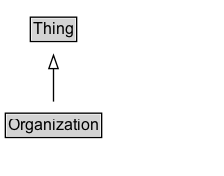

# Organization

An organization such as a school, NGO, corporation, club, etc.

## Diagram

=== "SVG (interactive)"

    <!-- Generated by graphviz version 14.1.3 (20260303.0454)
     -->
    <!-- Pages: 1 -->
    <svg width="168pt" height="132pt"
     viewBox="0.00 0.00 168.00 132.00" xmlns="http://www.w3.org/2000/svg" xmlns:xlink="http://www.w3.org/1999/xlink">
    <g id="graph0" class="graph" transform="scale(1 1) rotate(0) translate(4 128)">
    <polygon fill="white" stroke="none" points="-4,4 -4,-128 164.12,-128 164.12,4 -4,4"/>
    <g id="clust3" class="cluster">
    <title>cluster_associated</title>
    </g>
    <!-- Thing -->
    <g id="node1" class="node">
    <title>Thing</title>
    <g id="a_node1"><a xlink:href="../Thing" xlink:title="&lt;TABLE&gt;">
    <polygon fill="lightgray" stroke="none" points="19.75,-97.88 19.75,-114.12 52.5,-114.12 52.5,-97.88 19.75,-97.88"/>
    <text xml:space="preserve" text-anchor="start" x="20.75" y="-101.88" font-family="Arial" font-size="12.00">Thing</text>
    <polygon fill="none" stroke="black" points="18.75,-96.88 18.75,-115.12 53.5,-115.12 53.5,-96.88 18.75,-96.88"/>
    </a>
    </g>
    </g>
    <!-- Organization -->
    <g id="node2" class="node">
    <title>Organization</title>
    <g id="a_node2"><a xlink:href="../Organization" xlink:title="&lt;TABLE&gt;">
    <polygon fill="lightgray" stroke="none" points="1,-25.88 1,-42.12 71.25,-42.12 71.25,-25.88 1,-25.88"/>
    <text xml:space="preserve" text-anchor="start" x="2" y="-29.88" font-family="Arial" font-size="12.00">Organization</text>
    <polygon fill="none" stroke="black" points="0,-24.88 0,-43.12 72.25,-43.12 72.25,-24.88 0,-24.88"/>
    </a>
    </g>
    </g>
    <!-- Organization&#45;&gt;Thing -->
    <g id="edge1" class="edge">
    <title>Organization&#45;&gt;Thing</title>
    <path fill="none" stroke="black" d="M36.12,-51.79C36.12,-59.25 36.12,-68.24 36.12,-76.69"/>
    <polygon fill="none" stroke="black" points="32.63,-76.54 36.13,-86.54 39.63,-76.54 32.63,-76.54"/>
    </g>
    <!-- Invis -->
    </g>
    </svg>

=== "PNG"

    

## Specializations of Organization

| Class | Description |
|-------|-------------|
| [Accounting Service](AccountingService.md) | Accountancy business.\n\nAs a [[LocalBusiness]] it can be described as a [[provider]] of one or more [[Service]]\(s).
       |
| [Adult Entertainment](AdultEntertainment.md) | An adult entertainment establishment. |
| [Airline](Airline.md) | An organization that provides flights for passengers. |
| [Amusement Park](AmusementPark.md) | An amusement park. |
| [Animal Shelter](AnimalShelter.md) | Animal shelter. |
| [Archive Organization](ArchiveOrganization.md) | An organization with archival holdings. An organization which keeps and preserves archival material and typically makes it accessible to the public. |
| [Art Gallery](ArtGallery.md) | An art gallery. |
| [Attorney](Attorney.md) | Professional service: Attorney. \n\nThis type is deprecated - [[LegalService]] is more inclusive and less ambiguous. |
| [Auto Body Shop](AutoBodyShop.md) | Auto body shop. |
| [Auto Dealer](AutoDealer.md) | An car dealership. |
| [Automated Teller](AutomatedTeller.md) | ATM/cash machine. |
| [Automotive Business](AutomotiveBusiness.md) | Car repair, sales, or parts. |
| [Auto Parts Store](AutoPartsStore.md) | An auto parts store. |
| [Auto Parts Store](AutoPartsStore.md) | An auto parts store. |
| [Auto Rental](AutoRental.md) | A car rental business. |
| [Auto Repair](AutoRepair.md) | Car repair business. |
| [Auto Wash](AutoWash.md) | A car wash business. |
| [Bakery](Bakery.md) | A bakery. |
| [Bank Or Credit Union](BankOrCreditUnion.md) | Bank or credit union. |
| [Bar Or Pub](BarOrPub.md) | A bar or pub. |
| [Beauty Salon](BeautySalon.md) | Beauty salon. |
| [Bed And Breakfast](BedAndBreakfast.md) | Bed and breakfast.
  
See also the <a href="/docs/hotels.html">dedicated document on the use of schema.org for marking up hotels and other forms of accommodations</a>.
 |
| [Bike Store](BikeStore.md) | A bike store. |
| [Book Store](BookStore.md) | A bookstore. |
| [Bowling Alley](BowlingAlley.md) | A bowling alley. |
| [Brewery](Brewery.md) | Brewery. |
| [Cafe Or Coffee Shop](CafeOrCoffeeShop.md) | A cafe or coffee shop. |
| [Campground](Campground.md) | A camping site, campsite, or [[Campground]] is a place used for overnight stay in the outdoors, typically containing individual [[CampingPitch]] locations. \n\n
In British English a campsite is an area, usually divided into a number of pitches, where people can camp overnight using tents or camper vans or caravans; this British English use of the word is synonymous with the American English expression campground. In American English the term campsite generally means an area where an individual, family, group, or military unit can pitch a tent or park a camper; a campground may contain many campsites (source: Wikipedia, see [https://en.wikipedia.org/wiki/Campsite](https://en.wikipedia.org/wiki/Campsite)).\n\n

See also the dedicated [document on the use of schema.org for marking up hotels and other forms of accommodations](/docs/hotels.html).
 |
| [Casino](Casino.md) | A casino. |
| [Child Care](ChildCare.md) | A Childcare center. |
| [Clothing Store](ClothingStore.md) | A clothing store. |
| [College Or University](CollegeOrUniversity.md) | A college, university, or other third-level educational institution. |
| [Comedy Club](ComedyClub.md) | A comedy club. |
| [Computer Store](ComputerStore.md) | A computer store. |
| [Consortium](Consortium.md) | A Consortium is a membership [[Organization]] whose members are typically Organizations. |
| [Convenience Store](ConvenienceStore.md) | A convenience store. |
| [Cooperative](Cooperative.md) | An organization that is a joint project of multiple organizations or persons. |
| [Corporation](Corporation.md) | Organization: A business corporation. |
| [Covid Testing Facility](CovidTestingFacility.md) | A CovidTestingFacility is a [[MedicalClinic]] where testing for the COVID-19 Coronavirus
      disease is available. If the facility is being made available from an established [[Pharmacy]], [[Hotel]], or other
      non-medical organization, multiple types can be listed. This makes it easier to re-use existing schema.org information
      about that place, e.g. contact info, address, opening hours. Note that in an emergency, such information may not always be reliable.
       |
| [Dance Group](DanceGroup.md) | A dance group&#x2014;for example, the Alvin Ailey Dance Theater or Riverdance. |
| [Day Spa](DaySpa.md) | A day spa. |
| [Dentist](Dentist.md) | A dentist. |
| [Dentist](Dentist.md) | A dentist. |
| [Dentist](Dentist.md) | A dentist. |
| [Department Store](DepartmentStore.md) | A department store. |
| [Diagnostic Lab](DiagnosticLab.md) | A medical laboratory that offers on-site or off-site diagnostic services. |
| [Distillery](Distillery.md) | A distillery. |
| [Dry Cleaning Or Laundry](DryCleaningOrLaundry.md) | A dry-cleaning business. |
| [Educational Organization](EducationalOrganization.md) | An educational organization. |
| [Electrician](Electrician.md) | An electrician. |
| [Electronics Store](ElectronicsStore.md) | An electronics store. |
| [Elementary School](ElementarySchool.md) | An elementary school. |
| [Emergency Service](EmergencyService.md) | An emergency service, such as a fire station or ER. |
| [Employment Agency](EmploymentAgency.md) | An employment agency. |
| [Entertainment Business](EntertainmentBusiness.md) | A business providing entertainment. |
| [Exercise Gym](ExerciseGym.md) | A gym. |
| [Fast Food Restaurant](FastFoodRestaurant.md) | A fast-food restaurant. |
| [Financial Service](FinancialService.md) | Financial services business. |
| [Fire Station](FireStation.md) | A fire station. With firemen. |
| [Florist](Florist.md) | A florist. |
| [Food Establishment](FoodEstablishment.md) | A food-related business. |
| [Funding Agency](FundingAgency.md) | A FundingAgency is an organization that implements one or more [[FundingScheme]]s and manages
    the granting process (via [[Grant]]s, typically [[MonetaryGrant]]s).
    A funding agency is not always required for grant funding, e.g. philanthropic giving, corporate sponsorship etc.
    
Examples of funding agencies include ERC, REA, NIH, Bill and Melinda Gates Foundation, ...
     |
| [Funding Scheme](FundingScheme.md) | A FundingScheme combines organizational, project and policy aspects of grant-based funding
    that sets guidelines, principles and mechanisms to support other kinds of projects and activities.
    Funding is typically organized via [[Grant]] funding. Examples of funding schemes: Swiss Priority Programmes (SPPs); EU Framework 7 (FP7); Horizon 2020; the NIH-R01 Grant Program; Wellcome institutional strategic support fund. For large scale public sector funding, the management and administration of grant awards is often handled by other, dedicated, organizations - [[FundingAgency]]s such as ERC, REA, ... |
| [Furniture Store](FurnitureStore.md) | A furniture store. |
| [Garden Store](GardenStore.md) | A garden store. |
| [Gas Station](GasStation.md) | A gas station. |
| [General Contractor](GeneralContractor.md) | A general contractor. |
| [Golf Course](GolfCourse.md) | A golf course. |
| [Government Office](GovernmentOffice.md) | A government office&#x2014;for example, an IRS or DMV office. |
| [Government Organization](GovernmentOrganization.md) | A governmental organization or agency. |
| [Grocery Store](GroceryStore.md) | A grocery store. |
| [Hair Salon](HairSalon.md) | A hair salon. |
| [Hardware Store](HardwareStore.md) | A hardware store. |
| [Health And Beauty Business](HealthAndBeautyBusiness.md) | Health and beauty. |
| [Health Club](HealthClub.md) | A health club. |
| [Health Club](HealthClub.md) | A health club. |
| [High School](HighSchool.md) | A high school. |
| [Hobby Shop](HobbyShop.md) | A store that sells materials useful or necessary for various hobbies. |
| [Home And Construction Business](HomeAndConstructionBusiness.md) | A construction business.\n\nA HomeAndConstructionBusiness is a [[LocalBusiness]] that provides services around homes and buildings.\n\nAs a [[LocalBusiness]] it can be described as a [[provider]] of one or more [[Service]]\(s). |
| [Home Goods Store](HomeGoodsStore.md) | A home goods store. |
| [Hospital](Hospital.md) | A hospital. |
| [Hospital](Hospital.md) | A hospital. |
| [Hostel](Hostel.md) | A hostel - cheap accommodation, often in shared dormitories.
  
See also the <a href="/docs/hotels.html">dedicated document on the use of schema.org for marking up hotels and other forms of accommodations</a>.
 |
| [Hotel](Hotel.md) | A hotel is an establishment that provides lodging paid on a short-term basis (source: Wikipedia, the free encyclopedia, see http://en.wikipedia.org/wiki/Hotel).
  
See also the <a href="/docs/hotels.html">dedicated document on the use of schema.org for marking up hotels and other forms of accommodations</a>.
 |
| [House Painter](HousePainter.md) | A house painting service. |
| [Hvac Business](HVACBusiness.md) | A business that provides Heating, Ventilation and Air Conditioning services. |
| [Ice Cream Shop](IceCreamShop.md) | An ice cream shop. |
| [Individual Physician](IndividualPhysician.md) | An individual medical practitioner. For their official address use [[address]], for affiliations to hospitals use [[hospitalAffiliation]]. 
The [[practicesAt]] property can be used to indicate [[MedicalOrganization]] hospitals, clinics, pharmacies etc. where this physician practices. |
| [Insurance Agency](InsuranceAgency.md) | An Insurance agency. |
| [Internet Cafe](InternetCafe.md) | An internet cafe. |
| [Jewelry Store](JewelryStore.md) | A jewelry store. |
| [Legal Service](LegalService.md) | A LegalService is a business that provides legally-oriented services, advice and representation, e.g. law firms.\n\nAs a [[LocalBusiness]] it can be described as a [[provider]] of one or more [[Service]]\(s). |
| [Library](Library.md) | A library. |
| [Library System](LibrarySystem.md) | A [[LibrarySystem]] is a collaborative system amongst several libraries. |
| [Liquor Store](LiquorStore.md) | A shop that sells alcoholic drinks such as wine, beer, whisky and other spirits. |
| [Local Business](LocalBusiness.md) | A particular physical business or branch of an organization. Examples of LocalBusiness include a restaurant, a particular branch of a restaurant chain, a branch of a bank, a medical practice, a club, a bowling alley, etc. |
| [Locksmith](Locksmith.md) | A locksmith. |
| [Lodging Business](LodgingBusiness.md) | A lodging business, such as a motel, hotel, or inn. |
| [Medical Business](MedicalBusiness.md) | A particular physical or virtual business of an organization for medical purposes. Examples of MedicalBusiness include different businesses run by health professionals. |
| [Medical Clinic](MedicalClinic.md) | A facility, often associated with a hospital or medical school, that is devoted to the specific diagnosis and/or healthcare. Previously limited to outpatients but with evolution it may be open to inpatients as well. |
| [Medical Clinic](MedicalClinic.md) | A facility, often associated with a hospital or medical school, that is devoted to the specific diagnosis and/or healthcare. Previously limited to outpatients but with evolution it may be open to inpatients as well. |
| [Medical Organization](MedicalOrganization.md) | A medical organization (physical or not), such as hospital, institution or clinic. |
| [Mens Clothing Store](MensClothingStore.md) | A men's clothing store. |
| [Middle School](MiddleSchool.md) | A middle school (typically for children aged around 11-14, although this varies somewhat). |
| [Mobile Phone Store](MobilePhoneStore.md) | A store that sells mobile phones and related accessories. |
| [Motel](Motel.md) | A motel.
  
See also the <a href="/docs/hotels.html">dedicated document on the use of schema.org for marking up hotels and other forms of accommodations</a>.
 |
| [Motorcycle Dealer](MotorcycleDealer.md) | A motorcycle dealer. |
| [Motorcycle Repair](MotorcycleRepair.md) | A motorcycle repair shop. |
| [Movie Rental Store](MovieRentalStore.md) | A movie rental store. |
| [Movie Theater](MovieTheater.md) | A movie theater. |
| [Moving Company](MovingCompany.md) | A moving company. |
| [Music Group](MusicGroup.md) | A musical group, such as a band, an orchestra, or a choir. Can also be a solo musician. |
| [Music Store](MusicStore.md) | A music store. |
| [Nail Salon](NailSalon.md) | A nail salon. |
| [News Media Organization](NewsMediaOrganization.md) | A News/Media organization such as a newspaper or TV station. |
| [Ngo](NGO.md) | Organization: Non-governmental Organization. |
| [Night Club](NightClub.md) | A nightclub or discotheque. |
| [Notary](Notary.md) | A notary. |
| [Office Equipment Store](OfficeEquipmentStore.md) | An office equipment store. |
| [Online Business](OnlineBusiness.md) | A particular online business, either standalone or the online part of a broader organization. Examples include an eCommerce site, an online travel booking site, an online learning site, an online logistics and shipping provider, an online (virtual) doctor, etc. |
| [Online Marketplace](OnlineMarketplace.md) | An eCommerce marketplace. |
| [Online Store](OnlineStore.md) | An eCommerce site. |
| [Optician](Optician.md) | A store that sells reading glasses and similar devices for improving vision. |
| [Outlet Store](OutletStore.md) | An outlet store. |
| [Pawn Shop](PawnShop.md) | A shop that will buy, or lend money against the security of, personal possessions. |
| [Performing Group](PerformingGroup.md) | A performance group, such as a band, an orchestra, or a circus. |
| [Pet Store](PetStore.md) | A pet store. |
| [Pharmacy](Pharmacy.md) | A pharmacy or drugstore. |
| [Pharmacy](Pharmacy.md) | A pharmacy or drugstore. |
| [Physician](Physician.md) | An individual physician or a physician's office considered as a [[MedicalOrganization]]. |
| [Physician](Physician.md) | An individual physician or a physician's office considered as a [[MedicalOrganization]]. |
| [Physicians Office](PhysiciansOffice.md) | A doctor's office or clinic. |
| [Plumber](Plumber.md) | A plumbing service. |
| [Police Station](PoliceStation.md) | A police station. |
| [Political Party](PoliticalParty.md) | Organization: Political Party. |
| [Post Office](PostOffice.md) | A post office. |
| [Preschool](Preschool.md) | A preschool. |
| [Professional Service](ProfessionalService.md) | Original definition: "provider of professional services."\n\nThe general [[ProfessionalService]] type for local businesses was deprecated due to confusion with [[Service]]. For reference, the types that it included were: [[Dentist]],
        [[AccountingService]], [[Attorney]], [[Notary]], as well as types for several kinds of [[HomeAndConstructionBusiness]]: [[Electrician]], [[GeneralContractor]],
        [[HousePainter]], [[Locksmith]], [[Plumber]], [[RoofingContractor]]. [[LegalService]] was introduced as a more inclusive supertype of [[Attorney]]. |
| [Project](Project.md) | An enterprise (potentially individual but typically collaborative), planned to achieve a particular aim.
Use properties from [[Organization]], [[subOrganization]]/[[parentOrganization]] to indicate project sub-structures. 
    |
| [Public Swimming Pool](PublicSwimmingPool.md) | A public swimming pool. |
| [Radio Station](RadioStation.md) | A radio station. |
| [Real Estate Agent](RealEstateAgent.md) | A real-estate agent. |
| [Recycling Center](RecyclingCenter.md) | A recycling center. |
| [Research Organization](ResearchOrganization.md) | A Research Organization (e.g. scientific institute, research company). |
| [Research Project](ResearchProject.md) | A Research project. |
| [Resort](Resort.md) | A resort is a place used for relaxation or recreation, attracting visitors for holidays or vacations. Resorts are places, towns or sometimes commercial establishments operated by a single company (source: Wikipedia, the free encyclopedia, see <a href="http://en.wikipedia.org/wiki/Resort">http://en.wikipedia.org/wiki/Resort</a>).
  
See also the <a href="/docs/hotels.html">dedicated document on the use of schema.org for marking up hotels and other forms of accommodations</a>.
     |
| [Restaurant](Restaurant.md) | A restaurant. |
| [Roofing Contractor](RoofingContractor.md) | A roofing contractor. |
| [School](School.md) | A school. |
| [Search Rescue Organization](SearchRescueOrganization.md) | A Search and Rescue organization of some kind. |
| [Self Storage](SelfStorage.md) | A self-storage facility. |
| [Shoe Store](ShoeStore.md) | A shoe store. |
| [Shopping Center](ShoppingCenter.md) | A shopping center or mall. |
| [Ski Resort](SkiResort.md) | A ski resort. |
| [Ski Resort](SkiResort.md) | A ski resort. |
| [Sporting Goods Store](SportingGoodsStore.md) | A sporting goods store. |
| [Sports Activity Location](SportsActivityLocation.md) | A sports location, such as a playing field. |
| [Sports Club](SportsClub.md) | A sports club. |
| [Sports Organization](SportsOrganization.md) | Represents the collection of all sports organizations, including sports teams, governing bodies, and sports associations. |
| [Sports Team](SportsTeam.md) | Organization: Sports team. |
| [Stadium Or Arena](StadiumOrArena.md) | A stadium. |
| [Store](Store.md) | A retail good store. |
| [Tattoo Parlor](TattooParlor.md) | A tattoo parlor. |
| [Television Station](TelevisionStation.md) | A television station. |
| [Tennis Complex](TennisComplex.md) | A tennis complex. |
| [Theater Group](TheaterGroup.md) | A theater group or company, for example, the Royal Shakespeare Company or Druid Theatre. |
| [Tire Shop](TireShop.md) | A tire shop. |
| [Tourist Information Center](TouristInformationCenter.md) | A tourist information center. |
| [Toy Store](ToyStore.md) | A toy store. |
| [Travel Agency](TravelAgency.md) | A travel agency. |
| [Vacation Rental](VacationRental.md) | A kind of lodging business that focuses on renting single properties for limited time. |
| [Veterinary Care](VeterinaryCare.md) | A vet's office. |
| [Wholesale Store](WholesaleStore.md) | A wholesale store. |
| [Winery](Winery.md) | A winery. |
| [Workers Union](WorkersUnion.md) | A Workers Union (also known as a Labor Union, Labour Union, or Trade Union) is an organization that promotes the interests of its worker members by collectively bargaining with management, organizing, and political lobbying. |

## Formalization for Organization

| Property | Constraint |
|----------|------------|
| subClassOf | [Thing](Thing.md) |

