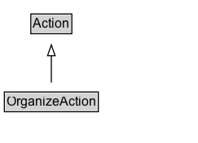

# OrganizeAction

The act of manipulating/administering/supervising/controlling one or more objects.

## Diagram

=== "SVG (interactive)"

    <!-- Generated by graphviz version 14.1.3 (20260303.0454)
     -->
    <!-- Pages: 1 -->
    <svg width="182pt" height="132pt"
     viewBox="0.00 0.00 182.00 132.00" xmlns="http://www.w3.org/2000/svg" xmlns:xlink="http://www.w3.org/1999/xlink">
    <g id="graph0" class="graph" transform="scale(1 1) rotate(0) translate(4 128)">
    <polygon fill="white" stroke="none" points="-4,4 -4,-128 178.25,-128 178.25,4 -4,4"/>
    <g id="clust3" class="cluster">
    <title>cluster_associated</title>
    </g>
    <!-- Action -->
    <g id="node1" class="node">
    <title>Action</title>
    <g id="a_node1"><a xlink:href="../Action" xlink:title="&lt;TABLE&gt;">
    <polygon fill="lightgray" stroke="none" points="25.38,-97.88 25.38,-114.12 61.12,-114.12 61.12,-97.88 25.38,-97.88"/>
    <text xml:space="preserve" text-anchor="start" x="26.38" y="-101.88" font-family="Arial" font-size="12.00">Action</text>
    <polygon fill="none" stroke="black" points="24.38,-96.88 24.38,-115.12 62.12,-115.12 62.12,-96.88 24.38,-96.88"/>
    </a>
    </g>
    </g>
    <!-- OrganizeAction -->
    <g id="node2" class="node">
    <title>OrganizeAction</title>
    <g id="a_node2"><a xlink:href="../OrganizeAction" xlink:title="&lt;TABLE&gt;">
    <polygon fill="lightgray" stroke="none" points="1,-25.88 1,-42.12 85.5,-42.12 85.5,-25.88 1,-25.88"/>
    <text xml:space="preserve" text-anchor="start" x="2" y="-29.88" font-family="Arial" font-size="12.00">OrganizeAction</text>
    <polygon fill="none" stroke="black" points="0,-24.88 0,-43.12 86.5,-43.12 86.5,-24.88 0,-24.88"/>
    </a>
    </g>
    </g>
    <!-- OrganizeAction&#45;&gt;Action -->
    <g id="edge1" class="edge">
    <title>OrganizeAction&#45;&gt;Action</title>
    <path fill="none" stroke="black" d="M43.25,-51.79C43.25,-59.25 43.25,-68.24 43.25,-76.69"/>
    <polygon fill="none" stroke="black" points="39.75,-76.54 43.25,-86.54 46.75,-76.54 39.75,-76.54"/>
    </g>
    <!-- Invis -->
    </g>
    </svg>

=== "PNG"

    

## Specializations of OrganizeAction

| Class | Description |
|-------|-------------|
| [Accept Action](AcceptAction.md) | The act of committing to/adopting an object.\n\nRelated actions:\n\n* [[RejectAction]]: The antonym of AcceptAction. |
| [Allocate Action](AllocateAction.md) | The act of organizing tasks/objects/events by associating resources to it. |
| [Apply Action](ApplyAction.md) | The act of registering to an organization/service without the guarantee to receive it.\n\nRelated actions:\n\n* [[RegisterAction]]: Unlike RegisterAction, ApplyAction has no guarantees that the application will be accepted. |
| [Assign Action](AssignAction.md) | The act of allocating an action/event/task to some destination (someone or something). |
| [Authorize Action](AuthorizeAction.md) | The act of granting permission to an object. |
| [Bookmark Action](BookmarkAction.md) | An agent bookmarks/flags/labels/tags/marks an object. |
| [Cancel Action](CancelAction.md) | The act of asserting that a future event/action is no longer going to happen.\n\nRelated actions:\n\n* [[ConfirmAction]]: The antonym of CancelAction. |
| [Plan Action](PlanAction.md) | The act of planning the execution of an event/task/action/reservation/plan to a future date. |
| [Reject Action](RejectAction.md) | The act of rejecting to/adopting an object.\n\nRelated actions:\n\n* [[AcceptAction]]: The antonym of RejectAction. |
| [Reserve Action](ReserveAction.md) | Reserving a concrete object.\n\nRelated actions:\n\n* [[ScheduleAction]]: Unlike ScheduleAction, ReserveAction reserves concrete objects (e.g. a table, a hotel) towards a time slot / spatial allocation. |
| [Schedule Action](ScheduleAction.md) | Scheduling future actions, events, or tasks.\n\nRelated actions:\n\n* [[ReserveAction]]: Unlike ReserveAction, ScheduleAction allocates future actions (e.g. an event, a task, etc) towards a time slot / spatial allocation. |

## Formalization for OrganizeAction

| Property | Constraint |
|----------|------------|
| subClassOf | [Action](Action.md) |

