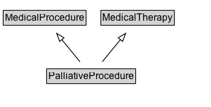

# PalliativeProcedure

A medical procedure intended primarily for palliative purposes, aimed at relieving the symptoms of an underlying health condition.

## Diagram

=== "SVG (interactive)"

    <!-- Generated by graphviz version 14.1.3 (20260303.0454)
     -->
    <!-- Pages: 1 -->
    <svg width="259pt" height="132pt"
     viewBox="0.00 0.00 259.00 132.00" xmlns="http://www.w3.org/2000/svg" xmlns:xlink="http://www.w3.org/1999/xlink">
    <g id="graph0" class="graph" transform="scale(1 1) rotate(0) translate(4 128)">
    <polygon fill="white" stroke="none" points="-4,4 -4,-128 254.75,-128 254.75,4 -4,4"/>
    <g id="clust3" class="cluster">
    <title>cluster_associated</title>
    </g>
    <!-- MedicalProcedure -->
    <g id="node1" class="node">
    <title>MedicalProcedure</title>
    <g id="a_node1"><a xlink:href="../MedicalProcedure" xlink:title="&lt;TABLE&gt;">
    <polygon fill="lightgray" stroke="none" points="1,-97.88 1,-114.12 100.5,-114.12 100.5,-97.88 1,-97.88"/>
    <text xml:space="preserve" text-anchor="start" x="2" y="-101.88" font-family="Arial" font-size="12.00">MedicalProcedure</text>
    <polygon fill="none" stroke="black" points="0,-96.88 0,-115.12 101.5,-115.12 101.5,-96.88 0,-96.88"/>
    </a>
    </g>
    </g>
    <!-- MedicalTherapy -->
    <g id="node2" class="node">
    <title>MedicalTherapy</title>
    <g id="a_node2"><a xlink:href="../MedicalTherapy" xlink:title="&lt;TABLE&gt;">
    <polygon fill="lightgray" stroke="none" points="120.62,-97.88 120.62,-114.12 208.88,-114.12 208.88,-97.88 120.62,-97.88"/>
    <text xml:space="preserve" text-anchor="start" x="121.62" y="-101.88" font-family="Arial" font-size="12.00">MedicalTherapy</text>
    <polygon fill="none" stroke="black" points="119.62,-96.88 119.62,-115.12 209.88,-115.12 209.88,-96.88 119.62,-96.88"/>
    </a>
    </g>
    </g>
    <!-- PalliativeProcedure -->
    <g id="node3" class="node">
    <title>PalliativeProcedure</title>
    <g id="a_node3"><a xlink:href="../PalliativeProcedure" xlink:title="&lt;TABLE&gt;">
    <polygon fill="lightgray" stroke="none" points="54.25,-25.88 54.25,-42.12 161.25,-42.12 161.25,-25.88 54.25,-25.88"/>
    <text xml:space="preserve" text-anchor="start" x="55.25" y="-29.88" font-family="Arial" font-size="12.00">PalliativeProcedure</text>
    <polygon fill="none" stroke="black" points="53.25,-24.88 53.25,-43.12 162.25,-43.12 162.25,-24.88 53.25,-24.88"/>
    </a>
    </g>
    </g>
    <!-- PalliativeProcedure&#45;&gt;MedicalProcedure -->
    <g id="edge1" class="edge">
    <title>PalliativeProcedure&#45;&gt;MedicalProcedure</title>
    <path fill="none" stroke="black" d="M94.08,-51.79C87.38,-60.02 79.16,-70.11 71.69,-79.29"/>
    <polygon fill="none" stroke="black" points="69.1,-76.92 65.5,-86.88 74.53,-81.34 69.1,-76.92"/>
    </g>
    <!-- PalliativeProcedure&#45;&gt;MedicalTherapy -->
    <g id="edge2" class="edge">
    <title>PalliativeProcedure&#45;&gt;MedicalTherapy</title>
    <path fill="none" stroke="black" d="M121.42,-51.79C128.12,-60.02 136.34,-70.11 143.81,-79.29"/>
    <polygon fill="none" stroke="black" points="140.97,-81.34 150,-86.88 146.4,-76.92 140.97,-81.34"/>
    </g>
    <!-- Invis -->
    </g>
    </svg>

=== "PNG"

    

## Formalization for PalliativeProcedure

| Property | Constraint |
|----------|------------|
| subClassOf | [MedicalProcedure](MedicalProcedure.md) |
| subClassOf | [MedicalTherapy](MedicalTherapy.md) |

