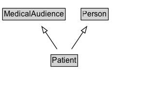

# Patient

A patient is any person recipient of health care services.

## Diagram

=== "SVG (interactive)"

    <!-- Generated by graphviz version 14.1.3 (20260303.0454)
     -->
    <!-- Pages: 1 -->
    <svg width="219pt" height="132pt"
     viewBox="0.00 0.00 219.00 132.00" xmlns="http://www.w3.org/2000/svg" xmlns:xlink="http://www.w3.org/1999/xlink">
    <g id="graph0" class="graph" transform="scale(1 1) rotate(0) translate(4 128)">
    <polygon fill="white" stroke="none" points="-4,4 -4,-128 214.5,-128 214.5,4 -4,4"/>
    <g id="clust3" class="cluster">
    <title>cluster_associated</title>
    </g>
    <!-- MedicalAudience -->
    <g id="node1" class="node">
    <title>MedicalAudience</title>
    <g id="a_node1"><a xlink:href="../MedicalAudience" xlink:title="&lt;TABLE&gt;">
    <polygon fill="lightgray" stroke="none" points="1,-97.88 1,-114.12 96,-114.12 96,-97.88 1,-97.88"/>
    <text xml:space="preserve" text-anchor="start" x="2" y="-101.88" font-family="Arial" font-size="12.00">MedicalAudience</text>
    <polygon fill="none" stroke="black" points="0,-96.88 0,-115.12 97,-115.12 97,-96.88 0,-96.88"/>
    </a>
    </g>
    </g>
    <!-- Person -->
    <g id="node2" class="node">
    <title>Person</title>
    <g id="a_node2"><a xlink:href="../Person" xlink:title="&lt;TABLE&gt;">
    <polygon fill="lightgray" stroke="none" points="122.38,-97.88 122.38,-114.12 162.62,-114.12 162.62,-97.88 122.38,-97.88"/>
    <text xml:space="preserve" text-anchor="start" x="123.38" y="-101.88" font-family="Arial" font-size="12.00">Person</text>
    <polygon fill="none" stroke="black" points="121.38,-96.88 121.38,-115.12 163.62,-115.12 163.62,-96.88 121.38,-96.88"/>
    </a>
    </g>
    </g>
    <!-- Patient -->
    <g id="node3" class="node">
    <title>Patient</title>
    <g id="a_node3"><a xlink:href="../Patient" xlink:title="&lt;TABLE&gt;">
    <polygon fill="lightgray" stroke="none" points="75.75,-25.88 75.75,-42.12 115.25,-42.12 115.25,-25.88 75.75,-25.88"/>
    <text xml:space="preserve" text-anchor="start" x="76.75" y="-29.88" font-family="Arial" font-size="12.00">Patient</text>
    <polygon fill="none" stroke="black" points="74.75,-24.88 74.75,-43.12 116.25,-43.12 116.25,-24.88 74.75,-24.88"/>
    </a>
    </g>
    </g>
    <!-- Patient&#45;&gt;MedicalAudience -->
    <g id="edge1" class="edge">
    <title>Patient&#45;&gt;MedicalAudience</title>
    <path fill="none" stroke="black" d="M84.23,-51.79C78.82,-59.85 72.21,-69.69 66.15,-78.71"/>
    <polygon fill="none" stroke="black" points="63.39,-76.55 60.72,-86.8 69.2,-80.45 63.39,-76.55"/>
    </g>
    <!-- Patient&#45;&gt;Person -->
    <g id="edge2" class="edge">
    <title>Patient&#45;&gt;Person</title>
    <path fill="none" stroke="black" d="M106.77,-51.79C112.18,-59.85 118.79,-69.69 124.85,-78.71"/>
    <polygon fill="none" stroke="black" points="121.8,-80.45 130.28,-86.8 127.61,-76.55 121.8,-80.45"/>
    </g>
    <!-- Invis -->
    </g>
    </svg>

=== "PNG"

    

## Formalization for Patient

| Property | Constraint |
|----------|------------|
| subClassOf | [MedicalAudience](MedicalAudience.md) |
| subClassOf | [Person](Person.md) |

