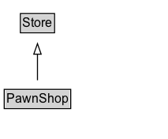

# PawnShop

A shop that will buy, or lend money against the security of, personal possessions.

## Diagram

=== "SVG (interactive)"

    <!-- Generated by graphviz version 14.1.3 (20260303.0454)
     -->
    <!-- Pages: 1 -->
    <svg width="160pt" height="132pt"
     viewBox="0.00 0.00 160.00 132.00" xmlns="http://www.w3.org/2000/svg" xmlns:xlink="http://www.w3.org/1999/xlink">
    <g id="graph0" class="graph" transform="scale(1 1) rotate(0) translate(4 128)">
    <polygon fill="white" stroke="none" points="-4,4 -4,-128 155.62,-128 155.62,4 -4,4"/>
    <g id="clust3" class="cluster">
    <title>cluster_associated</title>
    </g>
    <!-- Store -->
    <g id="node1" class="node">
    <title>Store</title>
    <g id="a_node1"><a xlink:href="../Store" xlink:title="&lt;TABLE&gt;">
    <polygon fill="lightgray" stroke="none" points="16.38,-97.88 16.38,-114.12 46.88,-114.12 46.88,-97.88 16.38,-97.88"/>
    <text xml:space="preserve" text-anchor="start" x="17.38" y="-101.88" font-family="Arial" font-size="12.00">Store</text>
    <polygon fill="none" stroke="black" points="15.38,-96.88 15.38,-115.12 47.88,-115.12 47.88,-96.88 15.38,-96.88"/>
    </a>
    </g>
    </g>
    <!-- PawnShop -->
    <g id="node2" class="node">
    <title>PawnShop</title>
    <g id="a_node2"><a xlink:href="../PawnShop" xlink:title="&lt;TABLE&gt;">
    <polygon fill="lightgray" stroke="none" points="1,-25.88 1,-42.12 62.25,-42.12 62.25,-25.88 1,-25.88"/>
    <text xml:space="preserve" text-anchor="start" x="2" y="-29.88" font-family="Arial" font-size="12.00">PawnShop</text>
    <polygon fill="none" stroke="black" points="0,-24.88 0,-43.12 63.25,-43.12 63.25,-24.88 0,-24.88"/>
    </a>
    </g>
    </g>
    <!-- PawnShop&#45;&gt;Store -->
    <g id="edge1" class="edge">
    <title>PawnShop&#45;&gt;Store</title>
    <path fill="none" stroke="black" d="M31.62,-51.79C31.62,-59.25 31.62,-68.24 31.62,-76.69"/>
    <polygon fill="none" stroke="black" points="28.13,-76.54 31.63,-86.54 35.13,-76.54 28.13,-76.54"/>
    </g>
    <!-- Invis -->
    </g>
    </svg>

=== "PNG"

    

## Formalization for PawnShop

| Property | Constraint |
|----------|------------|
| subClassOf | [Store](Store.md) |

