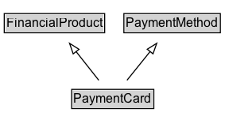

# PaymentCard

A payment method using a credit, debit, store or other card to associate the payment with an account.

## Diagram

=== "SVG (interactive)"

    <!-- Generated by graphviz version 14.1.3 (20260303.0454)
     -->
    <!-- Pages: 1 -->
    <svg width="237pt" height="132pt"
     viewBox="0.00 0.00 237.00 132.00" xmlns="http://www.w3.org/2000/svg" xmlns:xlink="http://www.w3.org/1999/xlink">
    <g id="graph0" class="graph" transform="scale(1 1) rotate(0) translate(4 128)">
    <polygon fill="white" stroke="none" points="-4,4 -4,-128 233.38,-128 233.38,4 -4,4"/>
    <g id="clust3" class="cluster">
    <title>cluster_associated</title>
    </g>
    <!-- FinancialProduct -->
    <g id="node1" class="node">
    <title>FinancialProduct</title>
    <g id="a_node1"><a xlink:href="../FinancialProduct" xlink:title="&lt;TABLE&gt;">
    <polygon fill="lightgray" stroke="none" points="1,-97.88 1,-114.12 93.75,-114.12 93.75,-97.88 1,-97.88"/>
    <text xml:space="preserve" text-anchor="start" x="2" y="-101.88" font-family="Arial" font-size="12.00">FinancialProduct</text>
    <polygon fill="none" stroke="black" points="0,-96.88 0,-115.12 94.75,-115.12 94.75,-96.88 0,-96.88"/>
    </a>
    </g>
    </g>
    <!-- PaymentMethod -->
    <g id="node2" class="node">
    <title>PaymentMethod</title>
    <g id="a_node2"><a xlink:href="../PaymentMethod" xlink:title="&lt;TABLE&gt;">
    <polygon fill="lightgray" stroke="none" points="113.88,-97.88 113.88,-114.12 202.88,-114.12 202.88,-97.88 113.88,-97.88"/>
    <text xml:space="preserve" text-anchor="start" x="114.88" y="-101.88" font-family="Arial" font-size="12.00">PaymentMethod</text>
    <polygon fill="none" stroke="black" points="112.88,-96.88 112.88,-115.12 203.88,-115.12 203.88,-96.88 112.88,-96.88"/>
    </a>
    </g>
    </g>
    <!-- PaymentCard -->
    <g id="node3" class="node">
    <title>PaymentCard</title>
    <g id="a_node3"><a xlink:href="../PaymentCard" xlink:title="&lt;TABLE&gt;">
    <polygon fill="lightgray" stroke="none" points="64.62,-25.88 64.62,-42.12 140.12,-42.12 140.12,-25.88 64.62,-25.88"/>
    <text xml:space="preserve" text-anchor="start" x="65.62" y="-29.88" font-family="Arial" font-size="12.00">PaymentCard</text>
    <polygon fill="none" stroke="black" points="63.62,-24.88 63.62,-43.12 141.12,-43.12 141.12,-24.88 63.62,-24.88"/>
    </a>
    </g>
    </g>
    <!-- PaymentCard&#45;&gt;FinancialProduct -->
    <g id="edge1" class="edge">
    <title>PaymentCard&#45;&gt;FinancialProduct</title>
    <path fill="none" stroke="black" d="M89.18,-51.79C82.72,-60.02 74.79,-70.11 67.58,-79.29"/>
    <polygon fill="none" stroke="black" points="65.05,-76.84 61.62,-86.86 70.55,-81.16 65.05,-76.84"/>
    </g>
    <!-- PaymentCard&#45;&gt;PaymentMethod -->
    <g id="edge2" class="edge">
    <title>PaymentCard&#45;&gt;PaymentMethod</title>
    <path fill="none" stroke="black" d="M115.81,-51.79C122.39,-60.02 130.47,-70.11 137.81,-79.29"/>
    <polygon fill="none" stroke="black" points="134.89,-81.25 143.87,-86.87 140.36,-76.88 134.89,-81.25"/>
    </g>
    <!-- Invis -->
    </g>
    </svg>

=== "PNG"

    

## Specializations of PaymentCard

| Class | Description |
|-------|-------------|
| [Credit Card](CreditCard.md) | A card payment method of a particular brand or name.  Used to mark up a particular payment method and/or the financial product/service that supplies the card account.\n\nCommonly used values:\n\n* http://purl.org/goodrelations/v1#AmericanExpress\n* http://purl.org/goodrelations/v1#DinersClub\n* http://purl.org/goodrelations/v1#Discover\n* http://purl.org/goodrelations/v1#JCB\n* http://purl.org/goodrelations/v1#MasterCard\n* http://purl.org/goodrelations/v1#VISA
        |

## Formalization for PaymentCard

| Property | Constraint |
|----------|------------|
| subClassOf | [FinancialProduct](FinancialProduct.md) |
| subClassOf | [PaymentMethod](PaymentMethod.md) |

