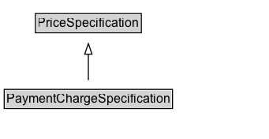

# PaymentChargeSpecification

The costs of settling the payment using a particular payment method.

## Diagram

=== "SVG (interactive)"

    <!-- Generated by graphviz version 14.1.3 (20260303.0454)
     -->
    <!-- Pages: 1 -->
    <svg width="256pt" height="132pt"
     viewBox="0.00 0.00 256.00 132.00" xmlns="http://www.w3.org/2000/svg" xmlns:xlink="http://www.w3.org/1999/xlink">
    <g id="graph0" class="graph" transform="scale(1 1) rotate(0) translate(4 128)">
    <polygon fill="white" stroke="none" points="-4,4 -4,-128 252,-128 252,4 -4,4"/>
    <g id="clust3" class="cluster">
    <title>cluster_associated</title>
    </g>
    <!-- PriceSpecification -->
    <g id="node1" class="node">
    <title>PriceSpecification</title>
    <g id="a_node1"><a xlink:href="../PriceSpecification" xlink:title="&lt;TABLE&gt;">
    <polygon fill="lightgray" stroke="none" points="30.62,-97.88 30.62,-114.12 129.38,-114.12 129.38,-97.88 30.62,-97.88"/>
    <text xml:space="preserve" text-anchor="start" x="31.62" y="-101.88" font-family="Arial" font-size="12.00">PriceSpecification</text>
    <polygon fill="none" stroke="black" points="29.62,-96.88 29.62,-115.12 130.38,-115.12 130.38,-96.88 29.62,-96.88"/>
    </a>
    </g>
    </g>
    <!-- PaymentChargeSpecification -->
    <g id="node2" class="node">
    <title>PaymentChargeSpecification</title>
    <g id="a_node2"><a xlink:href="../PaymentChargeSpecification" xlink:title="&lt;TABLE&gt;">
    <polygon fill="lightgray" stroke="none" points="1,-25.88 1,-42.12 159,-42.12 159,-25.88 1,-25.88"/>
    <text xml:space="preserve" text-anchor="start" x="2" y="-29.88" font-family="Arial" font-size="12.00">PaymentChargeSpecification</text>
    <polygon fill="none" stroke="black" points="0,-24.88 0,-43.12 160,-43.12 160,-24.88 0,-24.88"/>
    </a>
    </g>
    </g>
    <!-- PaymentChargeSpecification&#45;&gt;PriceSpecification -->
    <g id="edge1" class="edge">
    <title>PaymentChargeSpecification&#45;&gt;PriceSpecification</title>
    <path fill="none" stroke="black" d="M80,-51.79C80,-59.25 80,-68.24 80,-76.69"/>
    <polygon fill="none" stroke="black" points="76.5,-76.54 80,-86.54 83.5,-76.54 76.5,-76.54"/>
    </g>
    <!-- Invis -->
    </g>
    </svg>

=== "PNG"

    

## Formalization for PaymentChargeSpecification

| Property | Constraint |
|----------|------------|
| subClassOf | [PriceSpecification](PriceSpecification.md) |

