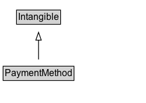

# PaymentMethod

A payment method is a standardized procedure for transferring the monetary amount for a purchase. Payment methods are characterized by the legal and technical structures used, and by the organization or group carrying out the transaction. The following legacy values should be accepted: \n\n* http://purl.org/goodrelations/v1#ByBankTransferInAdvance\n* http://purl.org/goodrelations/v1#ByInvoice\n* http://purl.org/goodrelations/v1#Cash\n* http://purl.org/goodrelations/v1#CheckInAdvance\n* http://purl.org/goodrelations/v1#COD\n* http://purl.org/goodrelations/v1#DirectDebit\n* http://purl.org/goodrelations/v1#GoogleCheckout\n* http://purl.org/goodrelations/v1#PayPal\n* http://purl.org/goodrelations/v1#PaySwarm\n\nStructured values, or [UNCE payment means](https://vocabulary.uncefact.org/PaymentMeans) are recommended or for newer annotations.

## Diagram

=== "SVG (interactive)"

    <!-- Generated by graphviz version 14.1.3 (20260303.0454)
     -->
    <!-- Pages: 1 -->
    <svg width="188pt" height="132pt"
     viewBox="0.00 0.00 188.00 132.00" xmlns="http://www.w3.org/2000/svg" xmlns:xlink="http://www.w3.org/1999/xlink">
    <g id="graph0" class="graph" transform="scale(1 1) rotate(0) translate(4 128)">
    <polygon fill="white" stroke="none" points="-4,4 -4,-128 183.5,-128 183.5,4 -4,4"/>
    <g id="clust3" class="cluster">
    <title>cluster_associated</title>
    </g>
    <!-- Intangible -->
    <g id="node1" class="node">
    <title>Intangible</title>
    <g id="a_node1"><a xlink:href="../Intangible" xlink:title="&lt;TABLE&gt;">
    <polygon fill="lightgray" stroke="none" points="18.25,-97.88 18.25,-114.12 72.75,-114.12 72.75,-97.88 18.25,-97.88"/>
    <text xml:space="preserve" text-anchor="start" x="19.25" y="-101.88" font-family="Arial" font-size="12.00">Intangible</text>
    <polygon fill="none" stroke="black" points="17.25,-96.88 17.25,-115.12 73.75,-115.12 73.75,-96.88 17.25,-96.88"/>
    </a>
    </g>
    </g>
    <!-- PaymentMethod -->
    <g id="node2" class="node">
    <title>PaymentMethod</title>
    <g id="a_node2"><a xlink:href="../PaymentMethod" xlink:title="&lt;TABLE&gt;">
    <polygon fill="lightgray" stroke="none" points="1,-25.88 1,-42.12 90,-42.12 90,-25.88 1,-25.88"/>
    <text xml:space="preserve" text-anchor="start" x="2" y="-29.88" font-family="Arial" font-size="12.00">PaymentMethod</text>
    <polygon fill="none" stroke="black" points="0,-24.88 0,-43.12 91,-43.12 91,-24.88 0,-24.88"/>
    </a>
    </g>
    </g>
    <!-- PaymentMethod&#45;&gt;Intangible -->
    <g id="edge1" class="edge">
    <title>PaymentMethod&#45;&gt;Intangible</title>
    <path fill="none" stroke="black" d="M45.5,-51.79C45.5,-59.25 45.5,-68.24 45.5,-76.69"/>
    <polygon fill="none" stroke="black" points="42,-76.54 45.5,-86.54 49,-76.54 42,-76.54"/>
    </g>
    <!-- Invis -->
    </g>
    </svg>

=== "PNG"

    

## Specializations of PaymentMethod

| Class | Description |
|-------|-------------|
| [Credit Card](CreditCard.md) | A card payment method of a particular brand or name.  Used to mark up a particular payment method and/or the financial product/service that supplies the card account.\n\nCommonly used values:\n\n* http://purl.org/goodrelations/v1#AmericanExpress\n* http://purl.org/goodrelations/v1#DinersClub\n* http://purl.org/goodrelations/v1#Discover\n* http://purl.org/goodrelations/v1#JCB\n* http://purl.org/goodrelations/v1#MasterCard\n* http://purl.org/goodrelations/v1#VISA
        |
| [Payment Card](PaymentCard.md) | A payment method using a credit, debit, store or other card to associate the payment with an account. |
| [Payment Service](PaymentService.md) | A Service to transfer funds from a person or organization to a beneficiary person or organization. |

## Formalization for PaymentMethod

| Property | Constraint |
|----------|------------|
| subClassOf | [Intangible](Intangible.md) |

