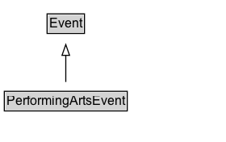

# PerformingArtsEvent

Live performance <a class="localLink" href="http://schema.org/Event">Event of the performing arts (music, theatre, dance, acrobatics, spoken word), including performance art and performative sports (e.g. choreographed forms of martial arts, figure skating, competitive ballroom dancing).  Note: Use <a class="localLink" href="http://schema.org/additionalType">additionalType</a> to differentiate between productions / shows (PerformanceWork, EventSeries), tours (EventSeries), and individual performances.

## Diagram

=== "SVG (interactive)"

    <!-- Generated by graphviz version 14.1.3 (20260303.0454)
     -->
    <!-- Pages: 1 -->
    <svg width="210pt" height="132pt"
     viewBox="0.00 0.00 210.00 132.00" xmlns="http://www.w3.org/2000/svg" xmlns:xlink="http://www.w3.org/1999/xlink">
    <g id="graph0" class="graph" transform="scale(1 1) rotate(0) translate(4 128)">
    <polygon fill="white" stroke="none" points="-4,4 -4,-128 206.12,-128 206.12,4 -4,4"/>
    <g id="clust3" class="cluster">
    <title>cluster_associated</title>
    </g>
    <!-- Event -->
    <g id="node1" class="node">
    <title>Event</title>
    <g id="a_node1"><a xlink:href="../Event" xlink:title="&lt;TABLE&gt;">
    <polygon fill="lightgray" stroke="none" points="40.75,-97.88 40.75,-114.12 73.5,-114.12 73.5,-97.88 40.75,-97.88"/>
    <text xml:space="preserve" text-anchor="start" x="41.75" y="-101.88" font-family="Arial" font-size="12.00">Event</text>
    <polygon fill="none" stroke="black" points="39.75,-96.88 39.75,-115.12 74.5,-115.12 74.5,-96.88 39.75,-96.88"/>
    </a>
    </g>
    </g>
    <!-- PerformingArtsEvent -->
    <g id="node2" class="node">
    <title>PerformingArtsEvent</title>
    <g id="a_node2"><a xlink:href="../PerformingArtsEvent" xlink:title="&lt;TABLE&gt;">
    <polygon fill="lightgray" stroke="none" points="1,-25.88 1,-42.12 113.25,-42.12 113.25,-25.88 1,-25.88"/>
    <text xml:space="preserve" text-anchor="start" x="2" y="-29.88" font-family="Arial" font-size="12.00">PerformingArtsEvent</text>
    <polygon fill="none" stroke="black" points="0,-24.88 0,-43.12 114.25,-43.12 114.25,-24.88 0,-24.88"/>
    </a>
    </g>
    </g>
    <!-- PerformingArtsEvent&#45;&gt;Event -->
    <g id="edge1" class="edge">
    <title>PerformingArtsEvent&#45;&gt;Event</title>
    <path fill="none" stroke="black" d="M57.12,-51.79C57.12,-59.25 57.12,-68.24 57.12,-76.69"/>
    <polygon fill="none" stroke="black" points="53.63,-76.54 57.13,-86.54 60.63,-76.54 53.63,-76.54"/>
    </g>
    <!-- Invis -->
    </g>
    </svg>

=== "PNG"

    

## Formalization for PerformingArtsEvent

| Property | Constraint |
|----------|------------|
| subClassOf | [Event](Event.md) |

