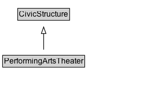

# PerformingArtsTheater

A theater or other performing art center.

## Diagram

=== "SVG (interactive)"

    <!-- Generated by graphviz version 14.1.3 (20260303.0454)
     -->
    <!-- Pages: 1 -->
    <svg width="220pt" height="132pt"
     viewBox="0.00 0.00 220.00 132.00" xmlns="http://www.w3.org/2000/svg" xmlns:xlink="http://www.w3.org/1999/xlink">
    <g id="graph0" class="graph" transform="scale(1 1) rotate(0) translate(4 128)">
    <polygon fill="white" stroke="none" points="-4,4 -4,-128 216.38,-128 216.38,4 -4,4"/>
    <g id="clust3" class="cluster">
    <title>cluster_associated</title>
    </g>
    <!-- CivicStructure -->
    <g id="node1" class="node">
    <title>CivicStructure</title>
    <g id="a_node1"><a xlink:href="../CivicStructure" xlink:title="&lt;TABLE&gt;">
    <polygon fill="lightgray" stroke="none" points="23.88,-97.88 23.88,-114.12 100.88,-114.12 100.88,-97.88 23.88,-97.88"/>
    <text xml:space="preserve" text-anchor="start" x="24.88" y="-101.88" font-family="Arial" font-size="12.00">CivicStructure</text>
    <polygon fill="none" stroke="black" points="22.88,-96.88 22.88,-115.12 101.88,-115.12 101.88,-96.88 22.88,-96.88"/>
    </a>
    </g>
    </g>
    <!-- PerformingArtsTheater -->
    <g id="node2" class="node">
    <title>PerformingArtsTheater</title>
    <g id="a_node2"><a xlink:href="../PerformingArtsTheater" xlink:title="&lt;TABLE&gt;">
    <polygon fill="lightgray" stroke="none" points="1,-25.88 1,-42.12 123.75,-42.12 123.75,-25.88 1,-25.88"/>
    <text xml:space="preserve" text-anchor="start" x="2" y="-29.88" font-family="Arial" font-size="12.00">PerformingArtsTheater</text>
    <polygon fill="none" stroke="black" points="0,-24.88 0,-43.12 124.75,-43.12 124.75,-24.88 0,-24.88"/>
    </a>
    </g>
    </g>
    <!-- PerformingArtsTheater&#45;&gt;CivicStructure -->
    <g id="edge1" class="edge">
    <title>PerformingArtsTheater&#45;&gt;CivicStructure</title>
    <path fill="none" stroke="black" d="M62.38,-51.79C62.38,-59.25 62.38,-68.24 62.38,-76.69"/>
    <polygon fill="none" stroke="black" points="58.88,-76.54 62.38,-86.54 65.88,-76.54 58.88,-76.54"/>
    </g>
    <!-- Invis -->
    </g>
    </svg>

=== "PNG"

    

## Formalization for PerformingArtsTheater

| Property | Constraint |
|----------|------------|
| subClassOf | [CivicStructure](CivicStructure.md) |

