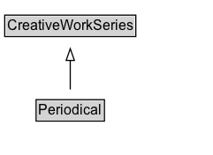

# Periodical

A publication in any medium issued in successive parts bearing numerical or chronological designations and intended to continue indefinitely, such as a magazine, scholarly journal, or newspaper.\n\nSee also [blog post](https://blog.schema.org/2014/09/02/schema-org-support-for-bibliographic-relationships-and-periodicals/).

## Diagram

=== "SVG (interactive)"

    <!-- Generated by graphviz version 14.1.3 (20260303.0454)
     -->
    <!-- Pages: 1 -->
    <svg width="181pt" height="132pt"
     viewBox="0.00 0.00 181.00 132.00" xmlns="http://www.w3.org/2000/svg" xmlns:xlink="http://www.w3.org/1999/xlink">
    <g id="graph0" class="graph" transform="scale(1 1) rotate(0) translate(4 128)">
    <polygon fill="white" stroke="none" points="-4,4 -4,-128 176.62,-128 176.62,4 -4,4"/>
    <g id="clust3" class="cluster">
    <title>cluster_associated</title>
    </g>
    <!-- CreativeWorkSeries -->
    <g id="node1" class="node">
    <title>CreativeWorkSeries</title>
    <g id="a_node1"><a xlink:href="../CreativeWorkSeries" xlink:title="&lt;TABLE&gt;">
    <polygon fill="lightgray" stroke="none" points="1,-97.88 1,-114.12 110.25,-114.12 110.25,-97.88 1,-97.88"/>
    <text xml:space="preserve" text-anchor="start" x="2" y="-101.88" font-family="Arial" font-size="12.00">CreativeWorkSeries</text>
    <polygon fill="none" stroke="black" points="0,-96.88 0,-115.12 111.25,-115.12 111.25,-96.88 0,-96.88"/>
    </a>
    </g>
    </g>
    <!-- Periodical -->
    <g id="node2" class="node">
    <title>Periodical</title>
    <g id="a_node2"><a xlink:href="../Periodical" xlink:title="&lt;TABLE&gt;">
    <polygon fill="lightgray" stroke="none" points="27.62,-25.88 27.62,-42.12 83.62,-42.12 83.62,-25.88 27.62,-25.88"/>
    <text xml:space="preserve" text-anchor="start" x="28.62" y="-29.88" font-family="Arial" font-size="12.00">Periodical</text>
    <polygon fill="none" stroke="black" points="26.62,-24.88 26.62,-43.12 84.62,-43.12 84.62,-24.88 26.62,-24.88"/>
    </a>
    </g>
    </g>
    <!-- Periodical&#45;&gt;CreativeWorkSeries -->
    <g id="edge1" class="edge">
    <title>Periodical&#45;&gt;CreativeWorkSeries</title>
    <path fill="none" stroke="black" d="M55.62,-51.79C55.62,-59.25 55.62,-68.24 55.62,-76.69"/>
    <polygon fill="none" stroke="black" points="52.13,-76.54 55.63,-86.54 59.13,-76.54 52.13,-76.54"/>
    </g>
    <!-- Invis -->
    </g>
    </svg>

=== "PNG"

    

## Specializations of Periodical

| Class | Description |
|-------|-------------|
| [Comic Series](ComicSeries.md) | A sequential publication of comic stories under a
    	unifying title, for example "The Amazing Spider-Man" or "Groo the
    	Wanderer". |
| [Newspaper](Newspaper.md) | A publication containing information about varied topics that are pertinent to general information, a geographic area, or a specific subject matter (i.e. business, culture, education). Often published daily. |

## Formalization for Periodical

| Property | Constraint |
|----------|------------|
| subClassOf | [CreativeWorkSeries](CreativeWorkSeries.md) |

