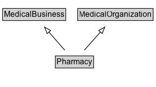

# Pharmacy

A pharmacy or drugstore.

## Diagram

=== "SVG (interactive)"

    <!-- Generated by graphviz version 14.1.3 (20260303.0454)
     -->
    <!-- Pages: 1 -->
    <svg width="236pt" height="132pt"
     viewBox="0.00 0.00 236.00 132.00" xmlns="http://www.w3.org/2000/svg" xmlns:xlink="http://www.w3.org/1999/xlink">
    <g id="graph0" class="graph" transform="scale(1 1) rotate(0) translate(4 128)">
    <polygon fill="white" stroke="none" points="-4,4 -4,-128 231.88,-128 231.88,4 -4,4"/>
    <g id="clust3" class="cluster">
    <title>cluster_associated</title>
    </g>
    <!-- MedicalBusiness -->
    <g id="node1" class="node">
    <title>MedicalBusiness</title>
    <g id="a_node1"><a xlink:href="../MedicalBusiness" xlink:title="&lt;TABLE&gt;">
    <polygon fill="lightgray" stroke="none" points="1,-97.88 1,-114.12 94.5,-114.12 94.5,-97.88 1,-97.88"/>
    <text xml:space="preserve" text-anchor="start" x="2" y="-101.88" font-family="Arial" font-size="12.00">MedicalBusiness</text>
    <polygon fill="none" stroke="black" points="0,-96.88 0,-115.12 95.5,-115.12 95.5,-96.88 0,-96.88"/>
    </a>
    </g>
    </g>
    <!-- MedicalOrganization -->
    <g id="node2" class="node">
    <title>MedicalOrganization</title>
    <g id="a_node2"><a xlink:href="../MedicalOrganization" xlink:title="&lt;TABLE&gt;">
    <polygon fill="lightgray" stroke="none" points="114.62,-97.88 114.62,-114.12 226.88,-114.12 226.88,-97.88 114.62,-97.88"/>
    <text xml:space="preserve" text-anchor="start" x="115.62" y="-101.88" font-family="Arial" font-size="12.00">MedicalOrganization</text>
    <polygon fill="none" stroke="black" points="113.62,-96.88 113.62,-115.12 227.88,-115.12 227.88,-96.88 113.62,-96.88"/>
    </a>
    </g>
    </g>
    <!-- Pharmacy -->
    <g id="node3" class="node">
    <title>Pharmacy</title>
    <g id="a_node3"><a xlink:href="../Pharmacy" xlink:title="&lt;TABLE&gt;">
    <polygon fill="lightgray" stroke="none" points="80.75,-25.88 80.75,-42.12 136.75,-42.12 136.75,-25.88 80.75,-25.88"/>
    <text xml:space="preserve" text-anchor="start" x="81.75" y="-29.88" font-family="Arial" font-size="12.00">Pharmacy</text>
    <polygon fill="none" stroke="black" points="79.75,-24.88 79.75,-43.12 137.75,-43.12 137.75,-24.88 79.75,-24.88"/>
    </a>
    </g>
    </g>
    <!-- Pharmacy&#45;&gt;MedicalBusiness -->
    <g id="edge1" class="edge">
    <title>Pharmacy&#45;&gt;MedicalBusiness</title>
    <path fill="none" stroke="black" d="M94.12,-51.79C86.87,-60.11 77.97,-70.32 69.91,-79.58"/>
    <polygon fill="none" stroke="black" points="67.44,-77.08 63.51,-86.91 72.72,-81.67 67.44,-77.08"/>
    </g>
    <!-- Pharmacy&#45;&gt;MedicalOrganization -->
    <g id="edge2" class="edge">
    <title>Pharmacy&#45;&gt;MedicalOrganization</title>
    <path fill="none" stroke="black" d="M123.62,-51.79C130.99,-60.11 140.04,-70.32 148.23,-79.58"/>
    <polygon fill="none" stroke="black" points="145.49,-81.76 154.74,-86.92 150.73,-77.12 145.49,-81.76"/>
    </g>
    <!-- Invis -->
    </g>
    </svg>

=== "PNG"

    

## Formalization for Pharmacy

| Property | Constraint |
|----------|------------|
| subClassOf | [MedicalBusiness](MedicalBusiness.md) |
| subClassOf | [MedicalOrganization](MedicalOrganization.md) |

