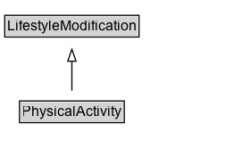

# PhysicalActivity

Any bodily activity that enhances or maintains physical fitness and overall health and wellness. Includes activity that is part of daily living and routine, structured exercise, and exercise prescribed as part of a medical treatment or recovery plan.

## Diagram

=== "SVG (interactive)"

    <!-- Generated by graphviz version 14.1.3 (20260303.0454)
     -->
    <!-- Pages: 1 -->
    <svg width="196pt" height="132pt"
     viewBox="0.00 0.00 196.00 132.00" xmlns="http://www.w3.org/2000/svg" xmlns:xlink="http://www.w3.org/1999/xlink">
    <g id="graph0" class="graph" transform="scale(1 1) rotate(0) translate(4 128)">
    <polygon fill="white" stroke="none" points="-4,4 -4,-128 192.38,-128 192.38,4 -4,4"/>
    <g id="clust3" class="cluster">
    <title>cluster_associated</title>
    </g>
    <!-- LifestyleModification -->
    <g id="node1" class="node">
    <title>LifestyleModification</title>
    <g id="a_node1"><a xlink:href="../LifestyleModification" xlink:title="&lt;TABLE&gt;">
    <polygon fill="lightgray" stroke="none" points="1,-97.88 1,-114.12 111.75,-114.12 111.75,-97.88 1,-97.88"/>
    <text xml:space="preserve" text-anchor="start" x="2" y="-101.88" font-family="Arial" font-size="12.00">LifestyleModification</text>
    <polygon fill="none" stroke="black" points="0,-96.88 0,-115.12 112.75,-115.12 112.75,-96.88 0,-96.88"/>
    </a>
    </g>
    </g>
    <!-- PhysicalActivity -->
    <g id="node2" class="node">
    <title>PhysicalActivity</title>
    <g id="a_node2"><a xlink:href="../PhysicalActivity" xlink:title="&lt;TABLE&gt;">
    <polygon fill="lightgray" stroke="none" points="13.38,-25.88 13.38,-42.12 99.38,-42.12 99.38,-25.88 13.38,-25.88"/>
    <text xml:space="preserve" text-anchor="start" x="14.38" y="-29.88" font-family="Arial" font-size="12.00">PhysicalActivity</text>
    <polygon fill="none" stroke="black" points="12.38,-24.88 12.38,-43.12 100.38,-43.12 100.38,-24.88 12.38,-24.88"/>
    </a>
    </g>
    </g>
    <!-- PhysicalActivity&#45;&gt;LifestyleModification -->
    <g id="edge1" class="edge">
    <title>PhysicalActivity&#45;&gt;LifestyleModification</title>
    <path fill="none" stroke="black" d="M56.38,-51.79C56.38,-59.25 56.38,-68.24 56.38,-76.69"/>
    <polygon fill="none" stroke="black" points="52.88,-76.54 56.38,-86.54 59.88,-76.54 52.88,-76.54"/>
    </g>
    <!-- Invis -->
    </g>
    </svg>

=== "PNG"

    

## Specializations of PhysicalActivity

| Class | Description |
|-------|-------------|
| [Exercise Plan](ExercisePlan.md) | Fitness-related activity designed for a specific health-related purpose, including defined exercise routines as well as activity prescribed by a clinician. |

## Formalization for PhysicalActivity

| Property | Constraint |
|----------|------------|
| subClassOf | [LifestyleModification](LifestyleModification.md) |

