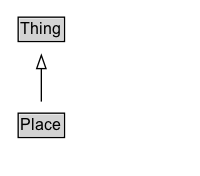

# Place

Entities that have a somewhat fixed, physical extension.

## Diagram

=== "SVG (interactive)"

    <!-- Generated by graphviz version 14.1.3 (20260303.0454)
     -->
    <!-- Pages: 1 -->
    <svg width="150pt" height="132pt"
     viewBox="0.00 0.00 150.00 132.00" xmlns="http://www.w3.org/2000/svg" xmlns:xlink="http://www.w3.org/1999/xlink">
    <g id="graph0" class="graph" transform="scale(1 1) rotate(0) translate(4 128)">
    <polygon fill="white" stroke="none" points="-4,4 -4,-128 146,-128 146,4 -4,4"/>
    <g id="clust3" class="cluster">
    <title>cluster_associated</title>
    </g>
    <!-- Thing -->
    <g id="node1" class="node">
    <title>Thing</title>
    <g id="a_node1"><a xlink:href="../Thing" xlink:title="&lt;TABLE&gt;">
    <polygon fill="lightgray" stroke="none" points="10.62,-97.88 10.62,-114.12 43.38,-114.12 43.38,-97.88 10.62,-97.88"/>
    <text xml:space="preserve" text-anchor="start" x="11.62" y="-101.88" font-family="Arial" font-size="12.00">Thing</text>
    <polygon fill="none" stroke="black" points="9.62,-96.88 9.62,-115.12 44.38,-115.12 44.38,-96.88 9.62,-96.88"/>
    </a>
    </g>
    </g>
    <!-- Place -->
    <g id="node2" class="node">
    <title>Place</title>
    <g id="a_node2"><a xlink:href="../Place" xlink:title="&lt;TABLE&gt;">
    <polygon fill="lightgray" stroke="none" points="10.62,-25.88 10.62,-42.12 43.38,-42.12 43.38,-25.88 10.62,-25.88"/>
    <text xml:space="preserve" text-anchor="start" x="11.62" y="-29.88" font-family="Arial" font-size="12.00">Place</text>
    <polygon fill="none" stroke="black" points="9.62,-24.88 9.62,-43.12 44.38,-43.12 44.38,-24.88 9.62,-24.88"/>
    </a>
    </g>
    </g>
    <!-- Place&#45;&gt;Thing -->
    <g id="edge1" class="edge">
    <title>Place&#45;&gt;Thing</title>
    <path fill="none" stroke="black" d="M27,-51.79C27,-59.25 27,-68.24 27,-76.69"/>
    <polygon fill="none" stroke="black" points="23.5,-76.54 27,-86.54 30.5,-76.54 23.5,-76.54"/>
    </g>
    <!-- Invis -->
    </g>
    </svg>

=== "PNG"

    

## Specializations of Place

| Class | Description |
|-------|-------------|
| [Accommodation](Accommodation.md) | An accommodation is a place that can accommodate human beings, e.g. a hotel room, a camping pitch, or a meeting room. Many accommodations are for overnight stays, but this is not a mandatory requirement.
For more specific types of accommodations not defined in schema.org, one can use [[additionalType]] with external vocabularies.
  
See also the <a href="/docs/hotels.html">dedicated document on the use of schema.org for marking up hotels and other forms of accommodations</a>.
 |
| [Accounting Service](AccountingService.md) | Accountancy business.\n\nAs a [[LocalBusiness]] it can be described as a [[provider]] of one or more [[Service]]\(s).
       |
| [Administrative Area](AdministrativeArea.md) | A geographical region, typically under the jurisdiction of a particular government. |
| [Adult Entertainment](AdultEntertainment.md) | An adult entertainment establishment. |
| [Airport](Airport.md) | An airport. |
| [Amusement Park](AmusementPark.md) | An amusement park. |
| [Animal Shelter](AnimalShelter.md) | Animal shelter. |
| [Apartment](Apartment.md) | An apartment (in American English) or flat (in British English) is a self-contained housing unit (a type of residential real estate) that occupies only part of a building (source: Wikipedia, the free encyclopedia, see <a href="http://en.wikipedia.org/wiki/Apartment">http://en.wikipedia.org/wiki/Apartment</a>). |
| [Apartment Complex](ApartmentComplex.md) | Residence type: Apartment complex. |
| [Aquarium](Aquarium.md) | Aquarium. |
| [Archive Organization](ArchiveOrganization.md) | An organization with archival holdings. An organization which keeps and preserves archival material and typically makes it accessible to the public. |
| [Art Gallery](ArtGallery.md) | An art gallery. |
| [Attorney](Attorney.md) | Professional service: Attorney. \n\nThis type is deprecated - [[LegalService]] is more inclusive and less ambiguous. |
| [Auto Body Shop](AutoBodyShop.md) | Auto body shop. |
| [Auto Dealer](AutoDealer.md) | An car dealership. |
| [Automated Teller](AutomatedTeller.md) | ATM/cash machine. |
| [Automotive Business](AutomotiveBusiness.md) | Car repair, sales, or parts. |
| [Auto Parts Store](AutoPartsStore.md) | An auto parts store. |
| [Auto Parts Store](AutoPartsStore.md) | An auto parts store. |
| [Auto Rental](AutoRental.md) | A car rental business. |
| [Auto Repair](AutoRepair.md) | Car repair business. |
| [Auto Wash](AutoWash.md) | A car wash business. |
| [Bakery](Bakery.md) | A bakery. |
| [Bank Or Credit Union](BankOrCreditUnion.md) | Bank or credit union. |
| [Bar Or Pub](BarOrPub.md) | A bar or pub. |
| [Beach](Beach.md) | Beach. |
| [Beauty Salon](BeautySalon.md) | Beauty salon. |
| [Bed And Breakfast](BedAndBreakfast.md) | Bed and breakfast.
  
See also the <a href="/docs/hotels.html">dedicated document on the use of schema.org for marking up hotels and other forms of accommodations</a>.
 |
| [Bike Store](BikeStore.md) | A bike store. |
| [Boat Terminal](BoatTerminal.md) | A terminal for boats, ships, and other water vessels. |
| [Body Of Water](BodyOfWater.md) | A body of water, such as a sea, ocean, or lake. |
| [Book Store](BookStore.md) | A bookstore. |
| [Bowling Alley](BowlingAlley.md) | A bowling alley. |
| [Brewery](Brewery.md) | Brewery. |
| [Bridge](Bridge.md) | A bridge. |
| [Buddhist Temple](BuddhistTemple.md) | A Buddhist temple. |
| [Bus Station](BusStation.md) | A bus station. |
| [Bus Stop](BusStop.md) | A bus stop. |
| [Cafe Or Coffee Shop](CafeOrCoffeeShop.md) | A cafe or coffee shop. |
| [Campground](Campground.md) | A camping site, campsite, or [[Campground]] is a place used for overnight stay in the outdoors, typically containing individual [[CampingPitch]] locations. \n\n
In British English a campsite is an area, usually divided into a number of pitches, where people can camp overnight using tents or camper vans or caravans; this British English use of the word is synonymous with the American English expression campground. In American English the term campsite generally means an area where an individual, family, group, or military unit can pitch a tent or park a camper; a campground may contain many campsites (source: Wikipedia, see [https://en.wikipedia.org/wiki/Campsite](https://en.wikipedia.org/wiki/Campsite)).\n\n

See also the dedicated [document on the use of schema.org for marking up hotels and other forms of accommodations](/docs/hotels.html).
 |
| [Campground](Campground.md) | A camping site, campsite, or [[Campground]] is a place used for overnight stay in the outdoors, typically containing individual [[CampingPitch]] locations. \n\n
In British English a campsite is an area, usually divided into a number of pitches, where people can camp overnight using tents or camper vans or caravans; this British English use of the word is synonymous with the American English expression campground. In American English the term campsite generally means an area where an individual, family, group, or military unit can pitch a tent or park a camper; a campground may contain many campsites (source: Wikipedia, see [https://en.wikipedia.org/wiki/Campsite](https://en.wikipedia.org/wiki/Campsite)).\n\n

See also the dedicated [document on the use of schema.org for marking up hotels and other forms of accommodations](/docs/hotels.html).
 |
| [Camping Pitch](CampingPitch.md) | A [[CampingPitch]] is an individual place for overnight stay in the outdoors, typically being part of a larger camping site, or [[Campground]].\n\n
In British English a campsite, or campground, is an area, usually divided into a number of pitches, where people can camp overnight using tents or camper vans or caravans; this British English use of the word is synonymous with the American English expression campground. In American English the term campsite generally means an area where an individual, family, group, or military unit can pitch a tent or park a camper; a campground may contain many campsites.
(Source: Wikipedia, see [https://en.wikipedia.org/wiki/Campsite](https://en.wikipedia.org/wiki/Campsite).)\n\n
See also the dedicated [document on the use of schema.org for marking up hotels and other forms of accommodations](/docs/hotels.html).
 |
| [Canal](Canal.md) | A canal, like the Panama Canal. |
| [Casino](Casino.md) | A casino. |
| [Catholic Church](CatholicChurch.md) | A Catholic church. |
| [Cemetery](Cemetery.md) | A graveyard. |
| [Child Care](ChildCare.md) | A Childcare center. |
| [Church](Church.md) | A church. |
| [City](City.md) | A city or town. |
| [City Hall](CityHall.md) | A city hall. |
| [Civic Structure](CivicStructure.md) | A public structure, such as a town hall or concert hall. |
| [Clothing Store](ClothingStore.md) | A clothing store. |
| [College Or University](CollegeOrUniversity.md) | A college, university, or other third-level educational institution. |
| [Comedy Club](ComedyClub.md) | A comedy club. |
| [Computer Store](ComputerStore.md) | A computer store. |
| [Continent](Continent.md) | One of the continents (for example, Europe or Africa). |
| [Convenience Store](ConvenienceStore.md) | A convenience store. |
| [Country](Country.md) | A country. |
| [Courthouse](Courthouse.md) | A courthouse. |
| [Covid Testing Facility](CovidTestingFacility.md) | A CovidTestingFacility is a [[MedicalClinic]] where testing for the COVID-19 Coronavirus
      disease is available. If the facility is being made available from an established [[Pharmacy]], [[Hotel]], or other
      non-medical organization, multiple types can be listed. This makes it easier to re-use existing schema.org information
      about that place, e.g. contact info, address, opening hours. Note that in an emergency, such information may not always be reliable.
       |
| [Crematorium](Crematorium.md) | A crematorium. |
| [Day Spa](DaySpa.md) | A day spa. |
| [Defence Establishment](DefenceEstablishment.md) | A defence establishment, such as an army or navy base. |
| [Defined Region](DefinedRegion.md) | A DefinedRegion is a geographic area defined by potentially arbitrary (rather than political, administrative or natural geographical) criteria. Properties are provided for defining a region by reference to sets of postal codes.

Examples: a delivery destination when shopping. Region where regional pricing is configured.

Requirement 1:
Country: US
States: "NY", "CA"

Requirement 2:
Country: US
PostalCode Set: { [94000-94585], [97000, 97999], [13000, 13599]}
{ [12345, 12345], [78945, 78945], }
Region = state, canton, prefecture, autonomous community...
 |
| [Dentist](Dentist.md) | A dentist. |
| [Dentist](Dentist.md) | A dentist. |
| [Department Store](DepartmentStore.md) | A department store. |
| [Distillery](Distillery.md) | A distillery. |
| [Dry Cleaning Or Laundry](DryCleaningOrLaundry.md) | A dry-cleaning business. |
| [Educational Organization](EducationalOrganization.md) | An educational organization. |
| [Electrician](Electrician.md) | An electrician. |
| [Electronics Store](ElectronicsStore.md) | An electronics store. |
| [Elementary School](ElementarySchool.md) | An elementary school. |
| [Embassy](Embassy.md) | An embassy. |
| [Emergency Service](EmergencyService.md) | An emergency service, such as a fire station or ER. |
| [Employment Agency](EmploymentAgency.md) | An employment agency. |
| [Entertainment Business](EntertainmentBusiness.md) | A business providing entertainment. |
| [Event Venue](EventVenue.md) | An event venue. |
| [Exercise Gym](ExerciseGym.md) | A gym. |
| [Fast Food Restaurant](FastFoodRestaurant.md) | A fast-food restaurant. |
| [Financial Service](FinancialService.md) | Financial services business. |
| [Fire Station](FireStation.md) | A fire station. With firemen. |
| [Fire Station](FireStation.md) | A fire station. With firemen. |
| [Florist](Florist.md) | A florist. |
| [Food Establishment](FoodEstablishment.md) | A food-related business. |
| [Furniture Store](FurnitureStore.md) | A furniture store. |
| [Garden Store](GardenStore.md) | A garden store. |
| [Gas Station](GasStation.md) | A gas station. |
| [Gated Residence Community](GatedResidenceCommunity.md) | Residence type: Gated community. |
| [General Contractor](GeneralContractor.md) | A general contractor. |
| [Golf Course](GolfCourse.md) | A golf course. |
| [Government Building](GovernmentBuilding.md) | A government building. |
| [Government Office](GovernmentOffice.md) | A government office&#x2014;for example, an IRS or DMV office. |
| [Grocery Store](GroceryStore.md) | A grocery store. |
| [Hair Salon](HairSalon.md) | A hair salon. |
| [Hardware Store](HardwareStore.md) | A hardware store. |
| [Health And Beauty Business](HealthAndBeautyBusiness.md) | Health and beauty. |
| [Health Club](HealthClub.md) | A health club. |
| [Health Club](HealthClub.md) | A health club. |
| [High School](HighSchool.md) | A high school. |
| [Hindu Temple](HinduTemple.md) | A Hindu temple. |
| [Hobby Shop](HobbyShop.md) | A store that sells materials useful or necessary for various hobbies. |
| [Home And Construction Business](HomeAndConstructionBusiness.md) | A construction business.\n\nA HomeAndConstructionBusiness is a [[LocalBusiness]] that provides services around homes and buildings.\n\nAs a [[LocalBusiness]] it can be described as a [[provider]] of one or more [[Service]]\(s). |
| [Home Goods Store](HomeGoodsStore.md) | A home goods store. |
| [Hospital](Hospital.md) | A hospital. |
| [Hospital](Hospital.md) | A hospital. |
| [Hostel](Hostel.md) | A hostel - cheap accommodation, often in shared dormitories.
  
See also the <a href="/docs/hotels.html">dedicated document on the use of schema.org for marking up hotels and other forms of accommodations</a>.
 |
| [Hotel](Hotel.md) | A hotel is an establishment that provides lodging paid on a short-term basis (source: Wikipedia, the free encyclopedia, see http://en.wikipedia.org/wiki/Hotel).
  
See also the <a href="/docs/hotels.html">dedicated document on the use of schema.org for marking up hotels and other forms of accommodations</a>.
 |
| [Hotel Room](HotelRoom.md) | A hotel room is a single room in a hotel.
  
See also the <a href="/docs/hotels.html">dedicated document on the use of schema.org for marking up hotels and other forms of accommodations</a>.
 |
| [House](House.md) | A house is a building or structure that has the ability to be occupied for habitation by humans or other creatures (source: Wikipedia, the free encyclopedia, see <a href="http://en.wikipedia.org/wiki/House">http://en.wikipedia.org/wiki/House</a>). |
| [House Painter](HousePainter.md) | A house painting service. |
| [Hvac Business](HVACBusiness.md) | A business that provides Heating, Ventilation and Air Conditioning services. |
| [Ice Cream Shop](IceCreamShop.md) | An ice cream shop. |
| [Individual Physician](IndividualPhysician.md) | An individual medical practitioner. For their official address use [[address]], for affiliations to hospitals use [[hospitalAffiliation]]. 
The [[practicesAt]] property can be used to indicate [[MedicalOrganization]] hospitals, clinics, pharmacies etc. where this physician practices. |
| [Insurance Agency](InsuranceAgency.md) | An Insurance agency. |
| [Internet Cafe](InternetCafe.md) | An internet cafe. |
| [Jewelry Store](JewelryStore.md) | A jewelry store. |
| [Lake Body Of Water](LakeBodyOfWater.md) | A lake (for example, Lake Pontrachain). |
| [Landform](Landform.md) | A landform or physical feature.  Landform elements include mountains, plains, lakes, rivers, seascape and oceanic waterbody interface features such as bays, peninsulas, seas and so forth, including sub-aqueous terrain features such as submersed mountain ranges, volcanoes, and the great ocean basins. |
| [Landmarks Or Historical Buildings](LandmarksOrHistoricalBuildings.md) | An historical landmark or building. |
| [Legal Service](LegalService.md) | A LegalService is a business that provides legally-oriented services, advice and representation, e.g. law firms.\n\nAs a [[LocalBusiness]] it can be described as a [[provider]] of one or more [[Service]]\(s). |
| [Legislative Building](LegislativeBuilding.md) | A legislative building&#x2014;for example, the state capitol. |
| [Library](Library.md) | A library. |
| [Liquor Store](LiquorStore.md) | A shop that sells alcoholic drinks such as wine, beer, whisky and other spirits. |
| [Local Business](LocalBusiness.md) | A particular physical business or branch of an organization. Examples of LocalBusiness include a restaurant, a particular branch of a restaurant chain, a branch of a bank, a medical practice, a club, a bowling alley, etc. |
| [Locksmith](Locksmith.md) | A locksmith. |
| [Lodging Business](LodgingBusiness.md) | A lodging business, such as a motel, hotel, or inn. |
| [Medical Business](MedicalBusiness.md) | A particular physical or virtual business of an organization for medical purposes. Examples of MedicalBusiness include different businesses run by health professionals. |
| [Medical Clinic](MedicalClinic.md) | A facility, often associated with a hospital or medical school, that is devoted to the specific diagnosis and/or healthcare. Previously limited to outpatients but with evolution it may be open to inpatients as well. |
| [Meeting Room](MeetingRoom.md) | A meeting room, conference room, or conference hall is a room provided for singular events such as business conferences and meetings (source: Wikipedia, the free encyclopedia, see <a href="http://en.wikipedia.org/wiki/Conference_hall">http://en.wikipedia.org/wiki/Conference_hall</a>).
  
See also the <a href="/docs/hotels.html">dedicated document on the use of schema.org for marking up hotels and other forms of accommodations</a>.
 |
| [Mens Clothing Store](MensClothingStore.md) | A men's clothing store. |
| [Middle School](MiddleSchool.md) | A middle school (typically for children aged around 11-14, although this varies somewhat). |
| [Mobile Phone Store](MobilePhoneStore.md) | A store that sells mobile phones and related accessories. |
| [Mosque](Mosque.md) | A mosque. |
| [Motel](Motel.md) | A motel.
  
See also the <a href="/docs/hotels.html">dedicated document on the use of schema.org for marking up hotels and other forms of accommodations</a>.
 |
| [Motorcycle Dealer](MotorcycleDealer.md) | A motorcycle dealer. |
| [Motorcycle Repair](MotorcycleRepair.md) | A motorcycle repair shop. |
| [Mountain](Mountain.md) | A mountain, like Mount Whitney or Mount Everest. |
| [Movie Rental Store](MovieRentalStore.md) | A movie rental store. |
| [Movie Theater](MovieTheater.md) | A movie theater. |
| [Movie Theater](MovieTheater.md) | A movie theater. |
| [Moving Company](MovingCompany.md) | A moving company. |
| [Museum](Museum.md) | A museum. |
| [Music Store](MusicStore.md) | A music store. |
| [Music Venue](MusicVenue.md) | A music venue. |
| [Nail Salon](NailSalon.md) | A nail salon. |
| [Night Club](NightClub.md) | A nightclub or discotheque. |
| [Notary](Notary.md) | A notary. |
| [Ocean Body Of Water](OceanBodyOfWater.md) | An ocean (for example, the Pacific). |
| [Office Equipment Store](OfficeEquipmentStore.md) | An office equipment store. |
| [Optician](Optician.md) | A store that sells reading glasses and similar devices for improving vision. |
| [Outlet Store](OutletStore.md) | An outlet store. |
| [Park](Park.md) | A park. |
| [Parking Facility](ParkingFacility.md) | A parking lot or other parking facility. |
| [Pawn Shop](PawnShop.md) | A shop that will buy, or lend money against the security of, personal possessions. |
| [Performing Arts Theater](PerformingArtsTheater.md) | A theater or other performing art center. |
| [Pet Store](PetStore.md) | A pet store. |
| [Pharmacy](Pharmacy.md) | A pharmacy or drugstore. |
| [Physician](Physician.md) | An individual physician or a physician's office considered as a [[MedicalOrganization]]. |
| [Physicians Office](PhysiciansOffice.md) | A doctor's office or clinic. |
| [Place Of Worship](PlaceOfWorship.md) | Place of worship, such as a church, synagogue, or mosque. |
| [Playground](Playground.md) | A playground. |
| [Plumber](Plumber.md) | A plumbing service. |
| [Police Station](PoliceStation.md) | A police station. |
| [Police Station](PoliceStation.md) | A police station. |
| [Pond](Pond.md) | A pond. |
| [Post Office](PostOffice.md) | A post office. |
| [Preschool](Preschool.md) | A preschool. |
| [Professional Service](ProfessionalService.md) | Original definition: "provider of professional services."\n\nThe general [[ProfessionalService]] type for local businesses was deprecated due to confusion with [[Service]]. For reference, the types that it included were: [[Dentist]],
        [[AccountingService]], [[Attorney]], [[Notary]], as well as types for several kinds of [[HomeAndConstructionBusiness]]: [[Electrician]], [[GeneralContractor]],
        [[HousePainter]], [[Locksmith]], [[Plumber]], [[RoofingContractor]]. [[LegalService]] was introduced as a more inclusive supertype of [[Attorney]]. |
| [Public Swimming Pool](PublicSwimmingPool.md) | A public swimming pool. |
| [Public Toilet](PublicToilet.md) | A public toilet is a room or small building containing one or more toilets (and possibly also urinals) which is available for use by the general public, or by customers or employees of certain businesses. |
| [Radio Station](RadioStation.md) | A radio station. |
| [Real Estate Agent](RealEstateAgent.md) | A real-estate agent. |
| [Recycling Center](RecyclingCenter.md) | A recycling center. |
| [Reservoir](Reservoir.md) | A reservoir of water, typically an artificially created lake, like the Lake Kariba reservoir. |
| [Residence](Residence.md) | The place where a person lives. |
| [Resort](Resort.md) | A resort is a place used for relaxation or recreation, attracting visitors for holidays or vacations. Resorts are places, towns or sometimes commercial establishments operated by a single company (source: Wikipedia, the free encyclopedia, see <a href="http://en.wikipedia.org/wiki/Resort">http://en.wikipedia.org/wiki/Resort</a>).
  
See also the <a href="/docs/hotels.html">dedicated document on the use of schema.org for marking up hotels and other forms of accommodations</a>.
     |
| [Restaurant](Restaurant.md) | A restaurant. |
| [River Body Of Water](RiverBodyOfWater.md) | A river (for example, the broad majestic Shannon). |
| [Roofing Contractor](RoofingContractor.md) | A roofing contractor. |
| [Room](Room.md) | A room is a distinguishable space within a structure, usually separated from other spaces by interior walls (source: Wikipedia, the free encyclopedia, see <a href="http://en.wikipedia.org/wiki/Room">http://en.wikipedia.org/wiki/Room</a>).
  
See also the <a href="/docs/hotels.html">dedicated document on the use of schema.org for marking up hotels and other forms of accommodations</a>.
 |
| [Rv Park](RVPark.md) | A place offering space for "Recreational Vehicles", Caravans, mobile homes and the like. |
| [School](School.md) | A school. |
| [School District](SchoolDistrict.md) | A School District is an administrative area for the administration of schools. |
| [Sea Body Of Water](SeaBodyOfWater.md) | A sea (for example, the Caspian sea). |
| [Self Storage](SelfStorage.md) | A self-storage facility. |
| [Shoe Store](ShoeStore.md) | A shoe store. |
| [Shopping Center](ShoppingCenter.md) | A shopping center or mall. |
| [Single Family Residence](SingleFamilyResidence.md) | Residence type: Single-family home. |
| [Ski Resort](SkiResort.md) | A ski resort. |
| [Ski Resort](SkiResort.md) | A ski resort. |
| [Sporting Goods Store](SportingGoodsStore.md) | A sporting goods store. |
| [Sports Activity Location](SportsActivityLocation.md) | A sports location, such as a playing field. |
| [Sports Club](SportsClub.md) | A sports club. |
| [Stadium Or Arena](StadiumOrArena.md) | A stadium. |
| [Stadium Or Arena](StadiumOrArena.md) | A stadium. |
| [State](State.md) | A state or province of a country. |
| [Store](Store.md) | A retail good store. |
| [Subway Station](SubwayStation.md) | A subway station. |
| [Suite](Suite.md) | A suite in a hotel or other public accommodation, denotes a class of luxury accommodations, the key feature of which is multiple rooms (source: Wikipedia, the free encyclopedia, see <a href="http://en.wikipedia.org/wiki/Suite_(hotel)">http://en.wikipedia.org/wiki/Suite_(hotel)</a>).
  
See also the <a href="/docs/hotels.html">dedicated document on the use of schema.org for marking up hotels and other forms of accommodations</a>.
 |
| [Synagogue](Synagogue.md) | A synagogue. |
| [Tattoo Parlor](TattooParlor.md) | A tattoo parlor. |
| [Taxi Stand](TaxiStand.md) | A taxi stand. |
| [Television Station](TelevisionStation.md) | A television station. |
| [Tennis Complex](TennisComplex.md) | A tennis complex. |
| [Tire Shop](TireShop.md) | A tire shop. |
| [Tourist Attraction](TouristAttraction.md) | A tourist attraction.  In principle any Thing can be a [[TouristAttraction]], from a [[Mountain]] and [[LandmarksOrHistoricalBuildings]] to a [[LocalBusiness]].  This Type can be used on its own to describe a general [[TouristAttraction]], or be used as an [[additionalType]] to add tourist attraction properties to any other type.  (See examples below) |
| [Tourist Destination](TouristDestination.md) | A tourist destination. In principle any [[Place]] can be a [[TouristDestination]] from a [[City]], Region or [[Country]] to an [[AmusementPark]] or [[Hotel]]. This Type can be used on its own to describe a general [[TouristDestination]], or be used as an [[additionalType]] to add tourist relevant properties to any other [[Place]].  A [[TouristDestination]] is defined as a [[Place]] that contains, or is colocated with, one or more [[TouristAttraction]]s, often linked by a similar theme or interest to a particular [[touristType]]. The [UNWTO](http://www2.unwto.org/) defines Destination (main destination of a tourism trip) as the place visited that is central to the decision to take the trip.
  (See examples below.) |
| [Tourist Information Center](TouristInformationCenter.md) | A tourist information center. |
| [Toy Store](ToyStore.md) | A toy store. |
| [Train Station](TrainStation.md) | A train station. |
| [Travel Agency](TravelAgency.md) | A travel agency. |
| [Vacation Rental](VacationRental.md) | A kind of lodging business that focuses on renting single properties for limited time. |
| [Volcano](Volcano.md) | A volcano, like Fujisan. |
| [Waterfall](Waterfall.md) | A waterfall, like Niagara. |
| [Wholesale Store](WholesaleStore.md) | A wholesale store. |
| [Winery](Winery.md) | A winery. |
| [Zoo](Zoo.md) | A zoo. |

## Formalization for Place

| Property | Constraint |
|----------|------------|
| subClassOf | [Thing](Thing.md) |

