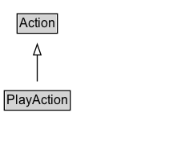

# PlayAction

The act of playing/exercising/training/performing for enjoyment, leisure, recreation, competition or exercise.\n\nRelated actions:\n\n* [[ListenAction]]: Unlike ListenAction (which is under ConsumeAction), PlayAction refers to performing for an audience or at an event, rather than consuming music.\n* [[WatchAction]]: Unlike WatchAction (which is under ConsumeAction), PlayAction refers to showing/displaying for an audience or at an event, rather than consuming visual content.

## Diagram

=== "SVG (interactive)"

    <!-- Generated by graphviz version 14.1.3 (20260303.0454)
     -->
    <!-- Pages: 1 -->
    <svg width="158pt" height="132pt"
     viewBox="0.00 0.00 158.00 132.00" xmlns="http://www.w3.org/2000/svg" xmlns:xlink="http://www.w3.org/1999/xlink">
    <g id="graph0" class="graph" transform="scale(1 1) rotate(0) translate(4 128)">
    <polygon fill="white" stroke="none" points="-4,4 -4,-128 153.88,-128 153.88,4 -4,4"/>
    <g id="clust3" class="cluster">
    <title>cluster_associated</title>
    </g>
    <!-- Action -->
    <g id="node1" class="node">
    <title>Action</title>
    <g id="a_node1"><a xlink:href="../Action" xlink:title="&lt;TABLE&gt;">
    <polygon fill="lightgray" stroke="none" points="13,-97.88 13,-114.12 48.75,-114.12 48.75,-97.88 13,-97.88"/>
    <text xml:space="preserve" text-anchor="start" x="14" y="-101.88" font-family="Arial" font-size="12.00">Action</text>
    <polygon fill="none" stroke="black" points="12,-96.88 12,-115.12 49.75,-115.12 49.75,-96.88 12,-96.88"/>
    </a>
    </g>
    </g>
    <!-- PlayAction -->
    <g id="node2" class="node">
    <title>PlayAction</title>
    <g id="a_node2"><a xlink:href="../PlayAction" xlink:title="&lt;TABLE&gt;">
    <polygon fill="lightgray" stroke="none" points="1,-25.88 1,-42.12 60.75,-42.12 60.75,-25.88 1,-25.88"/>
    <text xml:space="preserve" text-anchor="start" x="2" y="-29.88" font-family="Arial" font-size="12.00">PlayAction</text>
    <polygon fill="none" stroke="black" points="0,-24.88 0,-43.12 61.75,-43.12 61.75,-24.88 0,-24.88"/>
    </a>
    </g>
    </g>
    <!-- PlayAction&#45;&gt;Action -->
    <g id="edge1" class="edge">
    <title>PlayAction&#45;&gt;Action</title>
    <path fill="none" stroke="black" d="M30.88,-51.79C30.88,-59.25 30.88,-68.24 30.88,-76.69"/>
    <polygon fill="none" stroke="black" points="27.38,-76.54 30.88,-86.54 34.38,-76.54 27.38,-76.54"/>
    </g>
    <!-- Invis -->
    </g>
    </svg>

=== "PNG"

    

## Specializations of PlayAction

| Class | Description |
|-------|-------------|
| [Exercise Action](ExerciseAction.md) | The act of participating in exertive activity for the purposes of improving health and fitness. |
| [Perform Action](PerformAction.md) | The act of participating in performance arts. |

## Formalization for PlayAction

| Property | Constraint |
|----------|------------|
| subClassOf | [Action](Action.md) |

