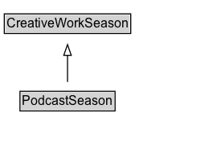

# PodcastSeason

A single season of a podcast. Many podcasts do not break down into separate seasons. In that case, PodcastSeries should be used.

## Diagram

=== "SVG (interactive)"

    <!-- Generated by graphviz version 14.1.3 (20260303.0454)
     -->
    <!-- Pages: 1 -->
    <svg width="199pt" height="132pt"
     viewBox="0.00 0.00 199.00 132.00" xmlns="http://www.w3.org/2000/svg" xmlns:xlink="http://www.w3.org/1999/xlink">
    <g id="graph0" class="graph" transform="scale(1 1) rotate(0) translate(4 128)">
    <polygon fill="white" stroke="none" points="-4,4 -4,-128 195,-128 195,4 -4,4"/>
    <g id="clust3" class="cluster">
    <title>cluster_associated</title>
    </g>
    <!-- CreativeWorkSeason -->
    <g id="node1" class="node">
    <title>CreativeWorkSeason</title>
    <g id="a_node1"><a xlink:href="../CreativeWorkSeason" xlink:title="&lt;TABLE&gt;">
    <polygon fill="lightgray" stroke="none" points="1,-97.88 1,-114.12 117,-114.12 117,-97.88 1,-97.88"/>
    <text xml:space="preserve" text-anchor="start" x="2" y="-101.88" font-family="Arial" font-size="12.00">CreativeWorkSeason</text>
    <polygon fill="none" stroke="black" points="0,-96.88 0,-115.12 118,-115.12 118,-96.88 0,-96.88"/>
    </a>
    </g>
    </g>
    <!-- PodcastSeason -->
    <g id="node2" class="node">
    <title>PodcastSeason</title>
    <g id="a_node2"><a xlink:href="../PodcastSeason" xlink:title="&lt;TABLE&gt;">
    <polygon fill="lightgray" stroke="none" points="15.62,-25.88 15.62,-42.12 102.38,-42.12 102.38,-25.88 15.62,-25.88"/>
    <text xml:space="preserve" text-anchor="start" x="16.62" y="-29.88" font-family="Arial" font-size="12.00">PodcastSeason</text>
    <polygon fill="none" stroke="black" points="14.62,-24.88 14.62,-43.12 103.38,-43.12 103.38,-24.88 14.62,-24.88"/>
    </a>
    </g>
    </g>
    <!-- PodcastSeason&#45;&gt;CreativeWorkSeason -->
    <g id="edge1" class="edge">
    <title>PodcastSeason&#45;&gt;CreativeWorkSeason</title>
    <path fill="none" stroke="black" d="M59,-51.79C59,-59.25 59,-68.24 59,-76.69"/>
    <polygon fill="none" stroke="black" points="55.5,-76.54 59,-86.54 62.5,-76.54 55.5,-76.54"/>
    </g>
    <!-- Invis -->
    </g>
    </svg>

=== "PNG"

    

## Formalization for PodcastSeason

| Property | Constraint |
|----------|------------|
| subClassOf | [CreativeWorkSeason](CreativeWorkSeason.md) |

