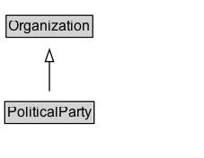

# PoliticalParty

Organization: Political Party.

## Diagram

=== "SVG (interactive)"

    <!-- Generated by graphviz version 14.1.3 (20260303.0454)
     -->
    <!-- Pages: 1 -->
    <svg width="170pt" height="132pt"
     viewBox="0.00 0.00 170.00 132.00" xmlns="http://www.w3.org/2000/svg" xmlns:xlink="http://www.w3.org/1999/xlink">
    <g id="graph0" class="graph" transform="scale(1 1) rotate(0) translate(4 128)">
    <polygon fill="white" stroke="none" points="-4,4 -4,-128 166.25,-128 166.25,4 -4,4"/>
    <g id="clust3" class="cluster">
    <title>cluster_associated</title>
    </g>
    <!-- Organization -->
    <g id="node1" class="node">
    <title>Organization</title>
    <g id="a_node1"><a xlink:href="../Organization" xlink:title="&lt;TABLE&gt;">
    <polygon fill="lightgray" stroke="none" points="2.12,-97.88 2.12,-114.12 72.38,-114.12 72.38,-97.88 2.12,-97.88"/>
    <text xml:space="preserve" text-anchor="start" x="3.12" y="-101.88" font-family="Arial" font-size="12.00">Organization</text>
    <polygon fill="none" stroke="black" points="1.12,-96.88 1.12,-115.12 73.38,-115.12 73.38,-96.88 1.12,-96.88"/>
    </a>
    </g>
    </g>
    <!-- PoliticalParty -->
    <g id="node2" class="node">
    <title>PoliticalParty</title>
    <g id="a_node2"><a xlink:href="../PoliticalParty" xlink:title="&lt;TABLE&gt;">
    <polygon fill="lightgray" stroke="none" points="1,-25.88 1,-42.12 73.5,-42.12 73.5,-25.88 1,-25.88"/>
    <text xml:space="preserve" text-anchor="start" x="2" y="-29.88" font-family="Arial" font-size="12.00">PoliticalParty</text>
    <polygon fill="none" stroke="black" points="0,-24.88 0,-43.12 74.5,-43.12 74.5,-24.88 0,-24.88"/>
    </a>
    </g>
    </g>
    <!-- PoliticalParty&#45;&gt;Organization -->
    <g id="edge1" class="edge">
    <title>PoliticalParty&#45;&gt;Organization</title>
    <path fill="none" stroke="black" d="M37.25,-51.79C37.25,-59.25 37.25,-68.24 37.25,-76.69"/>
    <polygon fill="none" stroke="black" points="33.75,-76.54 37.25,-86.54 40.75,-76.54 33.75,-76.54"/>
    </g>
    <!-- Invis -->
    </g>
    </svg>

=== "PNG"

    

## Formalization for PoliticalParty

| Property | Constraint |
|----------|------------|
| subClassOf | [Organization](Organization.md) |

