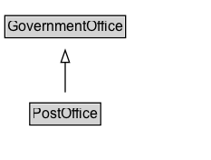

# PostOffice

A post office.

## Diagram

=== "SVG (interactive)"

    <!-- Generated by graphviz version 14.1.3 (20260303.0454)
     -->
    <!-- Pages: 1 -->
    <svg width="175pt" height="132pt"
     viewBox="0.00 0.00 175.00 132.00" xmlns="http://www.w3.org/2000/svg" xmlns:xlink="http://www.w3.org/1999/xlink">
    <g id="graph0" class="graph" transform="scale(1 1) rotate(0) translate(4 128)">
    <polygon fill="white" stroke="none" points="-4,4 -4,-128 171,-128 171,4 -4,4"/>
    <g id="clust3" class="cluster">
    <title>cluster_associated</title>
    </g>
    <!-- GovernmentOffice -->
    <g id="node1" class="node">
    <title>GovernmentOffice</title>
    <g id="a_node1"><a xlink:href="../GovernmentOffice" xlink:title="&lt;TABLE&gt;">
    <polygon fill="lightgray" stroke="none" points="1,-97.88 1,-114.12 99,-114.12 99,-97.88 1,-97.88"/>
    <text xml:space="preserve" text-anchor="start" x="2" y="-101.88" font-family="Arial" font-size="12.00">GovernmentOffice</text>
    <polygon fill="none" stroke="black" points="0,-96.88 0,-115.12 100,-115.12 100,-96.88 0,-96.88"/>
    </a>
    </g>
    </g>
    <!-- PostOffice -->
    <g id="node2" class="node">
    <title>PostOffice</title>
    <g id="a_node2"><a xlink:href="../PostOffice" xlink:title="&lt;TABLE&gt;">
    <polygon fill="lightgray" stroke="none" points="21.62,-25.88 21.62,-42.12 78.38,-42.12 78.38,-25.88 21.62,-25.88"/>
    <text xml:space="preserve" text-anchor="start" x="22.62" y="-29.88" font-family="Arial" font-size="12.00">PostOffice</text>
    <polygon fill="none" stroke="black" points="20.62,-24.88 20.62,-43.12 79.38,-43.12 79.38,-24.88 20.62,-24.88"/>
    </a>
    </g>
    </g>
    <!-- PostOffice&#45;&gt;GovernmentOffice -->
    <g id="edge1" class="edge">
    <title>PostOffice&#45;&gt;GovernmentOffice</title>
    <path fill="none" stroke="black" d="M50,-51.79C50,-59.25 50,-68.24 50,-76.69"/>
    <polygon fill="none" stroke="black" points="46.5,-76.54 50,-86.54 53.5,-76.54 46.5,-76.54"/>
    </g>
    <!-- Invis -->
    </g>
    </svg>

=== "PNG"

    

## Formalization for PostOffice

| Property | Constraint |
|----------|------------|
| subClassOf | [GovernmentOffice](GovernmentOffice.md) |

