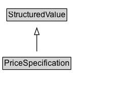

# PriceSpecification

A structured value representing a price or price range. Typically, only the subclasses of this type are used for markup. It is recommended to use [[MonetaryAmount]] to describe independent amounts of money such as a salary, credit card limits, etc.

## Diagram

=== "SVG (interactive)"

    <!-- Generated by graphviz version 14.1.3 (20260303.0454)
     -->
    <!-- Pages: 1 -->
    <svg width="196pt" height="132pt"
     viewBox="0.00 0.00 196.00 132.00" xmlns="http://www.w3.org/2000/svg" xmlns:xlink="http://www.w3.org/1999/xlink">
    <g id="graph0" class="graph" transform="scale(1 1) rotate(0) translate(4 128)">
    <polygon fill="white" stroke="none" points="-4,4 -4,-128 192.38,-128 192.38,4 -4,4"/>
    <g id="clust3" class="cluster">
    <title>cluster_associated</title>
    </g>
    <!-- StructuredValue -->
    <g id="node1" class="node">
    <title>StructuredValue</title>
    <g id="a_node1"><a xlink:href="../StructuredValue" xlink:title="&lt;TABLE&gt;">
    <polygon fill="lightgray" stroke="none" points="7,-97.88 7,-114.12 93.75,-114.12 93.75,-97.88 7,-97.88"/>
    <text xml:space="preserve" text-anchor="start" x="8" y="-101.88" font-family="Arial" font-size="12.00">StructuredValue</text>
    <polygon fill="none" stroke="black" points="6,-96.88 6,-115.12 94.75,-115.12 94.75,-96.88 6,-96.88"/>
    </a>
    </g>
    </g>
    <!-- PriceSpecification -->
    <g id="node2" class="node">
    <title>PriceSpecification</title>
    <g id="a_node2"><a xlink:href="../PriceSpecification" xlink:title="&lt;TABLE&gt;">
    <polygon fill="lightgray" stroke="none" points="1,-25.88 1,-42.12 99.75,-42.12 99.75,-25.88 1,-25.88"/>
    <text xml:space="preserve" text-anchor="start" x="2" y="-29.88" font-family="Arial" font-size="12.00">PriceSpecification</text>
    <polygon fill="none" stroke="black" points="0,-24.88 0,-43.12 100.75,-43.12 100.75,-24.88 0,-24.88"/>
    </a>
    </g>
    </g>
    <!-- PriceSpecification&#45;&gt;StructuredValue -->
    <g id="edge1" class="edge">
    <title>PriceSpecification&#45;&gt;StructuredValue</title>
    <path fill="none" stroke="black" d="M50.38,-51.79C50.38,-59.25 50.38,-68.24 50.38,-76.69"/>
    <polygon fill="none" stroke="black" points="46.88,-76.54 50.38,-86.54 53.88,-76.54 46.88,-76.54"/>
    </g>
    <!-- Invis -->
    </g>
    </svg>

=== "PNG"

    

## Specializations of PriceSpecification

| Class | Description |
|-------|-------------|
| [Compound Price Specification](CompoundPriceSpecification.md) | A compound price specification is one that bundles multiple prices that all apply in combination for different dimensions of consumption. Use the name property of the attached unit price specification for indicating the dimension of a price component (e.g. "electricity" or "final cleaning"). |
| [Delivery Charge Specification](DeliveryChargeSpecification.md) | The price for the delivery of an offer using a particular delivery method. |
| [Payment Charge Specification](PaymentChargeSpecification.md) | The costs of settling the payment using a particular payment method. |
| [Unit Price Specification](UnitPriceSpecification.md) | The price asked for a given offer by the respective organization or person. |

## Formalization for PriceSpecification

| Property | Constraint |
|----------|------------|
| subClassOf | [StructuredValue](StructuredValue.md) |

