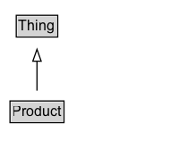

# Product

Any offered product or service. For example: a pair of shoes; a concert ticket; the rental of a car; a haircut; or an episode of a TV show streamed online.

## Diagram

=== "SVG (interactive)"

    <!-- Generated by graphviz version 14.1.3 (20260303.0454)
     -->
    <!-- Pages: 1 -->
    <svg width="150pt" height="132pt"
     viewBox="0.00 0.00 150.00 132.00" xmlns="http://www.w3.org/2000/svg" xmlns:xlink="http://www.w3.org/1999/xlink">
    <g id="graph0" class="graph" transform="scale(1 1) rotate(0) translate(4 128)">
    <polygon fill="white" stroke="none" points="-4,4 -4,-128 146,-128 146,4 -4,4"/>
    <g id="clust3" class="cluster">
    <title>cluster_associated</title>
    </g>
    <!-- Thing -->
    <g id="node1" class="node">
    <title>Thing</title>
    <g id="a_node1"><a xlink:href="../Thing" xlink:title="&lt;TABLE&gt;">
    <polygon fill="lightgray" stroke="none" points="10.62,-97.88 10.62,-114.12 43.38,-114.12 43.38,-97.88 10.62,-97.88"/>
    <text xml:space="preserve" text-anchor="start" x="11.62" y="-101.88" font-family="Arial" font-size="12.00">Thing</text>
    <polygon fill="none" stroke="black" points="9.62,-96.88 9.62,-115.12 44.38,-115.12 44.38,-96.88 9.62,-96.88"/>
    </a>
    </g>
    </g>
    <!-- Product -->
    <g id="node2" class="node">
    <title>Product</title>
    <g id="a_node2"><a xlink:href="../Product" xlink:title="&lt;TABLE&gt;">
    <polygon fill="lightgray" stroke="none" points="5.38,-25.88 5.38,-42.12 48.62,-42.12 48.62,-25.88 5.38,-25.88"/>
    <text xml:space="preserve" text-anchor="start" x="6.38" y="-29.88" font-family="Arial" font-size="12.00">Product</text>
    <polygon fill="none" stroke="black" points="4.38,-24.88 4.38,-43.12 49.62,-43.12 49.62,-24.88 4.38,-24.88"/>
    </a>
    </g>
    </g>
    <!-- Product&#45;&gt;Thing -->
    <g id="edge1" class="edge">
    <title>Product&#45;&gt;Thing</title>
    <path fill="none" stroke="black" d="M27,-51.79C27,-59.25 27,-68.24 27,-76.69"/>
    <polygon fill="none" stroke="black" points="23.5,-76.54 27,-86.54 30.5,-76.54 23.5,-76.54"/>
    </g>
    <!-- Invis -->
    </g>
    </svg>

=== "PNG"

    

## Specializations of Product

| Class | Description |
|-------|-------------|
| [Bus Or Coach](BusOrCoach.md) | A bus (also omnibus or autobus) is a road vehicle designed to carry passengers. Coaches are luxury buses, usually in service for long distance travel. |
| [Car](Car.md) | A car is a wheeled, self-powered motor vehicle used for transportation. |
| [Dietary Supplement](DietarySupplement.md) | A product taken by mouth that contains a dietary ingredient intended to supplement the diet. Dietary ingredients may include vitamins, minerals, herbs or other botanicals, amino acids, and substances such as enzymes, organ tissues, glandulars and metabolites. |
| [Drug](Drug.md) | A chemical or biologic substance, used as a medical therapy, that has a physiological effect on an organism. Here the term drug is used interchangeably with the term medicine although clinical knowledge makes a clear difference between them. |
| [Individual Product](IndividualProduct.md) | A single, identifiable product instance (e.g. a laptop with a particular serial number). |
| [Motorcycle](Motorcycle.md) | A motorcycle or motorbike is a single-track, two-wheeled motor vehicle. |
| [Motorized Bicycle](MotorizedBicycle.md) | A motorized bicycle is a bicycle with an attached motor used to power the vehicle, or to assist with pedaling. |
| [Product Collection](ProductCollection.md) | A set of products (either [[ProductGroup]]s or specific variants) that are listed together e.g. in an [[Offer]]. |
| [Product Group](ProductGroup.md) | A ProductGroup represents a group of [[Product]]s that vary only in certain well-described ways, such as by [[size]], [[color]], [[material]] etc.

While a ProductGroup itself is not directly offered for sale, the various varying products that it represents can be. The ProductGroup serves as a prototype or template, standing in for all of the products who have an [[isVariantOf]] relationship to it. As such, properties (including additional types) can be applied to the ProductGroup to represent characteristics shared by each of the (possibly very many) variants. Properties that reference a ProductGroup are not included in this mechanism; neither are the following specific properties [[variesBy]], [[hasVariant]], [[url]].  |
| [Product Model](ProductModel.md) | A datasheet or vendor specification of a product (in the sense of a prototypical description). |
| [Some Products](SomeProducts.md) | A placeholder for multiple similar products of the same kind. |
| [Vehicle](Vehicle.md) | A vehicle is a device that is designed or used to transport people or cargo over land, water, air, or through space. |

## Formalization for Product

| Property | Constraint |
|----------|------------|
| subClassOf | [Thing](Thing.md) |

