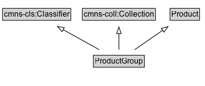

# ProductGroup

A ProductGroup represents a group of [[Product]]s that vary only in certain well-described ways, such as by [[size]], [[color]], [[material]] etc.

While a ProductGroup itself is not directly offered for sale, the various varying products that it represents can be. The ProductGroup serves as a prototype or template, standing in for all of the products who have an [[isVariantOf]] relationship to it. As such, properties (including additional types) can be applied to the ProductGroup to represent characteristics shared by each of the (possibly very many) variants. Properties that reference a ProductGroup are not included in this mechanism; neither are the following specific properties [[variesBy]], [[hasVariant]], [[url]]. 

## Diagram

=== "SVG (interactive)"

    <!-- Generated by graphviz version 14.1.3 (20260303.0454)
     -->
    <!-- Pages: 1 -->
    <svg width="314pt" height="132pt"
     viewBox="0.00 0.00 314.00 132.00" xmlns="http://www.w3.org/2000/svg" xmlns:xlink="http://www.w3.org/1999/xlink">
    <g id="graph0" class="graph" transform="scale(1 1) rotate(0) translate(4 128)">
    <polygon fill="white" stroke="none" points="-4,4 -4,-128 310.25,-128 310.25,4 -4,4"/>
    <g id="clust3" class="cluster">
    <title>cluster_associated</title>
    </g>
    <!-- cmns&#45;cls_Classifier -->
    <g id="node1" class="node">
    <title>cmns&#45;cls_Classifier</title>
    <g id="a_node1"><a xlink:href="https://w3id.org/citydata/imported/cmns-cls/latest/Classifier" xlink:title="&lt;TABLE&gt;">
    <polygon fill="lightgray" stroke="none" points="1,-97.88 1,-114.12 103.5,-114.12 103.5,-97.88 1,-97.88"/>
    <text xml:space="preserve" text-anchor="start" x="2" y="-101.88" font-family="Arial" font-size="12.00">cmns&#45;cls:Classifier</text>
    <polygon fill="none" stroke="black" points="0,-96.88 0,-115.12 104.5,-115.12 104.5,-96.88 0,-96.88"/>
    </a>
    </g>
    </g>
    <!-- cmns&#45;coll_Collection -->
    <g id="node2" class="node">
    <title>cmns&#45;coll_Collection</title>
    <g id="a_node2"><a xlink:href="https://w3id.org/citydata/imported/cmns-coll/latest/Collection" xlink:title="&lt;TABLE&gt;">
    <polygon fill="lightgray" stroke="none" points="123.25,-97.88 123.25,-114.12 233.25,-114.12 233.25,-97.88 123.25,-97.88"/>
    <text xml:space="preserve" text-anchor="start" x="124.25" y="-101.88" font-family="Arial" font-size="12.00">cmns&#45;coll:Collection</text>
    <polygon fill="none" stroke="black" points="122.25,-96.88 122.25,-115.12 234.25,-115.12 234.25,-96.88 122.25,-96.88"/>
    </a>
    </g>
    </g>
    <!-- Product -->
    <g id="node3" class="node">
    <title>Product</title>
    <g id="a_node3"><a xlink:href="../Product" xlink:title="&lt;TABLE&gt;">
    <polygon fill="lightgray" stroke="none" points="257.62,-97.88 257.62,-114.12 300.88,-114.12 300.88,-97.88 257.62,-97.88"/>
    <text xml:space="preserve" text-anchor="start" x="258.62" y="-101.88" font-family="Arial" font-size="12.00">Product</text>
    <polygon fill="none" stroke="black" points="256.62,-96.88 256.62,-115.12 301.88,-115.12 301.88,-96.88 256.62,-96.88"/>
    </a>
    </g>
    </g>
    <!-- ProductGroup -->
    <g id="node4" class="node">
    <title>ProductGroup</title>
    <g id="a_node4"><a xlink:href="../ProductGroup" xlink:title="&lt;TABLE&gt;">
    <polygon fill="lightgray" stroke="none" points="140.12,-25.88 140.12,-42.12 216.38,-42.12 216.38,-25.88 140.12,-25.88"/>
    <text xml:space="preserve" text-anchor="start" x="141.12" y="-29.88" font-family="Arial" font-size="12.00">ProductGroup</text>
    <polygon fill="none" stroke="black" points="139.12,-24.88 139.12,-43.12 217.38,-43.12 217.38,-24.88 139.12,-24.88"/>
    </a>
    </g>
    </g>
    <!-- ProductGroup&#45;&gt;cmns&#45;cls_Classifier -->
    <g id="edge1" class="edge">
    <title>ProductGroup&#45;&gt;cmns&#45;cls_Classifier</title>
    <path fill="none" stroke="black" d="M148.03,-51.79C131.44,-61.01 110.65,-72.56 92.67,-82.54"/>
    <polygon fill="none" stroke="black" points="91.12,-79.4 84.07,-87.32 94.52,-85.52 91.12,-79.4"/>
    </g>
    <!-- ProductGroup&#45;&gt;cmns&#45;coll_Collection -->
    <g id="edge2" class="edge">
    <title>ProductGroup&#45;&gt;cmns&#45;coll_Collection</title>
    <path fill="none" stroke="black" d="M178.25,-51.79C178.25,-59.25 178.25,-68.24 178.25,-76.69"/>
    <polygon fill="none" stroke="black" points="174.75,-76.54 178.25,-86.54 181.75,-76.54 174.75,-76.54"/>
    </g>
    <!-- ProductGroup&#45;&gt;Product -->
    <g id="edge3" class="edge">
    <title>ProductGroup&#45;&gt;Product</title>
    <path fill="none" stroke="black" d="M202.47,-51.79C215.34,-60.71 231.36,-71.81 245.43,-81.56"/>
    <polygon fill="none" stroke="black" points="243.34,-84.37 253.56,-87.19 247.33,-78.62 243.34,-84.37"/>
    </g>
    <!-- Invis -->
    </g>
    </svg>

=== "PNG"

    

## Formalization for ProductGroup

| Property | Constraint |
|----------|------------|
| subClassOf | [Product](Product.md) |
| subClassOf | [cmns-cls:Classifier](https://w3id.org/citydata/imported/cmns-cls/Classifier) |
| subClassOf | [cmns-coll:Collection](https://w3id.org/citydata/imported/cmns-coll/Collection) |

